# 42028: Deep Learning and Convolutional Neural Networks — Lecture Notes (Week 1–11)

> Merged from individual weekly lecture PDFs converted via `opendataloader-pdf`.
> Image references point to `lectures/<Week>-Lecture-YYYY_images/`.

______________________________________________________________________

## Table of Contents

- [Week 1 — Introduction to ML and DL](#week-1--introduction-to-ml-and-dl)
- [Week 2 — Lecture](#week-2--lecture)
- [Week 3 — Lecture](#week-3--lecture)
- [Week 4 — Lecture](#week-4--lecture)
- [Week 5 — Lecture](#week-5--lecture)
- [Week 6 — Lecture](#week-6--lecture)
- [Week 7 — Lecture](#week-7--lecture)
- [Week 8 — Lecture](#week-8--lecture)
- [Week 9 — Lecture](#week-9--lecture)
- [Week 10 — Lecture](#week-10--lecture)
- [Week 11 — Lecture](#week-11--lecture)

______________________________________________________________________

## Week 1 — Introduction to ML and DL

42028: Deep Learning and Convolutional Neural Network

#### Week 1

Introduction to Machine Learning and Deep Learning

Outline

- •Introduction to AI, ML, CV, & DL
- •Popular use cases
- •The Deep Learning Evolution
- •AI, ML, DL Relationship
- •Features in machine - example
- •ML/DL Pipeline
- •Deep Learning and CNN @ UTS

What is Artificial Intelligence?

Human Intelligence exhibited by machine!

What is Artificial Intelligence?

- • A generic term for getting computers to perform human tasks, and the scope is always changing overtime.

- • We don’t have a generic AI system which does multiple human tasks!

- • The systems available today are able to perform one or few well defined tasks, which are at par with the human performance or sometimes better!

- Popular Use Cases

- • Image Classification

- • Object Detection and Recognition

- • Image Captioning

- • Face Detection and Recognition

- • Biometrics (Fingerprint, Retina, Hand Geometry, etc.)

- • Speech Recognition

- • Natural Language Processing (NLP)

- • Language Translations

- • Creative (learn to draw an image in the style of an artist!) :

###### • Speech Recognition

###### Hey Google… What’s the weather today? …

Image Source: https://medium.com/@joelgarciajr84/creating-an-application-that-uses-speech-recognition-76117a396b7d

###### • Speech Recognition - Technology Challenges!

###### • Natural Language Processing

“Beware though, bots have the illusion of simplicity on the front end but there are many hurdles to overcome to create a great experience. So much work to be done. Analytics, flow optimization, keeping up with ever changing platforms that have no standard. For deeper integrations and real commerce like Assist powers, you have error checking, integrations to APIs, routing and escalation to live human support, understanding NLP, no back buttons, no home button, etc etc. We have to unlearn everything we learned the past 20 years to create an amazing experience in this new browser.” —Shane Mac, CEO of Assist

Reference: https://becominghuman.ai/a-simple-introduction-to-natural-language-processing-ea66a1747b32

###### • ChatGPT!

###### • Language translations

What is Machine Learning?

“Machine Leaning is the field of study that gives computer ability to learn without being explicitly programmed”

###### 1Machine Learning is a Science ( and art ) of programming computers so that they can learn from Data!

– Arthur Samuel, 1958

Why and When to use Machine Learning?

Problems for which existing solutions require a lot of hand-tuning or a long list of rules

Complex Problems for which there is no good solution at all using traditional approach

||
|---|

||
|---|

Fluctuating environments: Machine Learning systems can adapt on new data

Getting insight about complex problems and a large amount of data

||
|---|

||
|---|

- •Insufficient amount of training data

- •Non-representative training data

- •Poor Quality data

- •Irrelevant Features!: Garbage in à Garbage Out!

- •Overfitting the training data

- •Under fitting the training data

- •More of the challenges are around Data!

- •Data or Algorithm, which is more important?

- •Check:

###### 1Unreasonable Effectiveness of data 2Revisiting the Unreasonable Effectiveness of Data

Reference: 1https://static.googleusercontent.com/media/research.google.com/en//pubs/archive/35179.pdf 2https://ai.googleblog.com/2017/07/revisiting-unreasonable-effectiveness.html

###### •Overfitting example

Image source: https://www.reddit.com/r/ProgrammerHumor/comments/8p96r8/yes/

###### • Overfitting and Underfitting

This is too complex.. Skip!

Not Interested in learning Open Book Exam: 45% Closed Book Exam: 35%

Memorizing everything Open Book Exam: 98% Closed Book Exam: 55%

Learning concept well with examples Open Book Exam: 93% Closed Book Exam: 85%

###### Underfitting/not learning

###### Overfitting

###### Best-Fit

Computer Vision

How computers see and understand digital images and videos.

###### Human Brain

Apple, Pear, grapes, banana, oranges, basket

###### Human Eye

Apple, Pear, grapes, banana, oranges, basket

###### Input image Output

###### Webcam image sensor

###### Interpreting device Computer

Computer Vision

Computer vision includes all tasks performed by the biological vision system:

- • Eye/Retina à Camera/Webcam
- • Extracting information à Image Processing
- • understanding what is seen à Image Analysis and Understanding/ML

Applications

Assistance to differently abled humans (bionic eye)

Unmanned Surveillance using Drone

###### Image search engines

Human machine interaction/ Robotics

Autonomous driving

Computer Vision: Popular tasks

Image Classification

Image Classification Object Detection

- Localization Instance Segmentation

| |
|---|

|DOG|
|---|

|CAT|
|---|

|DOG|
|---|

|CAT|
|---|

|DOG|
|---|

DOG

Single Object Multiple Object

Images source: cs224d course

- • Image Captioning (Computer Vision + NLP)

• Face Detection and Recognition

###### • Biometrics (Fingerprint, Retina, Hand Geometry, etc.) (Computer Vision)

###### • Creative

###### This are fake images! à Generated using GAN

Image source: https://research.nvidia.com/publication/2017-10_Progressive-Growing-of

Generative AI

Definition:

- •Refers to the use of AI to create new content such as text, images, audio/music, and videos.
- •Examples: LLMs, ChatGPT, Bard etc. are examples of Gen AI designed for conversational purpose, producing human like responses.

Reference: https://cloud.google.com/use-cases/generative-ai

Deep Learning

Definition:

- •It is a class of machine learning algorithms that uses multiple layers to progressively extract higher level of features from the raw input.
- •The word “Deep” in deep learning refers to the number of layers through which data is transformed.

Reference: https://en.wikipedia.org/wiki/Deep_learning

The Deep Learning Evolution

- - Slow computers
- - Less data

|Deep Learning is a technique for implementing Machine Learning! also know as Deep Neural Networks (DNNs)|
|---|

So, What Changed Overtime?

|Availability of faster computers! Cheap and fast GPUs  |
|---|

|Very large datasets, Easy to collect and store    |
|---|

Improved libraries, toolboxes, modern architectures!

###### Keras

AI, ML and DL relationship!

Artificial Intelligence

Machine Learning

Deep Learning

explicitprogramming

programsintelligent

Makingmachine&

Learnwithoutany

LearnusingDeep

NeuralNetworks

1950s 1980s 2010s

Orange? Yes-40%

Orange? Yes-85%

No-55% Unsure- 5%

No-14% Unsure- 1%

Weight: 150 grams Colour:Colour: OrangeOrange?

|Feature dimension: 2|
|---|

###### Orange Apple

Weight

###### ?

|Choosing appropriate and useful features can have a significant impact on the performance of a Machine Learning system!|
|---|

Colour

Typical Machine Learning Pipeline

|Data/ Features  | |
|---|---|
| | |

|Launch|
|---|

|Train ML Algorithm| |
|---|---|
| | |

|Study the Problem| |
|---|---|
| | |

Evaluate Solution

| |Analyse errors|
|---|---|
| | |

Reference: Hands-On Machine Learning with Scikit-Learn and TensorFlow

Traditional ML Vs DL Pipeline

###### Traditional Machine Learning (ML) pipeline for object detection and classification

###### Result

###### Input video

###### Result

###### Input video

End-to-End Deep Learning (DL) technique for Object Detection and Classification

Deep Learning Pipeline example

|More layers that loosely mimic human brain|
|---|

|No explicit feature engineering|
|---|

##### Deep Learning System Pipeline

| |
|---|

## Student Projects from previous iterations of 42028!

### KrossConnection

### SignSync

### GestureFly

# Deep Learning Projects @UTS!

Signature and Logo detection

||
|---|

| |
|---|

Logo and Signature detection result

##### Drone detection for Security and Surveillance

###### The Award winning

______________________________________________________________________

## Week 2 — Lecture

42028: Deep Learning and Convolutional Neural Network

## Week-2 Lecture

Machine Learning and Image Processing Basics

Outline

- • Types of Machine Learning System
- • Supervised and Un-supervised learning
- • Support Vector Machine (SVM)
- • Evaluation Metrics
- • Image Processing Basics, Types
- • Edge Detection using Convolution

### Machine Learning Basics

Type of Machine Learning Systems

|Supervised Learning Unsupervised Learning Semi-supervised Learning Reinforcement Learning|
|---|

Depending on whether the system is trained with human supervision

|Batch and Online Learning|
|---|

Whether System can learn on the fly

Comparing data points or detect patterns in training data to build a predictive model

|Instance-based and Model-based Learning|
|---|

?

Apple

Pear

|Predictive Model|
|---|

Supervised Learning

Pear

Mango

|Classification Task|
|---|

Labelled data for training (Object + Desired Output Label)

|0  500  1000  1500  2000  2500  0 200 400 600 800 1000 1200 1400  PriceinAUD$(in100Ks)  Size in Sq. ft|
|---|

|House Price prediction Feature:  - Size of the house To Predict: - Price of the house |
|---|

PriceinAUD$(in10

|Regression Task|
|---|

Important Algorithms:

- • K-Nearest Neighbours
- • Logistic regression
- • Support Vector Machines (SVMs)
- • Neural Networks (\*some of themcan be unsupervised)

Supervised Learning Examples

Image Classification Object Recognition

Predictions

Forecasting

Supervised Learning

CLASSIFICATION CLASSIFICATIONREGRESSION

Fraud Detection

New Insights

Medical Diagnostics

Process Optimization

Unsupervised Learning

||
|---|

||
|---|

Unsupervised Learning

|      |
|---|

|Clustering Task|
|---|

|Groups of similar fruits|
|---|

Unlabelled data for training

Unsupervised Learning

Important Algorithms:

- • k-means

- • Expectation Maximization

- • A Support Vector Machine is a very powerful and versatile Machine Learning model, capable of performing linear or non-linear classification, regression, and also outlier detection.

- • Defined by a separating hyperplane

- • Suitable for small or medium sized datasets

###### Reference and Pre-Reading:

Theory: https://medium.com/machine-learning-101/chapter-2-svm-support-vector-machine-theory-f0812effc72 Implementation: https://medium.com/machine-learning-101/chapter-2-svm-support-vector-machine-coding-edd8f1cf8f2d

|Feature dimension: 2|
|---|

Orange Apple

Weight

###### ?

|SVM finds the best line or hyper-plane which will fairly separates the classes|
|---|

Colour

###### Example: Using sklearn for SVM classification (Partialcodesnippet)

||
|---|

Reference: https://scikit-learn.org/stable/auto_examples/svm/plot_iris.html#sphx-glr-auto-examples-svm-plot-iris-py

https://en.wikipedia.org/wiki/Iris_flower_data_set

###### SVM Parameters: Kernel, Gamma, Regularization (C)

| |
|---|

||
|---|

Low Regularization value

| |
|---|

||
|---|

High Regularization value

Image source and Reference: https://medium.com/machine-learning-101/chapter-2-svm-support-vector-machine-theory-f0812effc72

###### Example: Using sklearn for SVM classification

###### Iris flower data set

Reference: https://scikit-learn.org/stable/auto_examples/svm/plot_iris_svc.html

https://en.wikipedia.org/wiki/Iris_flower_data_set

##### • Precision & Recall

###### Precision: TP/Cancer Diagnoses Diagnoses

What are the “correct” cells?

| |No Cancer|Cancer|
|---|---|---|
|No Cancer|TN|FP|
|Cancer|FN|TP|

###### • TN: (Number of True Negatives), i.e., patients who did not have cancer whom we

Truestate

correctly diagnosed as not having cancer.

###### • TP: (Number of True Positives), i.e., patients who did have cancer whom we

correctly diagnosed as having cancer

Recall: TP/Cancer True States

##### • Precision & Recall

###### Precision: TP/Cancer Diagnoses Diagnoses

what are the “error” cells are:

| |No Cancer|Cancer|
|---|---|---|
|No Cancer|TN|FP|
|Cancer|FN|TP|

- • FN: (Number of False Negatives), i.e., patients who did have cancer whom we

incorrectly diagnosed as not having cancer

- • FP: (Number of False Positives), i.e., patients who did not have cancer whom we incorrectly diagnosed as having cancer

Truestate

Recall: TP/Cancer True States

|Precision= (𝑇𝑃)/(𝑇𝑃+𝐹𝑃)|
|---|

|Recall = (𝑇𝑃)/(𝑇𝑃+𝐹𝑁)|
|---|

##### • Intersection over Union (IoU):

###### Intersection over Union is a metric used for the evaluation of an object detector, i.e. how good is the predicted bounding box for an object detected closely matches

Reference: https://www.pyimagesearch.com/2016/11/07/intersection-over-union-iou-for-object-detection/

### Image Processing Basics

Image Processing Basics

##### What is a digital image?

- - Digital images are made of picture elements called Pixels.
- - It is an array, or a matrix of Pixels arranges in columns and rows.
- - Each Pixel has its own intensity value, or brightness
- - Intensity values in digital images are defined by bits
- - For a standard 8 bits image, a pixel can have 28= 256 (0 – 255) values.
- - Black & White images have a single 8-bits intensity range.

How computer sees Image?

||
|---|

A (24 X 16) Matrix which represents the number ’8’

### Colour Images

|170|170|55|170|170|
|---|---|---|---|---|
|170|55|170|55|170|
|170|55|170|55|170|
|55|140|140|140|55|
|55|170|170|170|55|

##### Image dimension = 5 X 5 f(2, 3) = 170 (Pixel/intensity value)

Hence, an image may be defined as a 2D function f(x, y) , where, x and y are spatial co-ordinates, and the amplitude of f at (x , y) is the intensity or Gray level of the image at that point/pixel.

###### 5 X 5 Gray scale image (8 bit)

Blue

170 170 55 170 170

Green

###### Image dimension = 5 X 5 X 3 No. of Channels = 3

170 170 55 170 170

170 55 170 55 170

Red

170 170 55 170 170

170 55 170 55 170

170 55 170 55 170

Since, RGB image contains 3 X 8-bits of intensities, they are referred to as 24-bit colour images.

170 55 170 55 170

170 55 170 55 170

55 140 140 140 55

170 55 170 55 170

55 140 140 140 55

55 170 170 170 55

So, 24-bit colour depth

55 140 140 140 55

= 8 X 8 X 8 bits

55 170 170 170 55

= 256 X 256 X 256 colours

55 170 170 170 55

= ~16 million colours

5 X 5 X 3 colour image (24 bit)

Image Processing - Types

- 1. Image Enhancement
- 2. Image Restoration
- 3. Image Segmentation
- 4. Image Recognition & Classification
- 5. Image Compression
- 6. Image Transformation
- 7. Image Filtering
- 8. Morphological Processing
- 9. Colour Image Processing
- 10. 3D Image Processing

### Image Enhancement, Restoration

###### Enhancement Restoration

Source: https://www.mathworks.com/discovery/image-enhancement.html https://en.wikipedia.org/wiki/Image_restoration_by_artificial_intelligence

- - Easiest method for image segmentation!
- - Converts gray-scale image into a binary image If f(x,y) > Threshold, then f(x,y) = 0 else f(x,y) = 255

###### Binary Image (8-bit) has only two possible values of pixel intensity ( 0 and 1, or B & W)

|170|170|55|170|170|
|---|---|---|---|---|
|170|55|170|55|170|
|170|55|170|55|170|
|55|140|140|140|55|
|55|170|170|170|55|

|255|255|0|255|255|
|---|---|---|---|---|
|255|0|255|0|255|
|255|0|255|0|255|
|0|255|255|255|0|
|0|255|255|255|0|

Threshold = 100

||
|---|

||
|---|

Thresholding

Original Image Binary Image

Image Source: https://en.wikipedia.org/wiki/Thresholding\_(image_processing)

Image Thresholding methods

###### - Histogram shape:

Peaks, valleys and curvature of the histogram are analysed.

No.ofPixels

###### - Clustering based:

The 1Otsu method, very good for bimodal distribution

|Threshold|
|---|

###### - Adaptive thresholding:

Gray-scale

Instead of a single threshold, have thresholds for different regions in the image

1Reference: https://en.wikipedia.org/wiki/Otsu%27s_method

###### Source https://scikit-image.org/docs/stable/auto_examples/segmentation/plot_multiotsu.html

Edge Detection (Image Filtering)

##### What is an edge?

- - The points/pixels in an image where brightness/intensities changes sharply
- - A simple and fundamental tools in image processing and computer vision, useful in feature detection/extraction

Colour to Gray

Edge detection

| |
|---|

Canny Edge detection Sobel Edge detection

|100|100|100|0|0|0|
|---|---|---|---|---|---|
|100|100|100|0|0|0|
|100|100|100|0|0|0|
|100|100|100|0|0|0|
|100|100|100|0|0|0|
|100|100|100|0|0|0|

|0|300|300|0|
|---|---|---|---|
|0|300|300|0|
|0|300|300|0|
|0|300|300|0|

|1|0|-1|
|---|---|---|
|1|0|-1|
|1|0|-1|

# \*

| | |
|---|---|
|Convolution operator| |

3 X 3 filter/Kernel

4 X 4 dimension matrix

6 X 6 dimension image

|(100 X 1 + 100 X 1 + 100 X 1) + (100 X 0 + 100 X 0 + 100 X 0) + (100 X -1 + 100 X -1 + 100 X -1)|
|---|

|1100|0100|-1100|0|0|0|
|---|---|---|---|---|---|
|1100|0100|-1100|0|0|0|
|1100|0100|-1100|0|0|0|
|100|100|100|0|0|0|
|100|100|100|0|0|0|
|100|100|100|0|0|0|

|0|300|300|0|
|---|---|---|---|
|0|300|300|0|
|0|300|300|0|
|0|300|300|0|

|1|0|-1|
|---|---|---|
|1|0|-1|
|1|0|-1|

-

# \*

|100|100|100|100|100|100|
|---|---|---|---|---|---|
|100|100|100|100|100|100|
|100|100|100|100|100|100|
|0|0|0|0|0|0|
|0|0|0|0|0|0|
|0|0|0|0|0|0|

|0|0|0|0|
|---|---|---|---|
|300|300|300|300|
|300|300|300|300|
|0|0|0|0|

|1|1|1|
|---|---|---|
|0|0|0|
|-1|-1|-1|

# \*

# \*

### Edge detection filters

||1|0|-1|
|---|---|---|
|1|0|-1|
|1|0|-1|
  |1|1|1|
|---|---|---|
|0|0|0|
|-1|-1|-1|
  3 X 3 filter/Kernel For Horizontal edges  3 X 3 filter/Kernel For Vertical edges  Prewitt Filters|
|---|

||1|2|1|
|---|---|---|
|0|0|0|
|-1|-2|-1|
  3 X 3 filter/Kernel For Horizontal edges  |1|0|-1|
|---|---|---|
|2|0|-2|
|1|0|-1|
  3 X 3 filter/Kernel For Vertical edges  Sobel Filters|
|---|

### Sobel edge detection - Example

Image Source: https://docs.opencv.org/3.0-beta/doc/py_tutorials/py_imgproc/py_gradients/py_gradients.html

Convolutions in CNN

- • Convolutions are very important operation in a Convolutional Neural Networks (CNN)
- • Filters weights are not fixed, but learned during the training operations of a CNN for a specific task!
- • Multiple filters are used in CNNs

Erosion example

Dilation example

______________________________________________________________________

## Week 3 — Lecture

42028: Deep Learning and Convolutional Neural Network

# Week-3 Lecture

Feature Extraction and Neural Network Basics

Outline

- • Image Gradient
- • Histogram of Oriented Gradient (HoG)
- • Local Binary Pattern
- • ANN Basics
- • ANN Learning Process
- • Logistic Regression using ANN
- • Gradient Descent

## Features Extraction

##### What is an Image Gradient?

- • It is a directional change in the intensity or color in an Image.
- • Can be used to extract valuable information from images.
- • Commonly used in edge detection.

##### What is an Image Gradient?

X

Change is X-directions

Change is Y-directions

Combining both X and Y direction to estimate if changes are in both directions

Y

##### Step -1: Computing Image Gradient:

###### 1. Use the horizontal and vertical filters to compute gradient values

Gradientisy-directions

gx= * I

gy= * I

Horizontal filter

Vertical filter

Gradient is X-directions

###### 2. Compute the strength/magnitude and direction of gradient.

|X|100|X|
|---|---|---|
|70|60|120|
|X|50|X|

Strength/Magnitude(g) =

Example

Direction

|gx= |-70 + 120| = 50 gy = |-100 + 50| = 50 |
|---|

|Gradient Magnitude = ~70.7 Direction/Angle = 45o|
|---|

##### Step -2: Create orientation histogram:

- - Divide the image into small connected regions called Cells which is a 8 X 8 patch
- - Create cell histogram based on gradient direction and magnitude
- - 64 (8 X 8) gradient vectors are put into a 9-bin histogram
- - The bins are the gradient directions (Ꝋ) quantized into 9-bins

|Pixel with blue circle has an angle of 80 degrees and magnitude of 2|
|---|

Reference: https://tanasecucliciu.wordpress.com/2016/06/08/programming-histogram-of-oriented-gradients-hog-explained/ Image source: https://www.learnopencv.com/histogram-of-oriented-gradients/

| |
|---|

##### Step -3: Block Normalization:

- - 16 X 16 pixels blocks or 2X2 cells are used for normalization, which has 4 histograms.
- - Normalization will make it scale/multiplication invariant
- - Each block will represent 36 X 1 element vector

##### Step -3: Block Normalization:

Normalization example: (3, 9) à 3 + 9 = 9.48 (3/9.48 , 9/9.48) = (0.32, 0.95) Multiple (3, 9) by 2 to increase brightness (6, 18) à 6 + 18 = 18.97 (6/18.97, 18/18.97) = (~0.32, ~0.95)

Brightness reduced Brightness increased

Original image

###### Step -4: Calculate the HOG feature vector:

- - Each of the 36 X 1 vectors in each blocks are concatenated into one big vector.
- - Size of the vector will be: Number of blocks X 36

Example: For an Image size: 64 X 128, will have 8 X 16 cells, and 7 X 15 block (with 50% overlap), hence size of HOG feature vector: 7 X 15 X 36 = 3,780

###### Example:

||
|---|

Visualisation of the histogram (Magnitude and direction)

Reference: http://scikit-image.org/docs/0.6/auto_examples/plot_hog.html

- - An efficient texture operator which labels each pixels of an image by thresholding their neighbours.
- - A powerful feature for texture classification
- - The idea behind the LBP operator is to describe the image textures using two measures namely, local spatial patterns and the gray scale contrast of its strength.

###### • The basic LBPP,R operator is defined as follows:

|Where, S(x) à a thresholding function (xc , yc) à the centre pixel in the 8 pixel neighbourhood, gcàgray level of the centre pixel gpàgray value of a sampling point in an equally spaced circular neighbourhood of P sampling points and radius R around the point (xc , yc)|
|---|

###### An Example of LBP Computation:

| | | |
|---|---|---|
| | | |
| | | |

| | | |
|---|---|---|
| | | |
| | | |

| | | |
|---|---|---|
| | | |
| | | |

###### An Example of LBP Computation:

An 8-digit binary number is obtained by consideringthe thresholding result, starting from pixel 1 to 8, as marked in red.

|8|1|2|
|---|---|---|
|7|62|3|
|6|5|4|

- - There can be 28 = 256 possible values
- - Hence, the LBP histogram will have 256 bins àfeature vector

|00111110 = (0 × 2⁷) + (0 × 2⁶) + (1 × 2⁵) + (1 × 2⁴) + (1 × 2³) + (1 × 2²) + (1 × 2¹) + (0 × 2⁰) = 62|
|---|

###### An Example of LBP Computation:

## Neural Network Basics

What is Artificial Neural Network (ANN)?

- • Artificial Neural Networks (ANN) are multi-layered fully-connected neural networks.
- • It has an input layer, multiple hidden layers and an output layer

||
|---|

CNNs

Standard ANNs

Image source: http://cs231n.github.io/assets/cnn/cnn.jpeg Reference & Image source: https://towardsdatascience.com/applied-deep-learning-part-1-artificial-neural-networks-d7834f67a4f6

|House Price prediction| |
|---|---|
|y = 1.8537x - 15.783  0  500  1000  1500  2000  2500  0 200 400 600 800 1000 1200 1400  PriceinAUD$(in100Ks)  Size in Sq. ft| |

|y = 1.8537x - 15.783| | |
|---|---|---|
| | | |

###### Price Y

Size X

###### “Neuron”

|House Price prediction|
|---|

Source and Reference: https://www.econstor.eu/bitstream/10419/113851/1/756619068.pdf

|House Price prediction|
|---|

|Size  #Bedroom  #Bathroom  Garden  Location|
|---|

FamilySize Facility Index

Price

##### Y

LocationIndex

##### X

|House Price prediction|
|---|

Size #Bedroom #Bathroom Garden Location

Price

Y

X

|Data/ Features  | |
|---|---|
| | |

|Launch|
|---|

|Train ML Algorithm| |
|---|---|
| | |

|Study the Problem| |
|---|---|
| | |

Evaluate Solution

| |Analyse errors|
|---|---|
| | |

Function to calculate the loss/error

###### Problem of Binary Classification:

Shark ? à 1 Not Shark? à 0

Error/ Loss

Mechanism to reduce the loss in the model

Gradient

# 1

Target

|Model  ANN Architecture + Parameters|
|---|

# 0

Output (y)

Input (x)

ANN Introduction – Learning Process: Example

###### T Target Position: (x, y)

###### S

###### Position: (x+dx, y+dx)

|UTS  Building-1|
|---|

d

###### D

Distance need to cover to reach target

Distance remaining = (D – d) (Error/Loss to minimize)

Update Position (parameter):

- x = x + dx
- y = y + dy

###### Problem of Binary Classification à Logistic Regression (Shark ? à 1 | Not Shark? à 0)

||
|---|

Image dimension: 64X128 = 8192 Pixels

image.reshape(image.shape[0]\*image.shape[1]\*image.shape[2],1)

x1 x2 x3 … xn-1 xn

128 56 89 … 250 255

𝑤𝑇𝑥 +𝑏 s 0.82

0.82 > 0.5

… … Shark

X

###### Problem of Binary Classification à Logistic Regression (Shark ? à 1 | Not Shark? à 0)

|𝑤𝑇 𝑥|
|---|

|𝑏|
|---|

-

à Linear function of input x

s =

|𝑤1𝑥1 + 𝑤2𝑥2 + …+ 𝑤𝑛𝑥𝑛 + 𝑏|
|---|

(Sigmoid function)

Where, Weighted sum of inputs

- W à Weights
- X à Inputs b à Bias term s à Activation function

|Rule of thumb: In case of binary classification, Sigmoid function is the obvious choice for output layer|
|---|

Problem of Binary Classification à Logistic Regression (Shark ? à 1 | Not Shark? à 0)

|Parameters:  1. w (weight) 2. b (bias) 3. Output a = s(𝒘𝑻𝒙+𝒃) |
|---|

###### Loss function for Logistic Regression:

L (a, y) =- 𝑦 log𝑎 + 1 − 𝑦 log(1 − 𝑎)

Logistic Regression pipeline with the math looks like:

###### X W B

###### L

|𝒘𝑻 𝒙 + 𝒃| |
|---|---|
| | |

|a = s(𝒘𝑻 𝒙 + 𝒃)|
|---|

|L (a, y)|
|---|

###### Problem of Binary Classification à Logistic Regression (Shark ? à 1 | Not Shark? à 0)

Gradient Descent for learning parameters: It is an iterative approach for error correction in a machine learning model.

GD(w)

For 1 Sample the loss function is: L (a, y)=- 𝑦 log𝑎 + 1 − 𝑦 log(1 − 𝑎)

GDmin(w)

For m Sample the loss function is: GD(w, b) =𝑥 = ∑ L (a, y)

w

Question: Find w and b that will minimize GD(w, b)

Image Source: https://subscription.packtpub.com/book/big_data_and_business_intelligence/9781788397872/1/ch01lvl1sec22/gradient-descent Source and Reference: http://cs230.stanford.edu/files/C1M2.pdf

###### Problem of Binary Classification à Logistic Regression (Shark ? à 1 | Not Shark? à 0)

###### Gradient Descent for learning parameters: It is an iterative approach for error correction in a machine learning model.

|Where,  dw = ( , )  db = ( , )|
|---|

|Updating the w and b iteratively, :  w = w - adw Updating the b:  b = b - adb|
|---|

|a à Learning rate|
|---|

###### Problem of Binary Classification à Logistic Regression (Shark ? à 1 | Not Shark? à 0)

###### Gradient Descent for learning parameters: Learning rate(a) issues:

GD(w) GD(w)

______________________________________________________________________

## Week 4 — Lecture

42028: Deep Learning and Convolutional Neural Network

# Week-4 Lecture

Neural Network in details

Outline

- • Logistic Regression Recap
- • Back Propagation
- • Gradient Descent and intuitions
- • Optimization techniques: SGD, RMSProp, Adam etc.
- • Activations Functions: Sigmoid, tanh, ReLu, Softmax
- • Logistic Regression with Back Propagation
- • Multi-Layered Neural Network

Logistic Regression – Recap

Function to calculate Loss/error

Mechanism to reduce the loss/error

###### Problem of Binary Classification:

Dog? → 1 Cat ( not Dog)? → 0

|Error/  Loss|
|---|

Gradient

### 1

Target

|Model  ANN Architecture + Parameters|
|---|

# 0

Output (y)

Input (x)

###### Activation function

Problem of Binary Classification → Logistic Regression (Dog ? → 1 | Not Dog? → 0)

|Parameters:  1. w (weight) 2. b (bias) 3. Output a= (𝒘𝑻𝒙+𝒃) |
|---|

###### Loss function for Logistic Regression:

|L (a, y) =- 𝑦 log𝑎 + 1 − 𝑦 log(1 − 𝑎)  |
|---|

Logistic Regression pipeline with the math looks like:

###### X W B

|𝒘𝑻 𝒙 + 𝒃| |
|---|---|
| | |

|a = (𝒘𝑻 𝒙 + 𝒃)|
|---|

|L (a, y)|
|---|

###### L

Logistic Regression pipeline with the math looks like:

|Where,  W → Weights X → Inputs b → Bias term    → Activation function|
|---|

###### X

###### ŷ

|𝒘𝑻 𝒙 + 𝒃| |
|---|---|
| | |

|a = (𝒘𝑻 𝒙 + 𝒃)| |
|---|---|
| | |

- W b

| |L (a, y)|
|---|---|
| | |

|Parameters:  1. w (weight) 2. b (bias) 3. Output a=(𝑤𝑇 𝑥 +𝑏) |
|---|

Activation function

|a= = 1+𝑒1−𝑥  |
|---|

###### Loss function for Logistic Regression:

|L (a, y) =- 𝑦 log𝑎 + 1 − 𝑦 log(1 − 𝑎)  |
|---|

Logistic Regression pipeline with the math looks like:

###### X

Activation function

|a= = 1+𝑒1−𝑥  |
|---|

###### ŷ

|𝒘𝑻 𝒙 + 𝒃| |
|---|---|
| | |

|a = (𝒘𝑻 𝒙 + 𝒃)| |
|---|---|
| | |

- W b

| |L (a, y)|
|---|---|
| | |

If y = 1:L (a, y) =-log a

###### Loss function for Logistic Regression:

If y = 0:L (a, y) =-log (1– a)

|L (a, y) =- 𝑦 log𝑎 + 1 − 𝑦 log(1 − 𝑎)  |
|---|

Logistic Regression pipeline with the math looks like:

|Where,  W → Weights X → Inputs b → Bias term    → Activation function|
|---|

###### X

|𝒘𝑻 𝒙 + 𝒃| |
|---|---|
| | |

|a = (𝒘𝑻 𝒙 + 𝒃)||L  |(a, y)|
|---|---|
| | |
|
|---|---|
| | |

|L  |(a, y)|
|---|---|
| | |

W b

Forward Pass

###### Back Propagation

|Parameters:  1. w (weight) 2. b (bias) 3. Output a=(𝑤𝑇 𝑥 +𝑏) |
|---|

|repeatedly adjust the weights to minimize the difference between actual output and desired output|
|---|

Activation function

|a= = 1+𝑒1−𝑥  |
|---|

###### Loss function for Logistic Regression:

|L (a, y) =- 𝑦 log𝑎 + 1 − 𝑦 log(1 − 𝑎)  |
|---|

#### Optimization techniques

|Generic Algorithm:  Step 1: Initialize w and b Step 2: Perform Forward pass operation/calculations Step 3: Compute Loss/Cost function L (a, y) Step 4: Compute change in w and b (Take the partial derivative of the cost function with  respect to Weights and bias (dw and db).  Step 5: Update w and b w := w – dw b := b – db Step 6: Repeat from Step 2 with new values of w and b for ‘n’ number of iterations. |
|---|

###### Gradient Descent for learning parameters: It is an iterative approach for error correction in a machine learning model.

###### Question: Find w and b that will minimize GD(w, b)

Required: Loss/cost function

###### (L)LossFn

|Example the loss function is:  L (a, y)=- 𝑦log𝑎 + 1 − 𝑦 log(1 − 𝑎)  | | |
|---|---|---|
| | → Learning rate| |

GDmin(w)

w

Image Source: https://subscription.packtpub.com/book/big_data_and_business_intelligence/9781788397872/1/ch01lvl1sec22/gradient-descent

Source and Reference: http://cs230.stanford.edu/files/C1M2.pdf

###### Gradient Descent for learning parameters: Learning rate() issues:

(L)LossFn

(L)LossFn

###### - It is a hyper-parameter

Image Source: https://subscription.packtpub.com/book/big_data_and_business_intelligence/9781788397872/1/ch01lvl1sec22/gradient-descent

Source and Reference: http://cs230.stanford.edu/files/C1M2.pdf

###### Learning rate(): more intuitions

Image Source: http://cs231n.github.io/neural-networks-3/

Gradient Descent Types

There are three main types of Gradient Descent Algorithms:

- 1. Batch Gradient Descent (BGD)
- 2. Stochastic Gradient Descent (SGD)
- 3. Mini-Batch Gradient Descent (MBGD)

Batch Gradient Descent (BGD)

###### Issues:

|Generic steps:  -Process each input sample and find the cost -Find the average cost over all input samples -Update w and b, and -repeat the steps for ‘n’ epochs(iterations) |
|---|

- 1. It uses the complete dataset to calculate the gradients at every steps
- 2. Slow when training set is large
- 3. Difficult to find the learning rate
- 4. Difficult to ascertain the number of epochs(iterations)

###### Advantage:

###### Stochastic → Random

- 1. Computes gradient based on single input sample: memory efficient
- 2. Much faster compared to BGD
- 3. Possible to train on large dataset
- 4. Randomness is a good escape from local minima problem

Due to the random nature, the

Algorithm is much less regular than

BGD

|Generic steps:  -Process a random input sample and find the cost -Update w and b, and -repeat the steps for ‘n’ iterations on the training samples |
|---|

###### Issues:

1. Might not reach the optimal value,

but very close to it.

Issues: Might not reach the optimal value, but very close to it.

Possible solution: Reduce the learning rate gradually → Stimulated annealing

Create a Learning Schedule to determine the learning at each iteration.

Epoch: One round through the complete training set. Iterations: Process in multiple subsets of the training set, say, ‘m’ iterations

my form 1 epoch

Mini-Batch Gradient Descent (MBGD)

###### Advantage:

|Generic steps:  -Divide the training set into mini-batches (set of random samples on fixed number) -Process all the samples in a Mini-batch and find the average cost -Update w and b, and -repeat the steps for ‘n’ iterations/epochs on the training samples |
|---|

- 1. Computes gradient based on small sets of input sample
- 2. Much faster compared to BGD
- 3. Possible to train on large dataset
- 4. Performance boost on matrix operations using GPUs!
- 5. Might not reach the optimal value, but very close to it, and possibly better than SGD

###### Issues:

1. It may be harder to escape the local

minima.

## Gradient Descent (SGD) - intuition

Image Source: https://towardsdatascience.com/gradient-descent-algorithm-and-its-variants-10f652806a3

## Gradient Descent (SGD) – loss function nature

- • One of the popular algorithm for smoothing sequential data
- • Also called Moving Average
- • Weight the number of observations and using their average
- • Example: Temperatureover ‘n’ days Days

Temperature

Vt : Moving average on day ‘t’

So, let V0 = 0 V1 = 0.9 V0 + 0.1 1 V2 = 0.9 V1 + 0.1 2 V3 = 0.9 V2 + 0.1 3

Temperature

: : Vt = 0.9 Vt-1 + 0.1 t

Days

Vt = 0.9 Vt-1 + 0.1 t If  = 0.9,

Temperature

|Vt =  Vt-1 + (1- ) t|
|---|

This equation gives the moving average

shown by the red line.

Days

|Vt =  Vt-1 + (1- ) t|
|---|

Temperature

Vt is approximate average over 1−1

 days

So,  = 0.9 is closer to 10 days temperature  = 0.98 is closer to 50 days temperature  = 0.5 is closer to 2 days temperature

Days

What is Exponentially Weighted Averages doing?

Vt =  Vt-1 + (1- ) t

For, V100= 0.9 V99 + 0.1 100 V99= 0.9 V98 + 0.1 99

Substituting, V99 V100= 0.1 100+ 0.9 (0.9 V98 + 0.1 99) V100= 0.1 100+ 0.9 ( 0.1 99+ 0.9 (0.9 V97+ 0.1 V98)) ..

- • “Compute the Exponentially weighted average of the gradients and use that gradient to update weights” - Andrew NG
- • One of the most popular algorithms
- • Helps to accelerate the gradient vectors in right direction and reduces oscillation
- • Always faster than the SGD

|Algorithm: At iteration t:  Calculate 𝑑𝑤 𝑎𝑛𝑑 𝑑𝑏 on the current mini-batch  V𝑑𝑤 =  V𝑑w + (1 - ) 𝑑𝑤 ➔ Vt =  Vt-1 + (1- ) t  V𝑑𝑏=  V𝑑𝑏 + (1 - ) 𝑑𝑏 Update w and b:  w = w -  V𝑑𝑤 ,b = b -  V𝑑𝑏 Hyper-parameters: , |
|---|

SGD Without Momentum SGD With Momentum

Faster convergence and reduced oscillation

Image Source and reference http://ruder.io/optimizing-gradient-descent/index.html#momentum

- • Root Mean Square Propagation
- • Unpublished adaptive learning method by Geoffrey Hinton
- • RMSProp also reduces oscillation but in a different way than Momentum
- • RMSprop as well divides the learning rate by an exponentially decaying average of squared gradients.

|Algorithm:  At iteration t:  Calculate 𝑑𝑤 𝑎𝑛𝑑 𝑑𝑏 on the current mini-batch S𝑑𝑤 = 2 S𝑑w + (1 - 2) 𝑑𝑤2 S𝑑𝑏= 2 S𝑑𝑏 + (1 - 2) 𝑑𝑏2  Update w and b:  w = w -  𝑑𝑤S  𝑑𝑤  , b = b -  𝑑𝑏S  𝑑𝑏  Squaring the derivatives  Square root of derivatives|
|---|

###### Intuition:

###### →Slow

S𝑑𝑤 → Smaller number expected S𝑑𝑏→ Larger number expected

b

###### W

So,

###### Fast →

w = w -  𝑑𝑤S

###### , b = b -  𝑑𝑏S

###### In Practice add ε :

𝑑𝑤

𝑑𝑏

w = w -  S𝑑𝑤

𝑑𝑤+ε , b = b -  S𝑑𝑏

|Smaller number So, w is larger|
|---|

Larger number So, b is small

𝑑𝑏+ ε

ε → small number, 10-8

- • Adam → Adaptive Moment Estimation
- • Combination of RMSProp and Momentum
- • Work well for a wide range of deep learning architecture

|Algorithm:  Initialize V𝑑𝑤 = 0, V𝑑𝑏= 0, S𝑑𝑤 = 0, S𝑑𝑏 = 0 At iteration t:  Calculate 𝑑𝑤 𝑎𝑛𝑑 𝑑𝑏 on the current mini-batch V𝑑𝑤 = 1 V𝑑w + (1 - 1) 𝑑𝑤, V𝑑𝑏= 1 V𝑑𝑏 + (1 - 1) 𝑑𝑏  From Momentum, 1 S𝑑𝑤 = 2 S𝑑w + (1 - 2) 𝑑𝑤2, S𝑑𝑏= 2 S𝑑𝑏 + (1 - 2) 𝑑𝑏2  From RMSProp, 2  Update w and b:  w = w -  V  𝑑𝑤  S𝑑𝑤+ε, b = b -  V  𝑑𝑏  S𝑑𝑏+ ε|
|---|

|In practice: Bias correction is required as V𝑑𝑤, V𝑑𝑏, S𝑑𝑤, S𝑑𝑏 are initialized to 0 and are biased towards zero. Hence, a bias correction is required as  follows:  V′𝑑𝑤 = V  𝑑w  ( 1− 1 )  , V′𝑑b = V  𝑑b  (1− 1)  S′𝑑𝑤 = S  𝑑w  (1 − 2)  , S′𝑑b = S  𝑑b  (1 − 2)  Update w and b:  w = w -  V  ′  𝑑𝑤  S′𝑑𝑤+ε , b = b -  V  ′  𝑑𝑏  S′𝑑𝑏+ ε|
|---|

|https://vis.ensmallen.org/  Hyper parameter guide:   (Learning rate)→ should be tunned, start with 0.001  1(Momentum term) → 0.9 (dw) 2(moving weighted average) → 0.999 (dw2) ε → 10-8   Optimization Demo: https://vis.ensmallen.org/  |
|---|

Learning Rate Decay

###### Speed-up the learning algorithm by slowing decreasing the 𝛼 (Learning rate)

#### Activation Functions

Activation Functions: Sigmoid

|= 1+1𝑒−𝑥  |
|---|

||
|---|

Sigmoid function:

|Characteristics:  - Non-linear in nature - Range(0, 1) - Tends to bring the activations to either side of the curve: good for a classifier - Suffers from vanishing gradient problem |
|---|

###### Vanishing Gradient: Towards to the end of the curve, the value of Y change very less to the changes in X values. Hence gradient at the region will be very small. The network will refuse or learning extremely slowly.

Source: https://medium.com/the-theory-of-everything/understanding-activation-functions-in-neural-networks-9491262884e0

Activation Functions: tanh

||
|---|

|Hyperbolic tangent:  tanh 𝑥 =  2 1 + 𝑒−2𝑥  − 1  |
|---|

|Characteristics:  - Non-linear in nature - Range(-1, 1) - Stronger gradient than sigmoid - Also suffers from vanishing gradient problem |
|---|

Activation Functions: ReLu

||
|---|

|Rectified Linear Unit (ReLu) 𝐴(𝑥) = max(0, x)|
|---|

i.e. : if x < 0, A(x) = 0, if x > 0, A(x) = x

|Characteristics:  - Non-linear in nature - Range[0, inf] - Stronger gradient than sigmoid - Computationally less expensive than Sigmoid and Tanh - Best used in hidden layers - Dying ReLu problem |
|---|

|Avoids and rectifies vanishing gradient problem|
|---|

Activation Functions: Leaky ReLu

|  Leak|
|---|

|Leaky Rectified Linear Unit (Leaky ReLu)  𝐴(𝑥) = max(0.01𝑥,x)|
|---|

###### i.e. : if x < 0, A(x) = 0.01x, if x > 0, A(x) = x

|Characteristics:  - Non-linear in nature - Range[0, inf] - Leaky ReLUs are one attempt to fix the “dying ReLU” problem |
|---|

Source & Reference : http://cs231n.github.io/neural-networks-1/

https://towardsdatascience.com/activation-functions-in-neural-networks-58115cda9c96

Activation Functions: Softmax

| |Softmax 𝑆 𝑦𝑖 = 𝑒𝑦𝑖   𝑗 𝑒𝑦𝑗  for j = 1, …, K.| |
|---|---|---|
|Characteristics:  - Non-linear in nature - Turns numbers in probabilities that sum to one. - Useful when we have more than one output - Used for classification in the output layer - Less computationally expensive than Sigmoid and Tanh | |Y|

###### Illustration:

###### = [ 2.0, 1.0, 0.1] Softmax(Y) = [0.7, 0.2, 0.1] (approx.)

Reference: https://medium.com/data-science-bootcamp/understand-the-softmax-function-in-minutes-f3a59641e86d

Logistic Regression with Backpropagation

###### Logistic Regression pipeline with the math looks like:

Average cost over all training ‘m’ samples

X W

###### a = (𝒘𝑻 𝒙 + 𝒃)

| |L (a, y)  |
|---|---|
| | |

𝒘𝑻 𝒙 + 𝒃

|Avg Loss(J) =  𝟏  𝒎  ෍  𝒊=𝟏  𝒎  L(ai,yi)  |
|---|

b

|Batch GD  Step 1: Initialize w and b Step 2: Perform Forward pass operation/calculations   Step 2: Compute Loss/Cost function L (a, y) Step 3: Find the average cost over all input samples (Take the partial derivative of the cost function with  respect to Weights and bias (dw and db).  Step 4: Update w and b w := w – dw b := b – db Step 5: Repeat from Step 2 with new values of w and b for ‘n’ number of iterations.   |
|---|

|dw = 𝜕𝑤𝜕𝐽 , db = 𝜕𝑏𝜕𝐽  |
|---|

|𝑤 ≔ 𝑤 − dw  b := b – db|
|---|

|Size  #Bedroom  #Bathroom  Garden  Location|
|---|

###### Price

Y

X

Hidden Layer→ Adding more neurons in between input and output layer

Single layer perceptron 3-layered neural network with 2 hidden layers

Image Source: https://towardsdatascience.com/multi-layer-neural-networks-with-sigmoid-function-deep-learning-for-rookies-2-bf464f09eb7f

Example: 2-layered architecture for multi-class classification (e.g: Fashion MNIST dataset)

Intuition: In a multi-layer neural network, the first hidden layer will be able to learn some very simple patterns. Each additional hidden layer will somehow be able to learn progressively more complicated patterns.

###### Example: 2-layered architecture for multi-class classification (e.g: MNIST digit dataset) intuition

______________________________________________________________________

## Week 5 — Lecture

42028: Deep Learning and Convolutional Neural Network

## Week-5 Lecture

Convolutional Neural Network (CNN) - 1

Outline

- • Computer Vision tasks Recap
- • CNN Layers
- • Convolution layer (Padding and Stride)
- • Pooling layer
- • Fully Connected Layer
- • CNN Layer Visualization and intuitions.

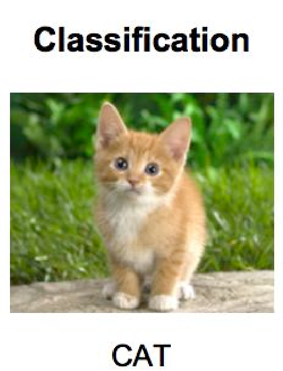

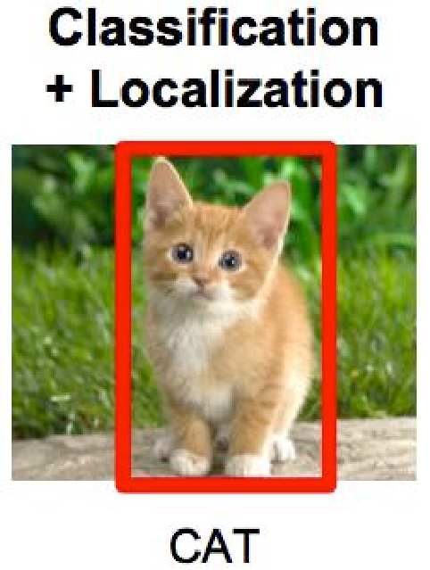

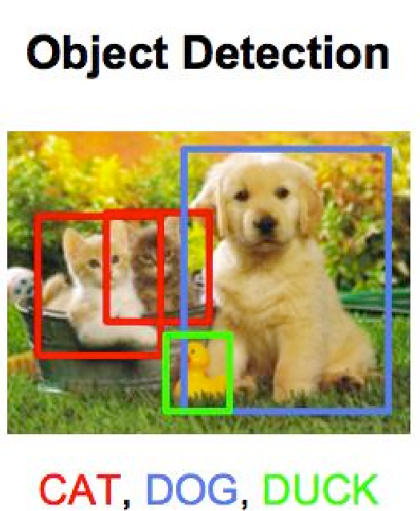

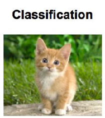

Cat

64 X 64 X 3

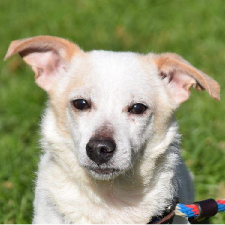

Dog

800 X 800 X 3

### Deep-NNs Vs CNNs

|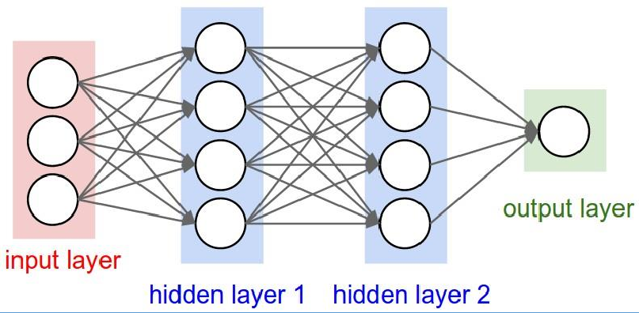|
|---|

|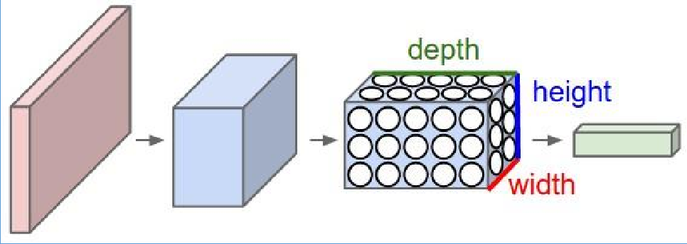|
|---|

###### ANN with 3-layers

###### CNN with 3-layers

- - Fully connected
- - Not great for images as input
- - May lead to overfitting
- - Too much of full connectivity
- - Well suited for images with 3 dimensions
- - CNNs have neurons arranged in 3D
- - It is a sequence of layers which transforms input 3D volume to 3D outputs volume

Image Source and reference to read : http://cs231n.github.io/convolutional-networks/

###### CNNs are the foundations of modern state-of-the-art deep

###### learning based computer vision. Layers in a CNN:

Three main type of layers used to build a CNN architecture

- 1. Convolutional Layer (CONV)
- 2. Pooling Layer (POOL)
- 3. Fully Connected layer (FC) These three types of layers are stacked together to form a CNN architecture!

Source and reference to read : http://cs231n.github.io/convolutional-networks/ https://medium.com/@pechyonkin/key-deep-learning-architectures-lenet-5-6fc3c59e6f4

##### Sample CNN architecture (LENET-5):

|CONV Layer|
|---|

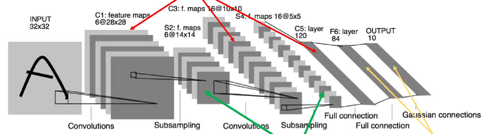

|FC Layer|
|---|

|POOL Layer|
|---|

##### Sample CNN architecture:

| |
|---|

| |
|---|

| |
|---|

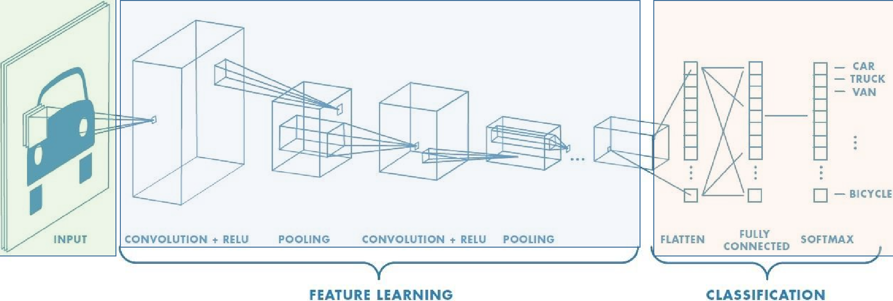

Image Source: https://medium.com/analytics-vidhya/ai-ml-dl-whats-what-ecb354967e63

- • CONVolution is the first layer to extract features from an input image
- • Core building block of a CNN
- • Convolutions are basic operation in this layer
- • A number of filters (e.g. edge detectors) are applied to the input image

Convolution Operation

|100|100|100|0|0|0|
|---|---|---|---|---|---|
|100|100|100|0|0|0|
|100|100|100|0|0|0|
|100|100|100|0|0|0|
|100|100|100|0|0|0|
|100|100|100|0|0|0|

|0|300|300|0|
|---|---|---|---|
|0|300|300|0|
|0|300|300|0|
|0|300|300|0|

|1|0|-1|
|---|---|---|
|1|0|-1|
|1|0|-1|

# \*

| | |
|---|---|
|Convolution operator| |

3 X 3 filter/Kernel

4 X 4 dimension matrix

6 X 6 dimension image

###### Convolution Operation

|(100 X 1 + 100 X 1 + 100 X 1) + (100 X 0 + 100 X 0 + 100 X 0) + (100 X -1 + 100 X -1 + 100 X -1)|
|---|

|1100|0100|-1100|0|0|0|
|---|---|---|---|---|---|
|1100|0100|-1100|0|0|0|
|1100|0100|-1100|0|0|0|
|100|100|100|0|0|0|
|100|100|100|0|0|0|
|100|100|100|0|0|0|

|0|300|300|0|
|---|---|---|---|
|0|300|300|0|
|0|300|300|0|
|0|300|300|0|

|1|0|-1|
|---|---|---|
|1|0|-1|
|1|0|-1|

# \*

| | |
|---|---|
|Convolution operator| |

3 X 3 filter/Kernel

4 X 4 dimension matrix

6 X 6 dimension image

|Vertical Edge detector|
|---|

###### Convolution Operation

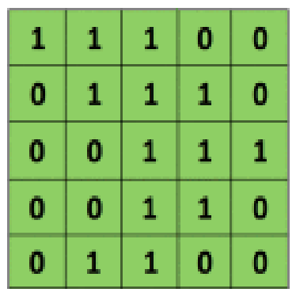

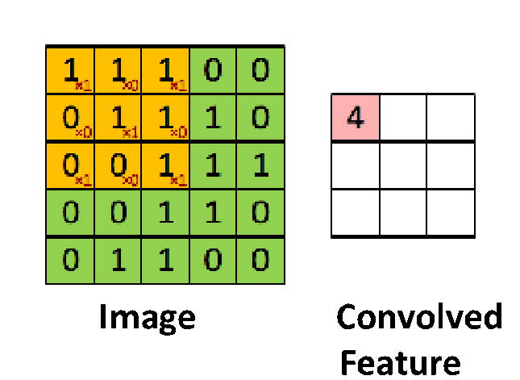

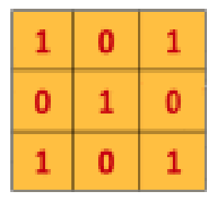

-

# →

3 X 3 Filter

Image Convolved Feature

5 X 5 Image

Image source: https://medium.com/@RaghavPrabhu/understanding-of-convolutional-neural-network-cnn-deep-learning-99760835f148

|0|0|0|0|0|0|0|0|
|---|---|---|---|---|---|---|---|
|0|100|100|100|0|0|0|0|
|0|100|100|100|0|0|0|0|
|0|100|100|100|0|0|0|0|
|0|100|100|100|0|0|0|0|
|0|100|100|100|0|0|0|0|
|0|100|100|100|0|0|0|0|
|0|0|0|0|0|0|0|0|

|100|100|100|0|0|0|
|---|---|---|---|---|---|
|100|100|100|0|0|0|
|100|100|100|0|0|0|
|100|100|100|0|0|0|
|100|100|100|0|0|0|
|100|100|100|0|0|0|

###### Padding (p) = 1

6 X 6 dimension image without padding

8 X 8 dimension matrix with padding

|0|0|0|0|0|0|0|0|
|---|---|---|---|---|---|---|---|
|0|100|100|100|0|0|0|0|
|0|100|100|100|0|0|0|0|
|0|100|100|100|0|0|0|0|
|0|100|100|100|0|0|0|0|
|0|100|100|100|0|0|0|0|
|0|100|100|100|0|0|0|0|
|0|0|0|0|0|0|0|0|

|-200|0|200|200|0|0|
|---|---|---|---|---|---|
|-300|0|300|300|0|0|
|-300|0|300|300|0|0|
|-300|0|300|300|0|0|
|-300|0|300|300|0|0|
|-200|0|200|200|0|0|

|1|0|-1|
|---|---|---|
|1|0|-1|
|| |3 X 3  1|
|---|---|
|Convolution operator| |
|0|-1|

# \*

| |3 X 3  1|
|---|---|
|Convolution operator| |

filter/Kernel

###### 6 X 6 dimension matrix 8 X 8 dimension matrix == Input Matrix dimension

||(𝒏 + 𝟐𝒑 − 𝒇 + 𝟏) 𝑿 (𝒏 + 𝟐𝒑 − 𝒇 + 𝟏)|
|---|
  |(𝒏 𝑿 𝒏) ∗ (𝒇 𝑿 𝒇)|
|---|
  Input Matrix Dimension : 𝑛 𝑥 𝑛 Filter size: 𝑓 𝑥 𝑓 Padding (𝑝) : 1  So, ( will produce (  e.g.: 6 𝑋 6 ∗ 3 𝑋 3 → 6 𝑋 6 Output matrix  Input Matrix Output Matrix  |
|---|

Given: Input Matrix Dimension : 𝑛 𝑥 𝑛

###### Filter size: 𝑓 𝑥 𝑓

Required Output Size = 𝒏 + 𝟐𝒑 − 𝒇 + 𝟏 𝑿 𝒏 + 𝟐𝒑 − 𝒇 + 𝟏 Question: What is pad size (𝒑) so that the input and output matrix are of same

sizes?

So, 𝑛 + 2𝑝 − 𝑓 + 1 = 𝑛

𝑝 = (𝑓2−1)

#### Padding (Same and Valid)

|Valid Padding:  No Padding (Padding 𝒑 = 0) So, Output size will be → 𝒏 − 𝒇 + 𝟏 𝑿 𝒏 − 𝒇 + 𝟏  Same Padding:  Output size and input size is same, this requires  appropriate padding. Hence use 𝑝 = (𝑓2−1), for calculate the required padding.  |
|---|

Stride

It is the number of pixels by which we slide the filter over the input

matrix Example:

- 1. Stride(s) = 1: Move the filter by one pixel horizontally and vertically
- 2. Stride(s) = 2: Move the filter by two pixels horizontally and vertically

Source and Reference: https://ujjwalkarn.me/2016/08/11/intuitive-explanation-convnets/

#### Stride and Padding illustration

Convolution with stride (s)=2,

Convolution with stride (s) =2 padding (p) = 0

Convolution with stride (s) =1 padding (p) = 1

padding (p) = 1

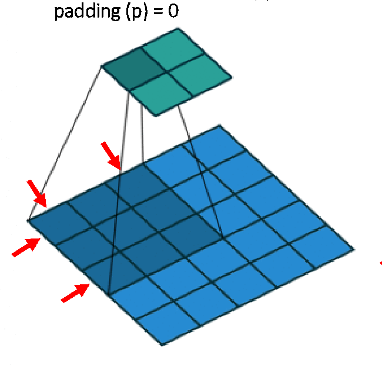

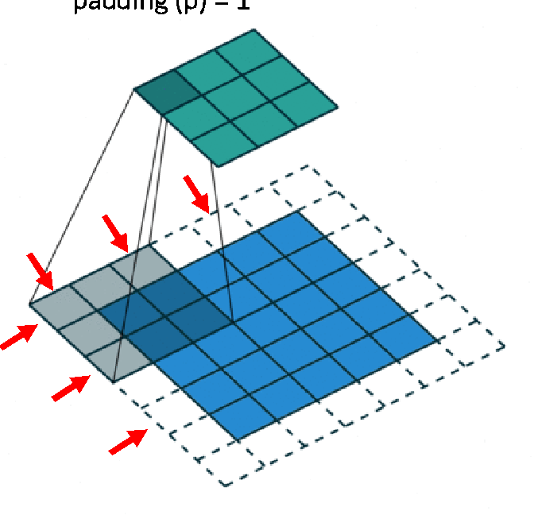

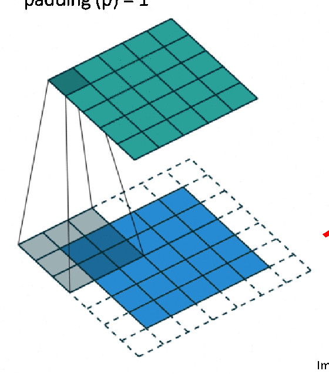

Image source: https://github.com/vdumoulin/conv_arithmetic

Output size with Stride and padding

Given: Input Matrix Dimension : 𝑛 𝑥 𝑛

###### Filter size: 𝑓 𝑥 𝑓

###### Padding:p Stride :s

###### Output Size = 𝑛 +2𝑝𝑠 −𝑓 + 𝟏 𝑿 𝑛 +2𝑝𝑠 −𝑓 + 𝟏

Example:

Input Matrix Dimension : 7 𝑥 7, Filter size: 3 𝑥 3

Padding:0, Stride :2

###### Output Size= 3 X 3

Reference and Source: http://cs230.stanford.edu/files/C4M1.pdf

- • Pooling layer is a down sampling operation which reduces the dimensionality of a matrix.

- • In other words, it reduces the number of parameters for large image, but retain the valuable information.

- • 3 types:

- • Max pooling

- • Average pooling

- • Sum pooling

###### • Max pooling:

|Max(7, 8, 1, 5) = 8|
|---|

|7|8|9|0|
|---|---|---|---|
|1|5|8|3|
|5|9|3|2|
|5|6|6|2|

|8|9|
|---|---|
|9|6|

Max pooling with 2X2 filter and Stride 2

###### • Average pooling:

|(7+8+1+5)/4 = 5.25|
|---|

|7|8|9|0|
|---|---|---|---|
|1|5|8|3|
|5|9|3|2|
|5|6|6|2|

|5.25|5|
|---|---|
|6.25|3.25|

Max pooling with 2X2 filter and Stride 2

###### • In FC layer, the output matrix after convolution layer is flattened and feed into a fully connected layer similar to ANN

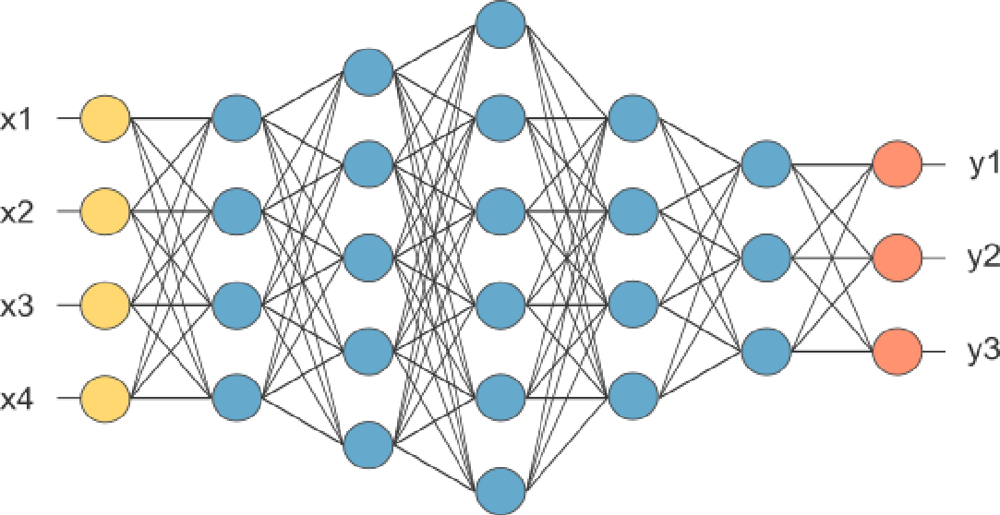

Image source ad reference: https://medium.com/@RaghavPrabhu/understanding-of-convolutional-neural-network-cnn-deep-learning-99760835f148

- • It is a traditional Multi-layer Perception/Neural Network
- • For multi-class classification, usually Softmax activation is used.
- • Softmax ensures the output
- • Output of the CONV and POOL layers represent a high level features of the Input image
- • FC layer uses this feature to classify the input image into the desired class.

Reference: https://ujjwalkarn.me/2016/08/11/intuitive-explanation-convnets/

CNN layers visualization and intuition

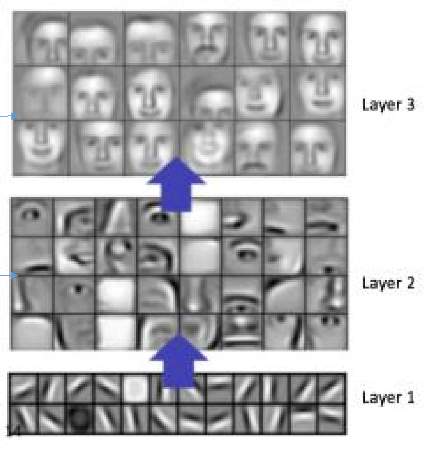

###### Example: Face recognition using CNNs

|Uses simple shapes to form higher level features like facial shapes!|
|---|

|Uses edges to detect simple shapes|
|---|

|Low level feature like edges from raw pixels|
|---|

Image Source: http://web.eecs.umich.edu/~honglak/icml09-ConvolutionalDeepBeliefNetworks.pdf

______________________________________________________________________

## Week 6 — Lecture

42028: Deep Learning and Convolutional Neural Network

# Week-6 Lecture

Convolutional Neural Network (CNN) - 2

Outline

- • Dataset preparation

- • Bias and Variance

- • Understanding Accuracy

- • Fixing Bias and Variance issues

- • Regularization

- • L1 and L2 Regularization

- • Dropouts

- • Data Augmentation – Simple and advanced

- • In case of small dataset (Range : 100 - \<100k)

- - Train set: 60%

- - Validation set: 20%

- - Test set: 20%

|Popular dataset spit choice in non-DL era! Or Small Data era!|
|---|

Or,

- - Train set: 70%
- - Test set: 30%

###### • In case of Large dataset (Range : 500K - 1M+)

###### Example: Total data sample : 1M+ Train: 98% ! Validation: 10,000 samples Test: 10,000 samples

|Popular dataset spit choice in DL era! Or BIG Data era!|
|---|

###### Train, validation and test set distribution:

Rule of Thumb: Validation and Test set should come from the same distribution

### Bias and Variance

Image Source: https://cv-tricks.com/machine-learning/bias-variance-trade-off/

###### • It is a value that allows to shift the activation function to left or right, to better fit the data

|With bias|
|---|

|Without bias|
|---|

|a = s(𝒘𝑻 𝒙)|
|---|

|a = s(𝒘𝑻 𝒙 + 𝒃)|
|---|

- • Changes in ‘w’ alters the steepness of the curve, keeping the origin at (0,0) or same/unchanged
- • Without bias we may get a poor fit to training data

|a = s(𝒘𝑻 𝒙)|
|---|

|Without bias|
|---|

- • Changes in ‘b’ shifts the curve to left or right
- • With bias the curve/line will not always pass through origin
- • We get a better fit to training data

|a = s(𝒘𝑻 𝒙 + 𝒃)|
|---|

|With bias|
|---|

Variance

- • It is the change in prediction accuracy of Machine Learning model between training data and test data.
- • Model with high variance pays a lot of attention to training data and does not generalize on the data which it hasn’t seen before.
- • With high variance, models perform very well on training data but has high error rates on test data.

### Bias and Variance effect

Reference and Source: http://snoek.ddns.net/~oliver/mysite/the-bias-variance-tradeoff.html

###### • Bayesian Optimal Error (BOE):

• Best optimal error that can be achieved

###### • Human Level performance:

- • Humans are very good at a lot of tasks
- • Can get labelled data from Humans – helps to improve the ML model performance
- • Gain insights from manual error analysis - Why did a human got it right?

Bayesian Optimal Error / Best Possible error

Accuracy

Human-level performance

Time

Medical diagnosis of fractures on arms Consider the performance by these groups:

|A|Untrained human|16 % error|
|---|---|---|
|B|General practitioner (GP)|5 % error|
|C|Orthopedic doctor (Specialist)|2 % error|
|D|Team of experienced doctors|0.4 % error|

X-ray: Stress fracture on arms

What is Human-level error?

###### • Identify High Bias:

- • High training error
- • Validation/test error nearly same as train error

###### • Identify High Variance:

- • Low training error

- • High validation/test error

- • High Bias Low Variance: Models are consistent but inaccurate

- • High Bias High Variance: Models are inconsistent and inaccurate

|• Low Bias and Low Variance: Models are consistent and accurate|
|---|

- • Low Bias and High Variance: Models are somewhat accurate but inconsistent on average

- • High Bias: Due to simple ML model and high training error.

- • Potential things to try :

- • Increase features: this will help in generalizing dataset

- • Make ML model more complicated

- • Decrease Regularization parameter

- • High Variance: Due to a ML model which is fitting most of the training dataset - overfitting.

- • Potential things to try :

- • Increase dataset size

- • Reduce input features

- • Increasing Regularization parameter

- • Regularization is a technique which makes slight modifications to the learning algorithm such that the model generalizes better.

- • Improves the model’s performance on the unseen data as well.

- • Popular techniques:

- • L2 and L1 regularization

- • Dropout

Source and reference: https://www.analyticsvidhya.com/blog/2018/04/fundamentals-deep-learning-regularization-techniques/

- • L2 and L1 regularization are common types and help in reducing the overfitting issue
- • Idea: Update the loss/cost function by adding a regularization term

Loss function = Loss + Regularization term (l)

- • Duetol,theweightmatriceswilldecrease,assuminganeuralnetworkwith

smaller weight matrices leads to simpler model

- • In Deep Learning, Regularization penalizes the weight matrices of the nodes

###### • L2 regularization:

|l 2𝑚  ∗ 𝑤  |
|---|

Cost func on = Loss + lis a hyper-parameter

Also known as weight decay, as it forces the weight to decay towards zero, but not exactly zero.

- • L1 regularization:

Cost func on = Loss +

|l 2𝑚  ∗ 𝑤  |
|---|

- • Penalize the absolute value of the ‘w’

- • Weight may reduce to zero

- • Useful in compressing a model

- • It produces good results and most popular regularization technique

- • At every iteration it randomly selects and drops some nodes and remove all the connections to and from them

- • Each iteration has a different set of nodes

###### Example Deep NN Example Deep NN with Dropout

Data Augmentation

- • Another simple way to reduce overfitting is to increase size of training dataset!
- • Increase the size of training data by creating more sample using the existing training set and applying the following simple operations:
- • Flip
- • Rotate
- • Scale
- • Crop
- • Translate
- • Gaussian Noise

Cutout:

Simple regularization technique of randomly masking out square regions of input during training

Key Parameters:

- - Patch size: 16X16 to 64X64
- - Fill Value: 0(black) or mean
- - Patches: 1-3 per image

Original Image After CutOut

Cutout:

Example - Cutout applied to CIFAR-10 dataset

Mixup:

Trains a neural network on convex combinations of pairs of examples and their labels. By doing so, mixup regularizes the neural network to favour simple linear behaviour in-between training examples

##### +

##### =

Image A (λ=0.55)

Blended Output

Image B (1-λ=0.45)

Reference: https://arxiv.org/pdf/1710.09412 | Zhang et. Al ICLR 2018

CutMix:

In CutMix augmentation strategy: patches are cut and pasted among training image; ground truth labels are also mixed proportionally to the area of the patch.

##### +

##### =

Image A

Pasted Patch

Image B (Patch Donor)

#### Overview of Mixup, Cutout and CutMix

#### RandAugment:

Example images augment by RandAugment

Reference: https://arxiv.org/pdf/1909.13719 | Cubuk et. Al, 2019

###### • Generative Adversarial Networks (GANs):

- - Among the hottest topic is DL
- - Able to generate images which look similar to the original ones
- - Proven to be very effective

Original image from MNIST GAN generated

Source and reference: https://towardsdatascience.com/advanced-data-augmentation-strategies-383226cd11ba Image Source: https://towardsdatascience.com/having-fun-with-deep-convolutional-gans-f4f8393686ed

Data Augmentation

###### • Advanced data augmentation techniques:

• Neural Style transfer:

- - Using CNN to separate style
- - transfer style to different image

Source and reference: https://towardsdatascience.com/advanced-data-augmentation-strategies-383226cd11ba

______________________________________________________________________

## Week 7 — Lecture

42028: Deep Learning and Convolutional Neural Network

# Week-7 Lecture

Convolutional Neural Network (CNN) - 3

Outline

- • Transfer Learning strategies

- • Classic CNN architectures case studies

- • AlexNet

- • Inception/GoogleNet

- • Understanding Inception and ResNet

- • 1X1 Convolution and it’s use

- • Motivation behind Inception

- • Inception V1, V2 and V3 Modules

- • Introduction to ResNet

- • Motivation behind ResNet

- • Residual Block

Transfer Learning

- • Knowledge acquired while solving one task, can be used to solve related tasks.

- • Example:

- • You know how to ride a Bi-cycle → You can learn how to ride a Motorbike

- • You know how to use a Tablet → You can easily learn how to use a Laptop/desktop

- • Similar to the way humans apply knowledge acquired from one task to solve a new but similar/related task.

- • We learned how to read in Year-1 in literacy class. Reading skills acquired in the literacy classes made it easy to understand Physics in Year-9.

Transfer Learning Benefits

- 1. Less training data required: Don’t have enough data to train a Deep Learning model from scratch. Model trained using a large (similar) dataset can be used.
- 2. Faster training : Training can converge faster, due the use to existing knowledge (weights) to start with rather than from scratch.
- 3. Better model generalization: Model is trained to identify features which can be applied to new contexts.

Source and reference: https://cs231n.github.io/transfer-learning/ https://missinglink.ai/guides/neural-network-concepts/transfer-learning-overview/

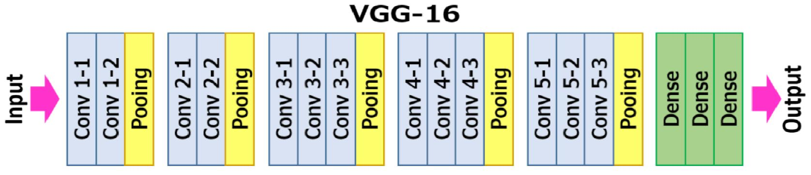

#### Option-1: (VGG-16 considered as an example) Use pre-trained (ImageNet) model for prediction, without any training.

→Useful when your dataset distribution is similar to ImageNet, with small

number of samples.

###### Train

|Freeze|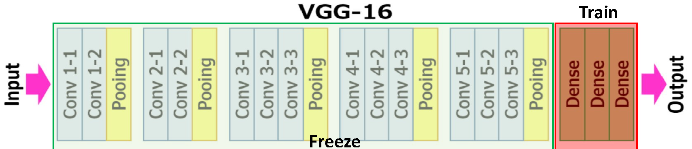|
|---|---|

#### Option-2: (VGG-16 considered as an example) Train Full-Connected layer, Use CONV layers for feature extraction

→Useful when your dataset distribution is similar to ImageNet (or original dataset), but number of classes are different and your dataset is small.

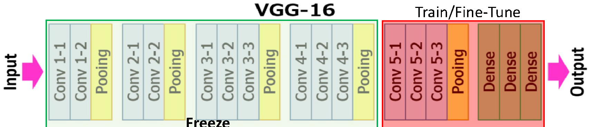

Train/Fine-Tune

|Freeze|
|---|

| |
|---|

###### Option-3: (VGG-16 considered as an example)

###### Partially Train CONV layers (usually last layer(s) which have specialised

###### features) + Full Connection (FC) layer (with modifications)

→Useful when your dataset distribution is not similar to ImageNet (or original dataset), number of classes are different and your dataset is small.

|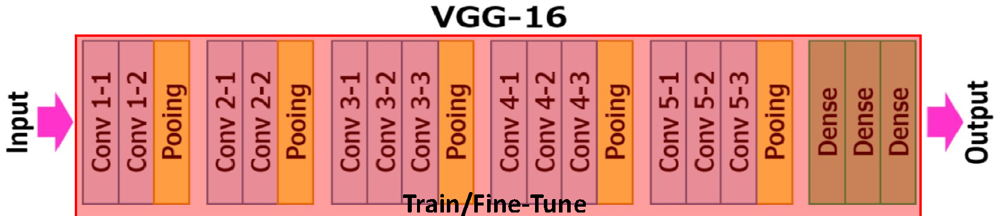  Train/Fine-Tune|
|---|

#### Option-4: (VGG-16 considered as an example) Train all the CONV layers + Full Connection (FC) layer (with modifications)

→Useful when your dataset distribution is not similar to ImageNet, number of classes are different, your is dataset large and the task is complex.

### Classic CNN Architectures

- • Similar architecture as LeNet by Yann LeCunn et al. but deeper with more layers

- • Simple architecture:

- • CONV : 5 layers

- • FC: 3 layer

- • Max pooling

- • Dropout

- • Accuracy: top-5 test error rate of 15.3%

- • Winner of ILSVRC 2012!

- • First CNN to be successful on a very big dataset!

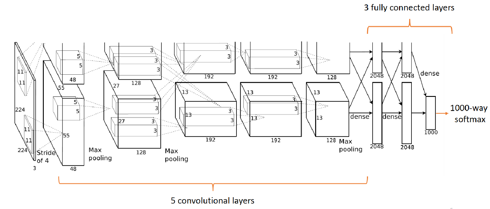

Input: 224x224x3 image

##### CONV1 → CONV2 → CONV3 → CONV4 → CONV5 → FC1 → FC2 → FC3

4096 Neuron

4096 Neuron

Filters: 96 Dim: 11x11 Stride: 4 Pad: 0

Filters: 256 Dim: 5x5 Stride: 1 Pad: 2

Filters: 384 Dim: 3x3 Stride: 1 Pad: 1

Filters: 384 Dim: 3x3 Stride: 1 Pad: 1

Filters: 256 Dim: 3x3 Stride: 1 Pad: 1

1000 Neuron

Activations: Relu after each CONV and FC layer Optimizer: SGD with Momentum Regularization: Dropout in FC1 and FC2 Total Trainable parameter: ~60Million Training settings: 2 X Nvidia GTX 580 3GB GPUs for 5-6days!

- • Accuracy: top-5 test error rate of 6.7%
- • Close to human level performance
- • Winner of ILSVRC 2014!
- • 22 layer Deep CNN
- • Number of trainable parameters: 4 Million (Alexnet ~ 60M), Significantly reduced
- • A novel inception module was introduced.
- • Optimizer: RMSProp

Source and reference: https://medium.com/@sidereal/cnns-architectures-lenet-alexnet-vgg-googlenet-resnet-and-more-666091488df5

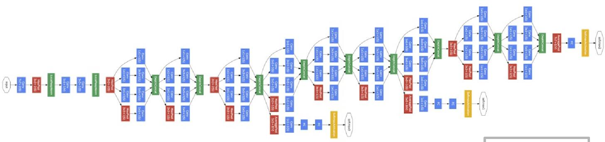

###### Inception Module

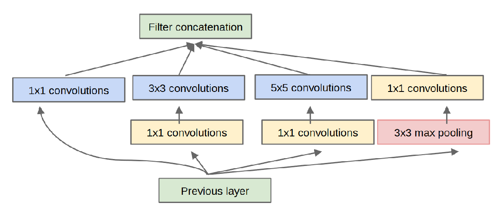

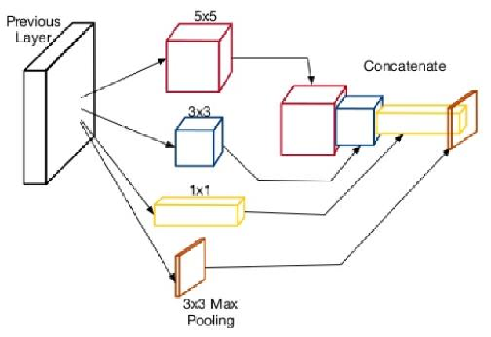

## Understanding Inception and ResNet

|100|100|100|0|0|0|
|---|---|---|---|---|---|
|100|100|100|0|0|0|
|100|100|100|0|0|0|
|100|100|100|0|0|0|
|100|100|100|0|0|0|
|100|100|100|0|0|0|

|300|300|300|0|0|0|
|---|---|---|---|---|---|
|300|300|300|0|0|0|
|300|300|300|0|0|0|
|300|300|300|0|0|0|
|300|300|300|0|0|0|
|300|300|300|0|0|0|

###### Is this useful?

|3|
|---|

-

| | |
|---|---|
|Convolution operator| |

1 X 1 filter/Kernel

6 X 6 X 1 dimension volume

6 X 6 X 1 dimension image

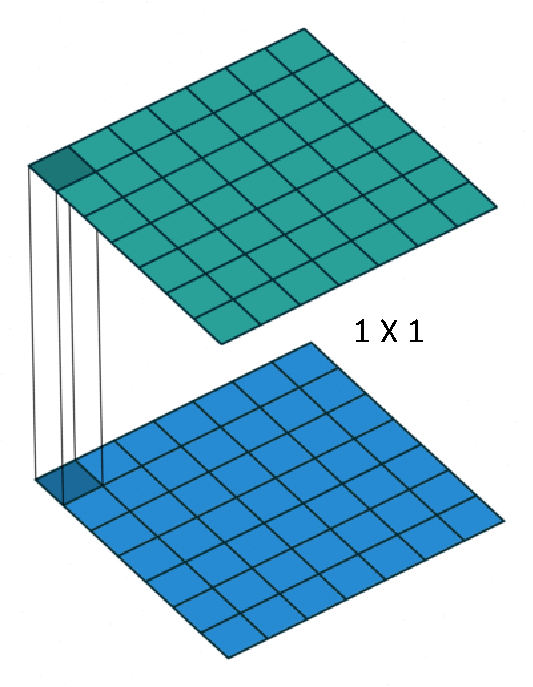

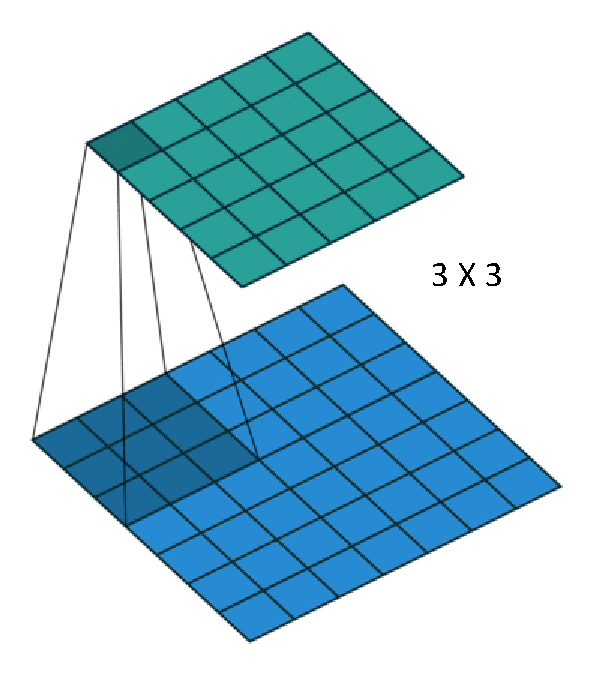

3 X 3

1 X 1

Images source: https://iamaaditya.github.io/2016/03/one-by-one-convolution/

###### + Relu

-

:

(6 X 6 )

X 32 (# of filters)

6 X 6 X 64

1 X 1 X 64

X 32 (# of filters)

#### So, (6 X 6 X 64) → (6 X 6 X 32) … reduced!

###### Relu

1 X 1 Conv 128 filters

64 X 64 X 256 64 X 64 X 128

- - Large filter preferred for large objects
- - Small filters for small objects
- - Large variation in object size
- - How to choose the right filter size?

Images source: https://towardsdatascience.com/a-simple-guide-to-the-versions-of-the-inception-network-7fc52b863202

|Designing CNN requires:  - Deciding filter size and number - Number and type of layers etc. |
|---|

|Inception suggests:  - Use filters with different size together! - Use different types of layers (CONV, POOL etc.) together Result → Complicated Architecture! & better performance |
|---|

###### 28 X 28 X 64

|1X1|
|---|

|3X3|
|---|

64

| |
|---|

128

28

32 28 32

|5X5|
|---|

28 X 28 X 192 28 X 28 X 256 Max-Pooling

Reference, Images source: https://towardsdatascience.com/a-simple-guide-to-the-versions-of-the-inception-network-7fc52b863202

Computation cost

28 X 28 X 32

|5X5|
|---|

28

32 28

5x5 CONV #Filter: 32

28 X 28 X 32

28 X 28 X 192

###### Computation Cost: 28 X 28 X 32 X 5 X 5 X 192  120M multiplications! Quite expensive !

Reduce Computation cost using 1X1 CONV

|1X1|
|---|

28 X 28 X 32

|5X5|
|---|

28

32 28

1 X 1 X 192 #Filters: 16

5 X 5 X 16 CONV #Filter: 32

28 X 28 X 32

###### 28 X 28 X 16

28 X 28 X 192

Computation Cost: 1X1: 28 X 28 X 16 X 192  2.4M multiplications! 5X5: 28 X 28 X 32 X 5 X 5 X 16  10M multiplications! Total : 12.4M multiplications!  Reduced by 10 times!

## Bottleneck Layer

|192|
|---|

|32|
|---|

|16|
|---|

|Bottleneck|
|---|

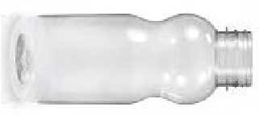

Image adapted from and Reference: http://www.pabloruizruiz10.com/resources/CNNs/1x1Convolutions.pdf

## Inception Module V1

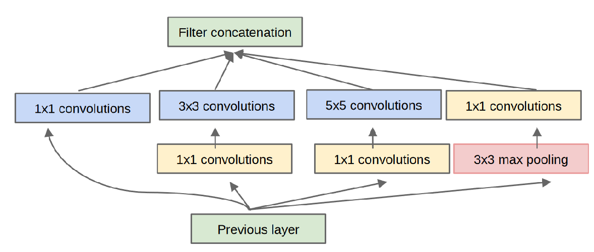

|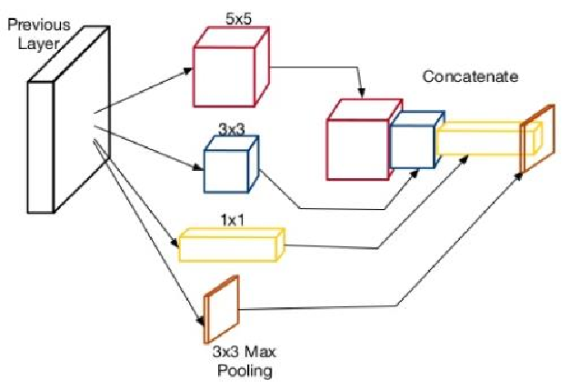|
|---|

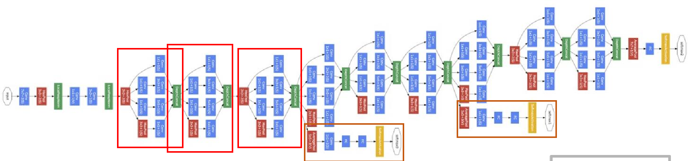

| | | |
|---|---|---|

| |
|---|

| |
|---|

| |
|---|

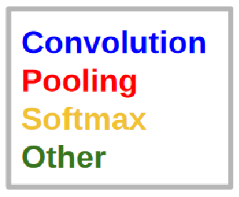

###### GoogleNet(2014): 9 Inception modules stacked together

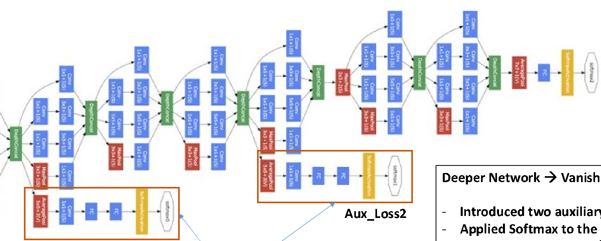

| |
|---|

|Deeper Network → Vanishing Gradient  - Introduced two auxiliary classifier - Applied Softmax to the output - Compute Auxiliary loss/cost - Only used for training |
|---|

| |
|---|

Aux_Loss2

Aux_Loss1

|Auxiliary Classifiers|
|---|

|Total Loss/cost = Real_Loss + 0.3 X Aux_Loss1 + 0.3 X Aux_Loss1|
|---|

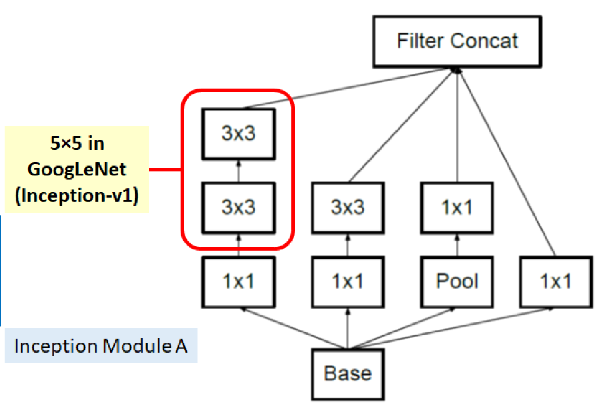

|Authors suggested 3 different modules  -Factorizing Convolutions: Reducing the number of parameters|
|---|

|1 layer of 5×5 filter, #parameters = 5×5=25 2 layers of 3×3 filters, #parameters = 3×3+3×3=18 Number of parameters is reduced by 28% |
|---|

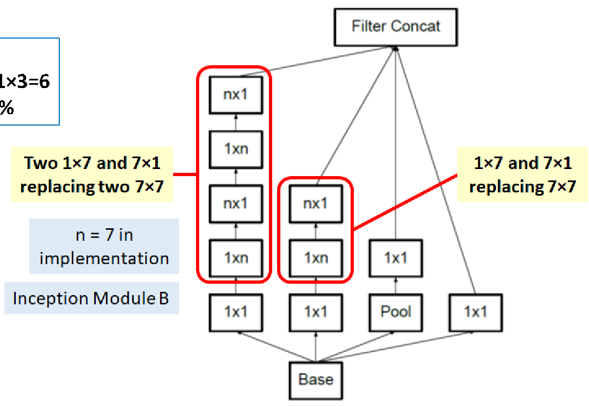

|3×3 filter, #parameters = 3×3=9  3×1 and 1×3 filters, #parameters = 3×1+1×3=6  Number of parameters is reduced by 33%|
|---|

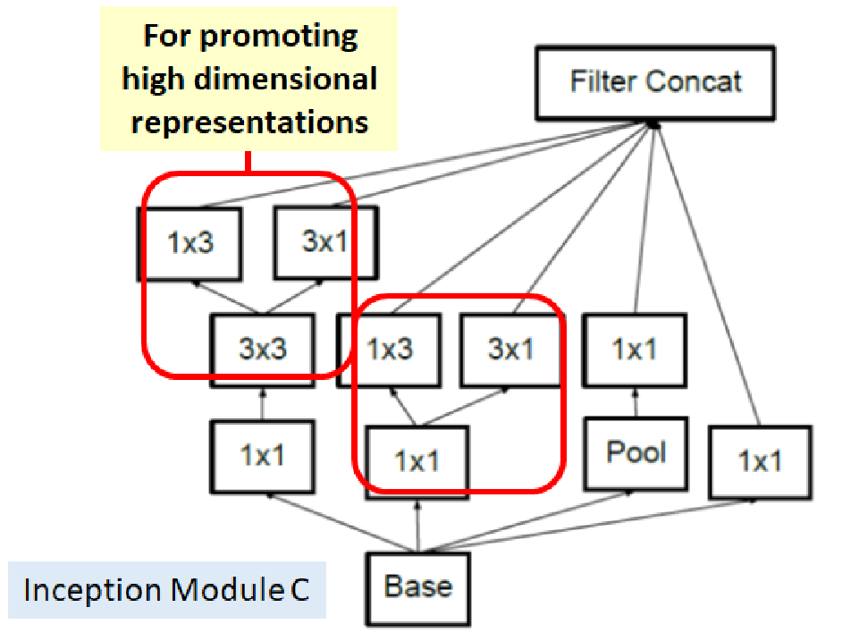

## Inception V3 Architecture

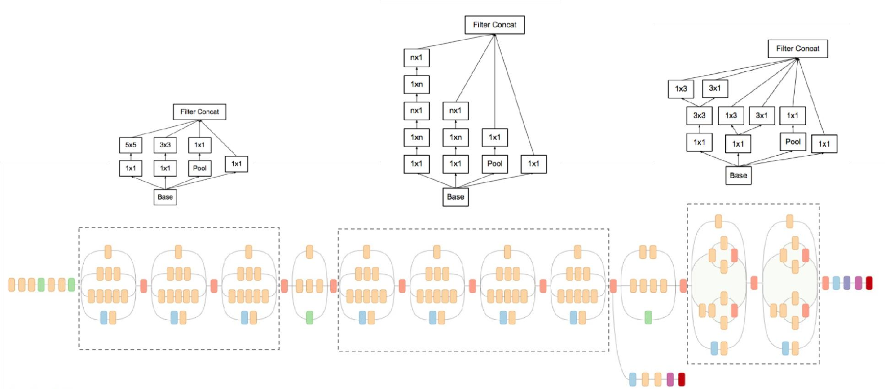

Image Source and reference: https://www.jeremyjordan.me/convnet-architectures/

For More details: https://cloud.google.com/tpu/docs/inception-v3-advanced

- - Deep Residual networks (ResNet) → Skip connections
- - Enabled the development of the much deeper networks (100s of layers!)
- - ResNet is composed of Residual Blocks were introduced!
- - Degradation problem: Adding more layers eventually have negative effect on the final performance.

Image Source and reference: https://www.jeremyjordan.me/convnet-architectures/

What wrong with this curves? Overfitting?

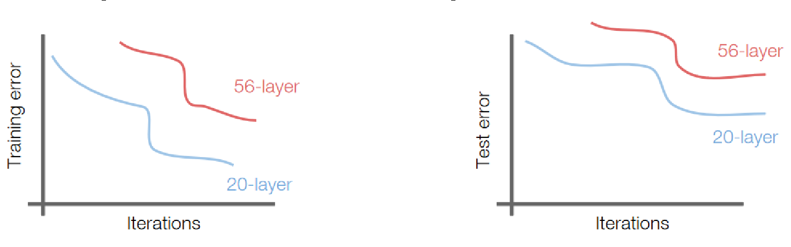

- - 56 layer model is not better than the 20 layers!
- - What happens when we keep add more layers to a plain CNN to make it deeper?

###### In principle deeper model should perform better than shallow CNNs

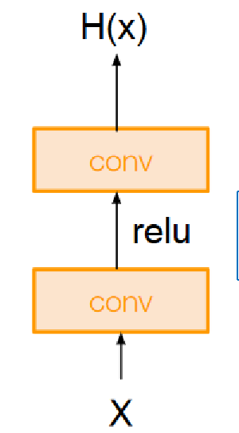

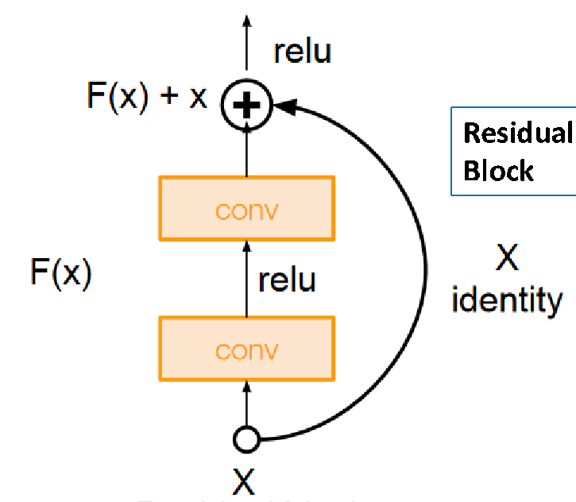

|Residual  Block|
|---|

|Plain Layers|
|---|

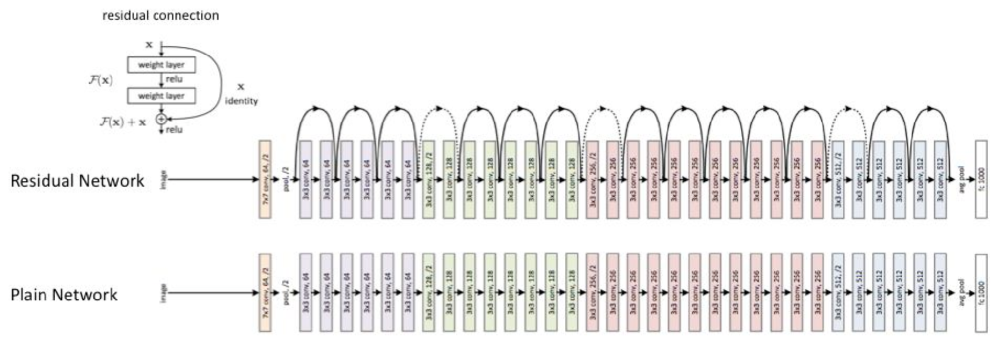

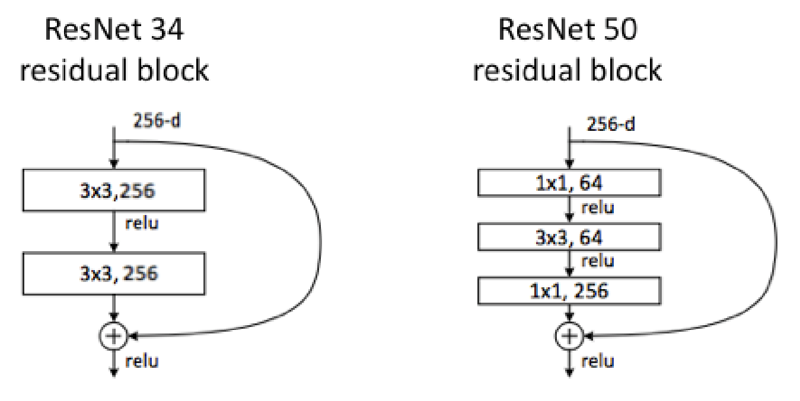

## Summary

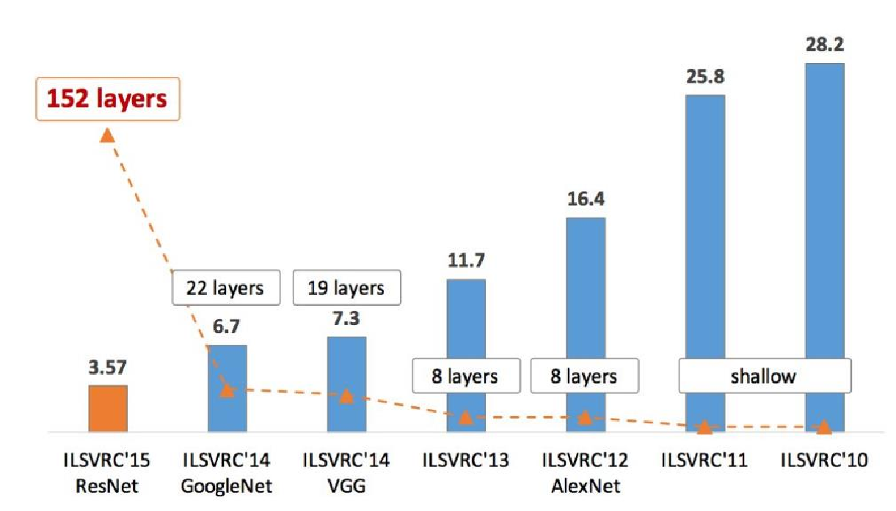

Reference and image Source: http://cs231n.stanford.edu/slides/2017/cs231n_2017_lecture9.pdf

- • 15+ million labelled high-resolution images
- • 22000 categories
- • ILSVRC (Large Scale Visual Recognition Challenge) used a subset of ImageNet:
- • ~1000 images per category
- • 1000 categories
- • Train: 1.2 million images
- • Validation: 50k images
- • Test : 150k images

Source and reference: http://www.image-net.org/ http://cvml.ist.ac.at/courses/DLWT_W17/material/AlexNet.pdf

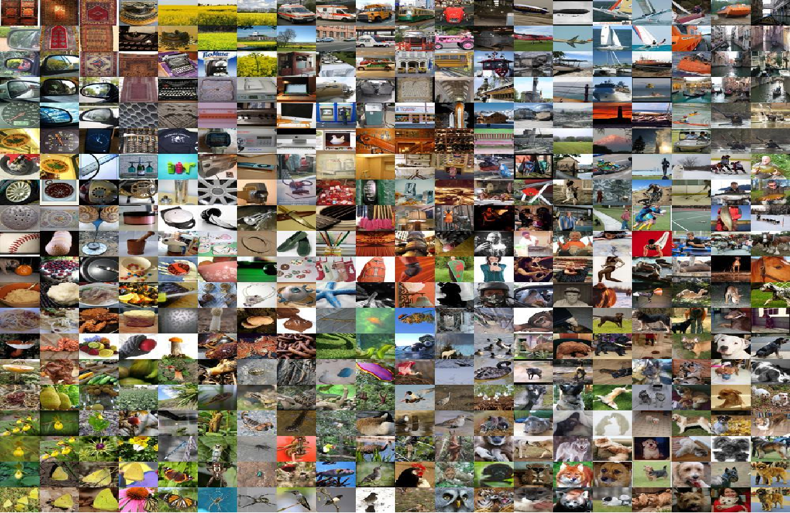

###### Source and reference https://cs.stanford.edu/people/karpathy/cnnembed/cnn_embed_full_1k.jpg

ImageNet Dataset Results:

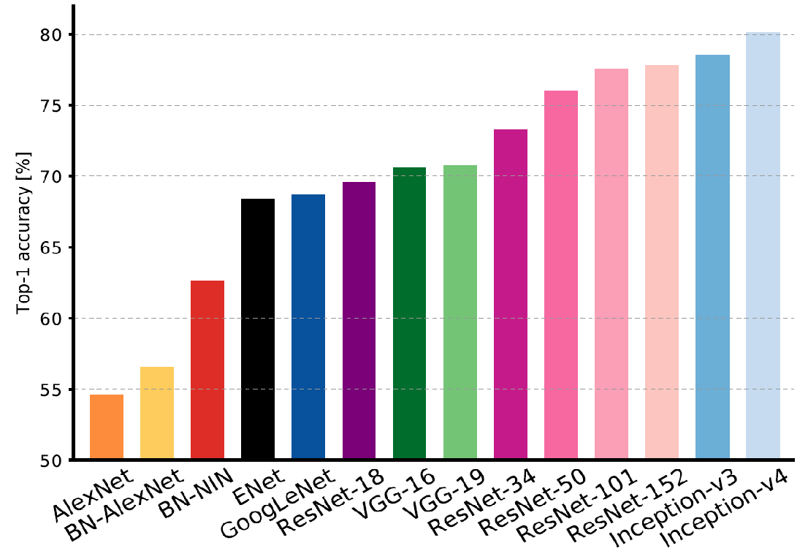

Image Source and reference: An Analysis of Deep Neural Network Models for Practical Applications, 2017, https://arxiv.org/abs/1605.07678

ImageNet Dataset Results (current):

|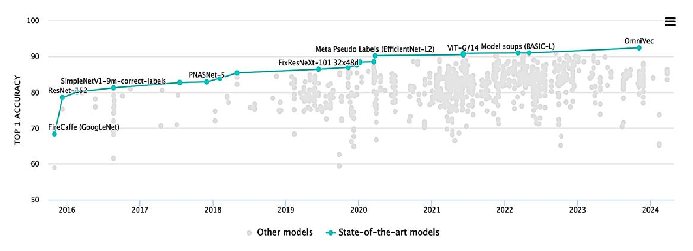|
|---|

Image Source and reference: https://paperswithcode.com/sota/image-classification-on-imagenet

______________________________________________________________________

## Week 8 — Lecture

42028: Deep Learning and Convolutional Neural Network

# Week-8 Lecture

Object Detection -1

Outline

- • Introduction to Object Detection
- • Datasets and Performance metrics
- • Taxonomy
- • Classification and Localization task
- • Object detection as a regression problem
- • Object detection as a classification problem
- • Case study: RCNN family
- • Image annotation

Introduction

Image Classification

Image Classification Object Detection

- Localization Instance Segmentation

| |
|---|

|DOG|
|---|

|CAT|
|---|

|DOG|
|---|

|CAT|
|---|

|DOG|
|---|

DOG

Single Object

Multiple Object

- • The PASCAL Visual Object Classification (PASCAL VOC) is a popular dataset for object detection, classification and segmentation.

- • 20 categories

- • Link: http://host.robots.ox.ac.uk/pascal/VOC/

- • ImageNet has released an object detection dataset in 2013

- • Train set: 500,000 images, 200 categories.

- • Not very popular due to large number of classes and dataset size!

- • Large number classes complicates the task

Images source: https://towardsdatascience.com/evolution-of-object-detection-and-localization-algorithms-e241021d8bad

###### Dataset Comparison

Images source: http://image-net.org/challenges/LSVRC/2014/

###### • Intersection over Union (IoU): Intersection over Union is a metric used for the evaluation of an object detector, i.e. how good is the predicted bounding box for an object detected closely matches

Reference: https://www.pyimagesearch.com/2016/11/07/intersection-over-union-iou-for-object-detection/

## Microsoft COCO Dataset

||
|---|

Source: https://cocodataset.org/#home

## Microsoft COCO Evaluation metrics

Source: https://cocodataset.org/#detection-eval

## Taxonomy of Object detectors

|Object Detection|
|---|

|Network type|
|---|

|Data type|
|---|

|Single stage| |
|---|---|
| | |

|Two Stage| |
|---|---|
| | |

|3D Object Detector|
|---|

|2D Object detectors|
|---|

|Regression/Classification Based|
|---|

|Region Proposal Based| |
|---|---|
| | |

|Monocular Image|
|---|

|Point Cloud|
|---|

|Point Nets|
|---|

|RCNN family|
|---|

|SSD|
|---|

|Yolo|
|---|

Refernce: https://medium.com/@saifhajsalem12/object-detection-state-of-the-art-and-modern-approaches-eaa5e6bfb46b

Image Classification

Image Classification Object Detection

- Localization Instance Segmentation

| |
|---|

|DOG|
|---|

|CAT|
|---|

|DOG|
|---|

|CAT|
|---|

|DOG|
|---|

DOG

Single Object

Multiple Object

##### Classification Task:

Input : Image Output: Label Performance Evaluation: Accuracy

##### Output : Dog

##### Localization Task:

| |
|---|

Input : Image Output: Bounding Box in the image

(x, y, Ht, Wd) or (x, y, x’, y’) Performance Evaluation: IoU

##### Output : (x, y, Ht, Wd)

###### Output : 4 numbers (x’, y’, Ht’, Wd’)

| |
|---|

###### Calculate Loss L2 Loss

###### CNN

###### Ground Truth: 4 numbers (x, y, Ht, Wd)

Input Image

###### Input Image

|We need to modify this CNN pipeline to output Class Label and Bounding Box (4 numbers)|
|---|

###### Pre-trained model or ImageNet, AlexNet, VGG16, ResNet, etc. Classification Head

Softmax Loss

#### + MultitaskLoss

Regression Head L2 Loss

Input Image

Image Source and Reference: http://cs231n.stanford.edu/slides/2016/winter1516_lecture8.pdf

Potential locations for Regression head in CNN

###### After CONV Layer, Before the FC layer After Last FC layer

Input Image

Task: Object Detection Problem

Image Classification

Image Classification Object Detection

- Localization Instance Segmentation

| |
|---|

|DOG|
|---|

|CAT|
|---|

|DOG|
|---|

|CAT|
|---|

|DOG|
|---|

DOG

Single Object

Multiple Object

Detection as a regression problem

##### Output : Dog, (x, y, Ht, Wd)

||
|---|

##### Output : Dog, (x, y, Ht, Wd)

##### Cat, (x, y, Ht, Wd) Cat, (x, y, Ht, Wd)

- 1. Apply Sliding Window technique
- 2. Apply CNN to different Windows and get a prediction

##### Output : Dog? No Cat? No

|CNN|
|---|

##### Background? Yes

- 1. Apply Sliding Window technique
- 2. Apply CNN to different Windows and get a prediction

##### Output : Dog? No Cat? Yes Background? No

|CNN|
|---|

- 1. Apply Sliding Window technique
- 2. Apply CNN to different Windows and get a prediction

##### Output : Dog? No Cat? Yes Background? No

|CNN|
|---|

###### Issue with Sliding Window technique

- 1. Apply CNN on large number of windows
- 2. Multiple scale and locations of windows
- 3. Inaccurate bounding boxes
- 4. Computationally expensive

###### Region Proposal Technique:

- • Find blobs in the image that are most likely to contain objects
- • E.g: Selective search à ~1000-2000 region proposals using CPU!

Source and Reference: http://cs231n.stanford.edu/slides/2016/winter1516_lecture8.pdf

Case Study: R-CNN

Linear Regression for bounding box offsets

###### R-CNN: Region based CNN

Classify each region with SVMs

|SVMs|
|---|

|Bbox Reg|
|---|

|SVMs|
|---|

|Bbox Reg|
|---|

- 1. Resized to match the input to CNN requirement.
- 2. mAP: 62.4% for 2007 PASCAL VOC
- 3. Problem: Very Slow!

Pass each region through ConvNet

|SVMs|
|---|

|Bbox Reg|
|---|

|Conv -Net|
|---|

|Conv -Net|
|---|

|Conv -Net|
|---|

Warped image regions

Region-of-interest (ROI) from proposal method around ~2K

|Linear + Softmax|
|---|

Object category

|Linear|
|---|

Box offset

|CNN|
|---|

Per-Region Network

###### Slow RCNN

| | | |
|---|---|---|
| | | |

Crop + Resize features

Region of Interest (ROIs) from proposal method

Run whole image through ConvNet

|ConvNet|
|---|

Source and Reference: https://cs231n.stanford.edu/slides/2022/lecture_9_jiajun.pdf

- 1. Reduce computation
- 2. ROIs from feature maps using selective search
- 3. mAP: 70% for 2007 PASCAL VOC

Case Study: FASTER- R-CNN

- 1. Use CNNs to make proposals

- 2. Introduced RPN (Region Proposal Network)

- 3. mAP: 78.8% for 2007 PASCAL VOC

- • RCNN à Look at every patch one by one

- • Fast R-CNN à Look once, and then inspect patches on feature map

- • Faster R-CNN à Propose patches using a neural network (RPN)

|Feature R-CNN Fast R-CNN Fater R-CNN|
|---|
|Region proposal Selective search Selective search RPN (learned)|
|CNN Usage Per region Once per image Once per image|
|Speed Very slow Faster Can work in realtime|
|Training Multi-stage, discreate  Partially en-to-end Fully end-to-end|
|Accuracy Good Better Best of all three|

## Object Detection Techniques History

Images source: https://arxiv.org/pdf/1807.05511.pdf

Image Annotation for Object Detection

|  PASCAL VOC Format|
|---|

| |
|---|

Image Sources: https://en.wikipedia.org/wiki/Kangaroo#/media/File:RedRoo.JPG https://towardsdatascience.com/coco-data-format-for-object-detection-a4c5eaf518c5

______________________________________________________________________

## Week 9 — Lecture

42028: Deep Learning and Convolutional Neural Network

# Week-9 Lecture

Object Detection -2

Outline

- • Object detection techniques recap
- • Strategies for predicting bounding boxes
- • Non-Maxima suppression (NMS)
- • Anchor boxes
- • Case study:
- • Yolo (You Look Only Once)
- • SSD (Single Shot Detector)
- • Object detection state-of-the-art

## Taxonomy of Object detectors

|Object Detection|
|---|

|Network type|
|---|

|Data type|
|---|

|Single stage| |
|---|---|
| | |

|Two Stage| |
|---|---|
| | |

|3D Object Detector|
|---|

|2D Object detectors|
|---|

|Regression/Classification Based|
|---|

|Region Proposal Based| |
|---|---|
| | |

|Monocular Image|
|---|

|Point Cloud|
|---|

|Point Nets|
|---|

|RCNN family|
|---|

|SSD|
|---|

|Yolo|
|---|

Refernce: https://medium.com/@saifhajsalem12/object-detection-state-of-the-art-and-modern-approaches-eaa5e6bfb46b

## Object Detection Techniques History

| |
|---|

###### Sliding Window technique

| |
|---|

||
|---|

| |
|---|

#### Sliding Window technique

- - Crop images and classify using CNN
- - Try different sizes of the sliding window Issues:
- - Slow
- - Computationally very expensive
- - Less accurate

#### Region Proposals

Currently:

Task:

- - Sliding Window

- - Selective Search

- - Region Proposals

- Predict Bounding boxes from CNN

Source and Reference: http://cs231n.stanford.edu/slides/2016/winter1516_lecture8.pdf

- - Place a grid over the image
- - Apply image classification and localization to each of the grid cells

| | | |
|---|---|---|
| || |
| | | |

- Input:
- - Image: (ht x wd x 3) Target:
- - Bounding box information for each object
- - Class for each object

###### Class : {car, bike}

##### Target:

Y = {po, x, y, h, w, c1, c2} for each cell e.g:

- Cell(1,1) = {0, ?, ?, ?, ?, ?, ?} :

- Cell(2,1) = {1, x, y, h, t, 1, 0}

- Cell(2,2) = {0, ?, ?, ?, ?, ?, ?}

- Cell(2,3) = {1, x, y, h, t, 1, 0} :

- Cell(3,3) = {0, ?, ?, ?, ?, ?, ?}

###### Class : {car, bike}

###### Idea: Take the mid-point of the object and Assign it to a grid cell based on its location

Images source: https://yallacompare.com/car-deals/uae/en/two-cars-one-dnajaguar-xe-300-sport-and-xe-sv-project-8/ Source and Reference: https://www.youtube.com/watch?v=gKreZOUi-O0

##### Target output vector: 3 X 3 X 7 3 X 3: Grid size 7: (5 + Number-of-Classes)

| | | |
|---|---|---|
| | | |
| | | |

###### Class : {car, bike}

3 X 3 X 7

#### Training Strategy:

Target: Y

Input: X

| | | |
|---|---|---|
| | | |
| | | |

|CNN|
|---|

3 X 3 X 7

Class : {car, bike}

In practice: The grid is finer, 19 X 19 instead of 3 X 3 So, Target will be of size: 19 X 19 X 7 Works well for non-overlapping objects

| | | | | | | | | | | | | | | | | | |
|---|---|---|---|---|---|---|---|---|---|---|---|---|---|---|---|---|---|
| | | | | | | | | | | | | | | | | | |
| | | | | | | | | | | | | | | | | | |
| | | | | | | | | | | | | | | | | | |
| | | | | | | | | | | | | | | | | | |
| | | | | | | | | | | | | | | | | | |
| | | | | | | | | | | | | | | | | | |
| | | | | | | | | | | | | | | | | | |
| | | | | | | | | | | | | | | | | | |
| | | | | | | | | | | | | | | | | | |
| | | | | | | | | | | | | | | | | | |
| | | | | | | | | | | | | | | | | | |
| | | | | | | | | | | | | | | | | | |
| | | | | | | | | | | | | | | | | | |
| | | | | | | | | | | | | | | | | | |
| | | | | | | | | | | | | | | | | | |
| | | | | | | | | | | | | | | | | | |
| | | | | | | | | | | | | | | | | | |
| | || | | | | | | | | | | | | | | |

###### Issues with Object Detection:

- 1. Each object has one midpoint
- 2. Each cells are subjected to object localization + classification
- 3. Hence, neighbouring cells might assume that it has the mid-point
- 4. Hence, Multiple detection bounding box

###### Sample prediction: For C1: Box1: 0.9 (Confidence Score) Box2: 0.79 Box3: 0.82

|C1| |
|---|---|

###### For C2: Box1: 0.92 Box2: 0.85 Box3: 0.7

|C2|
|---|
| |

NMS cleans/removes the multiple detection and only keeps the one with very high confidence

- 1. Check the probabilities of each detection and keep ones with score > Threshold (0.7)
- 2. For remaining boxes:

|C1| |
|---|---|

- - Box with highest score is the detection results.
- - Discard any remaining boxes with IoU > 0.5 with final detected box, i.e: overlap with the box with highest score.

|C2|
|---|
| |

YOLO: You Only Look Once Algorithm

###### Challenges with overlapping objects

- - Each grid cell detect only one object
- - For multiple overlapping objects, Mid point are on the same grid cell

###### So, Currently the Target Y = {1, x, y, h, w, C1, C2}, As the mid-points for both the objects are on the same grid cell, only one of the objects will be associated

Anchor Box 1 Anchor Box 2

| | | |
|---|---|---|
| | | |
| | | |
| | | |
| | | |

###### Anchor Box 1

###### Associate each object to:

Predicted BB

- 1. A cell which contains its mid-point and
- 2. Anchor box for the cell with highest IoU

Anchor Box 1

Calculate the IoU of Anchor boxes and predicted BB

Anchor Box 1 Anchor Box 2

Similar Shape

###### So, with Anchor boxes: Target Y = {Po, x, y, h, w, C1, C2, Po, x, y, h, w, C1, C2},

Anchor Box 1 Anchor Box 2

| | | | | | | | | | | | | | | | | | |
|---|---|---|---|---|---|---|---|---|---|---|---|---|---|---|---|---|---|
| | | | | | | | | | | | | | | | | | |
| | | | | | | | | | | | | | | | | | |
| | | | | | | | | | | | | | | | | | |
| | | | | | | | | | | | | | | | | | |
| | | | | | | | | | | | | | | | | | |
| | | | | | | | | | | | | | | | | | |
| | | | | | | | | | | | | | | | | | |
| | | | | | | | | | | | | | | | | | |
| | | | | | | | | | | | | | | | | | |
| | | | | | | | | | | | | | | | | | |
| | | | | | | | | | | | | | | | | | |
| | | | | | | | | | | | | | | | | | |
| | | | | | | | | | | | | | | | | | |
| | | | | | | | | | | | | | | | | | |
| | | | | | | | | | | | | | | | | | |
| | | | | | | | | | | | | | | | | | |
| | | | | | | | | | | | | | | | | | |
| | | | | | | | | | | | | | | || | |

|Training Set|
|---|

- Anchor Box 1
- Anchor Box 2

|Y = {Po, x, y, h, w, C1, C2, Po, x, y, h, w, C1, C2} Cell(1,1) = {0, ?, ?, ?, ?, ?, ?, 0, ?, ?, ?, ?, ?, ?} : Cell(12,6)= {0, ?, ?, ?, ?, ?, ?, 1, x, y, h, w, 1, 0} : Cell(12,15)= {0, ?, ?, ?, ?, ?, ?, 1, x, y, h, w, 1, 0} : Cell(19,19)= {0, ?, ?, ?, ?, ?, ?, 0, ?, ?, ?, ?, ?, ?}|
|---|

InputX

Class : {1:car, 2:bike} Y size : (

X 2 X 7 )

|19 X 19|
|---|

|Grid Size|
|---|

|#Anchor Box|
|---|

|5(Po, x,y,h,w) + #Classes(2)|
|---|

#### Training:

Target: Y

Input: X

| | | | | | | || | | | | | | | | | |
|---|---|---|---|---|---|---|---|---|---|---|---|---|---|---|---|---|---|
| | | | | | | | | | | | | | | | | | |
| | | | | | | | | | | | | | | | | | |
| | | | | | | | | | | | | | | | | | |
| | | | | | | | | | | | | | | | | | |
| | | | | | | | | | | | | | | | | | |
| | | | | | | | | | | | | | | | | | |
| | | | | | | | | | | | | | | | | | |
| | | | | | | | | | | | | | | | | | |
| | | | | | | | | | | | | | | | | | |
| | | | | | | | | | | | | | | | | | |
| | | | | | | | | | | | | | | | | | |
| | | | | | | | | | | | | | | | | | |
| | | | | | | | | | | | | | | | | | |
| | | | | | | | | | | | | | | | | | |
| | | | | | | | | | | | | | | | | | |
| | | | | | | | | | | | | | | | | | |
| | | | | | | | | | | | | | | | | | |
| | | | | | | | | | | | | | | | | | |

| | | | | | | | | | | | | | | | | | |
|---|---|---|---|---|---|---|---|---|---|---|---|---|---|---|---|---|---|
| | | | | | | | | | | | | | | | | | |
| | | | | | | | | | | | | | | | | | |
| | | | | | | | | | | | | | | | | | |
| | | | | | | | | | | | | | | | | | |
| | | | | | | | | | | | | | | | | | |
| | | | | | | | | | | | | | | | | | |
| | | | | | | | | | | | | | | | | | |
| | | | | | | | | | | | | | | | | | |
| | | | | | | | | | | | | | | | | | |
| | | | | | | | | | | | | | | | | | |
| | | | | | | | | | | | | | | | | | |
| | | | | | | | | | | | | | | | | | |
| | | | | | | | | | | | | | | | | | |
| | | | | | | | | | | | | | | | | | |
| | | | | | | | | | | | | | | | | | |
| | | | | | | | | | | | | | | | | | |

|CNN|
|---|

19 X 19 X 2 X 7

Class : {car, bike}

###### Input: X

|Y = {Po, x, y, h, w, C1, C2, Po, x, y, h, w, C1, C2}  {0, ?, ?, ?, ?, ?, ?, 0, ?, ?, ?, ?, ?, ?} : {0, ?, ?, ?, ?, ?, ?, 1, x, y, h, w, 1, 0} : {0, ?, ?, ?, ?, ?, ?, 1, x, y, h, w, 1, 0} : {0, ?, ?, ?, ?, ?, ?, 0, ?, ?, ?, ?, ?, ?} |
|---|

| | | | | | | | | | | | |
|---|---|---|---|---|---|---|---|---|---|---|---|
| | | | | | | | | | | | |
| | | | | | | | | | | | |
| | | | | | | | | | | | |
| | | | | | | | | | | | |
| | | | | | | | | | | | |
| | | | | | | | | | | | |
| | | | | | | | | | | | |
| | | | | || | | | | | |
| | | | | | | | | | | | |
| | | | | | | | | | | | |

|CNN|
|---|

19 X 19 X 2 X 7

###### Class : {car, bike}

###### Input: X

|Y = {Po, x, y, h, w, C1, C2, Po, x, y, h, w, C1, C2}  {0, ?, ?, ?, ?, ?, ?, 0, ?, ?, ?, ?, ?, ?} : {0, ?, ?, ?, ?, ?, ?, 1, x, y, h, w, 1, 0} : {0, ?, ?, ?, ?, ?, ?, 1, x, y, h, w, 1, 0} : {0, ?, ?, ?, ?, ?, ?, 0, ?, ?, ?, ?, ?, ?} |
|---|

| | | | | | | | | | | | |
|---|---|---|---|---|---|---|---|---|---|---|---|
| | | | | | | | | | | | |
| | | | | | | | | | | | |
| | | | | | | | | | | | |
| | | | | | | | | | | | |
| | | | | | | | | | | | |
| | | | | | | | | | | | |
| | | | | | | | | | | | |
| | | | | || | | | | | |
| | | | | | | | | | | | |
| | | | | | | | | | | | |

|CNN|
|---|

19 X 19 X 2 X 7

###### Class : {car, bike}

| |Apply NMS|
|---|---|
| | |

- • Real-time performance with 45 frames per sec, 0.02 sec per image

- • Not suitable for small objects

- • Issues with new or multiple aspect ratios and unable to generalize

- • Similar to YOLO

- • VGG16 base CONV layers

- • Take advantage of Anchor boxes with different aspect ratios

- • Large number of anchors boxes are chosen

- • Not suitable for small objects

- • 3 times faster than Faster-RCNN

- • With ResNet101 base SSD may be help in detecting small objects with better features from the CONV base

##### SSD300 architecture:

Object Detection State-of-the-Art

###### Dataset: PASCAL VOC 2007 and 2017 Test Dataset : PASCAL VOC 2007

|Method|Train Dataset|mAP|Time in sec/image|Time Frame /sec|
|---|---|---|---|---|
|RCNN (VGG16)|Pascal VOC 2007|66.0|50|-|
|Fast RCNN|VOC 2007+2012|70.0|2|-|
|Faster RCNN (VGG16)|VOC 2007+2012|73.2|0.11|9|
|Faster RCNN (ResNet101)|VOC 2007+2012|83.8|2.24|0.4|
|Yolo|VOC 2007+2012|63.4|0.02|45|
|SSD300|VOC 2007+2012|74.3|0.02|45|
|SSD512|VOC 2007+2012|76.8|0.05|19|

Yolo State-of-the-Art

###### Dataset: MS COCO

Source: https://docs.ultralytics.com/models/yolo11/#performance-metrics

Object Detection Summary

|Base Networks:  • VGG16 • REsNet101 • Inception V2 • Inception V3 • ResNet • MobileNet • Alexnet • ZFNet Etc. |
|---|

|Object Detection FrameWorks:  • RCNN Family (RCNN, Fast/Faster RCNN) • Yolo Family • SSD • F-RCN |
|---|

|Summary:  • Faster-RCNN is more accurate but slower • Yolo/SSD are faster/real-time but may not be very accurate |
|---|

Source: http://cs231n.stanford.edu/slides/2017/cs231n_2017_lecture11.pdf

______________________________________________________________________

## Week 10 — Lecture

42028: Deep Learning and Convolutional Neural Network

# Week-10 Lecture

Anchor Free Object Detection, Instance/Semantic Segmentation

Outline

- • Recap: Anchor-based object detection
- • Anchor-free object detection overview
- • Case-Study: YoloX
- • Introduction to Instance Segmentation
- • Techniques and application of Instance Segmentation
- • Case Study: Mask R-CNN
- • Semantic Segmentation Introduction
- • Case Study: U-Net

Recap: Predicting Bounding Boxes

### Training Strategy:

- - Place a grid over the image
- - Apply image classification and localization to each of the grid cells Input:
- - Image: (ht x wd x 3) Target:
- - Bounding box information for each object
- - Class for each object

Class : {car, bike}

Images source: https://yallacompare.com/car-deals/uae/en/two-cars-one-dnajaguar-xe-300-sport-and-xe-sv-project-8/

Recap: YOLO: You Only Look Once Algorithm

###### Challenges with overlapping objects

- - Each grid cell detect only one object
- - For multiple overlapping objects, Mid point are on the same grid cell

###### So, Currently the Target Y = {1, x, y, h, w, C1, C2}, As the mid-points for both the objects are on the same grid cell, only one of the objects will be associated

Anchor Box 1 Anchor Box 2

| | | |
|---|---|---|
| | | |
| | | |
| | | |
| | | |

###### Anchor Box 1

###### Associate each object to:

Predicted BB

- 1. A cell which contains its mid-point and
- 2. Anchor box for the cell with highest IoU

Anchor Box 1

Calculate the IoU of Anchor boxes and predicted BB

Anchor Box 1 Anchor Box 2

Similar Shape

###### So, with Anchor boxes: Target Y = {Po, x, y, h, w, C1, C2, Po, x, y, h, w, C1, C2},

Anchor Box 1 Anchor Box 2

Recap: YOLO: You Only Look Once Algorithm

| | | | | | | | | | | | | | | | | | |
|---|---|---|---|---|---|---|---|---|---|---|---|---|---|---|---|---|---|
| | | | | | | | | | | | | | | | | | |
| | | | | | | | | | | | | | | | | | |
| | | | | | | | | | | | | | | | | | |
| | | | | | | | | | | | | | | | | | |
| | | | | | | | | | | | | | | | | | |
| | | | | | | | | | | | | | | | | | |
| | | | | | | | | | | | | | | | | | |
| | | | | | | | | | | | | | | | | | |
| | | | | | | | | | | | | | | | | | |
| | | | | | | | | | | | | | | | | | |
| | | | | | | | | | | | | | | | | | |
| | | | | | | | | | | | | | | | | | |
| | | | | | | | | | | | | | | | | | |
| | | | | | | | | | | | | | | | | | |
| | | | | | | | | | | | | | | | | | |
| | | | | | | | | | | | | | | | | | |
| | | | | | | | | | | | | | | | | | |
| | | | | | | | | | | | | | | || | |

|Training Set|
|---|

- Anchor Box 1
- Anchor Box 2

|Y = {Po, x, y, h, w, C1, C2, Po, x, y, h, w, C1, C2} Cell(1,1) = {0, ?, ?, ?, ?, ?, ?, 0, ?, ?, ?, ?, ?, ?} : Cell(12,6)= {0, ?, ?, ?, ?, ?, ?, 1, x, y, h, w, 1, 0} : Cell(12,15)= {0, ?, ?, ?, ?, ?, ?, 1, x, y, h, w, 1, 0} : Cell(19,19)= {0, ?, ?, ?, ?, ?, ?, 0, ?, ?, ?, ?, ?, ?}|
|---|

InputX

Class : {1:car, 2:bike} Y size : (

X 2 X 7 )

|19 X 19|
|---|

|Grid Size|
|---|

|#Anchor Box|
|---|

|5(Po, x,y,h,w) + #Classes(2)|
|---|

Drawbacks of Anchor-based detectors

• Sensitive to:

|4|
|---|

|2|
|---|

|1|
|---|

2

- • Size
- • Aspect ratio
- • No. of Anchor boxes (fixed)
- • To much variation with shape
- • Small object
- • May not generalize due to pre-defined anchor boxes
- • Computation expensive

|3|
|---|

Anchor-free detector

Localize objects without using boxes as proposals Two board categories:

- 1. Key-point based

- 2. Center-based

- • Locates key object parts in an image

- • Detects spatial locations or points unique to an object

- • With human body as an example

- • Key Part of Face: nose, eyebrows etc.

- • Key point of human body: joints, elbows, etc.

- • Object is represented using Key-points

Anchor-free detector : Center-based

- • Finds positives in the centre
- • Predicts four distances from the positive to the potential object boundary

Reference and image source: https://learnopencv.com/yolox-object-detector-paper-explanation-and-custom-training/

YOLO Timeline

|Yolo X|
|---|

|Yolo - NAS|
|---|

Yolo v12

Yolo R

|Yolo v8|
|---|

##### Yolo v3

Yolo v1

2016

2020

2026

2022

2025

2023

2015

2018

2021

Yolo v2

Yolo v4 Scaled Yolo v4 Yolo v5

Yolo26

Yolo v6 Yolo v7

Yolo v9

- Yolo v10

2024

- Yolo v11

|Anchor Free|
|---|

- • YoloX: Exceeding the YOLO Series, 2021
- • Anchor-free detector in the Yolo Family
- • Decoupled head used
- • Label assignment using SimOTA
- • Uses YoloV3 SPP with DarkNet53 backbone
- • Uses advanced augmentation such as Mix-up & Mosaic

Source: https://arxiv.org/pdf/1807.05511.pdf

- Backbone Neck Head
- • Every Yolo Architecture consists of three parts: Backbone, neck, head
- • Backbone à Feature extraction
- • Neck à Aggregation of multi-scale feature
- • Headà Localization and Classification scores

## Case Study: YoloX, Decoupled head

| |
|---|

Source: https://arxiv.org/pdf/2107.08430.pdf

### Mixup Augmentation

### Mosaic Augmentation

## Case Study: YoloX, Performace

||
|---|

Source: https://arxiv.org/pdf/2107.08430.pdf

## Case Study: Yolo State-of-the-art, Performance

Source: https://docs.ultralytics.com/models/yolo11/#performance-metrics

Yolo26 – The Next Evolution

- • Real-time computer vision model by Ultralytics

- • Supports: Detection, Segmentation, Classification, Pose, Tracking, OBB

- • Available in Nano, Small, Medium, Large, XLarge

- • End-to-end detection pipeline (NMS-free)

- • Designed for edge AI and fast deployment

- Yolo26 – Why is it Faster?

- • NMS-free inference removes post-processing overhead

- • Direct bounding box regression (no DFL)

- • Lower latency and simpler deployment graph

- • CPU-optimized architecture

- • Up to 43% faster on CPUs than YOLO11 (Ultralytics benchmark)

Yolo26 – Key Changes

- • ProgLoss (Progressive Loss Balancing) improves training stability and convergence
- • STAL (Small-Target-Aware Label Assignment) improves small-object detection
- • MuSGD optimizer improves convergence speed
- • Better speed–accuracy trade-off than many previous YOLO models
- • Ideal for robotics, drones, surveillance, and edge devices

## Yolo26 – High Level Architecture (Inference)

## Yolo26 – Training Pipeline

## Yolo26 – Performance

## Instance Segmentation

Image Classification

Image Classification Object Detection

- Localization Instance Segmentation

| |
|---|

|DOG|
|---|

|CAT|
|---|

|DOG|
|---|

|CAT|
|---|

|DOG|
|---|

DOG

Single Object Multiple Object

Images source: cs224d course

Semantic Segmentation Vs Instance Segmentation:

- • Semantic segmentation classifies object pixels to specific classes/category
- • Instance Segmentation identifies each pixels object instance

Input Image Semantic Segmentation Instance Segmentation

##### Popular Techniques:

|Semantic Segmentation|Instance Segmentation|
|---|---|
|Conditional Random Field (CRF) Fully Convolutional Network (FCN) U-Net Pyramid Scene Parsing Network (PSPNet) etc.|SegNet, DeepMask, SharpMask, MaskRCNN, etc.|

##### Applications: Autonomous Driving

Images source: https://slideplayer.com/slide/784090/3/images/2/Dense+CRF+construction.jpg

##### Applications: Scene Understanding

Images source: https://www.topbots.com/semantic-segmentation-guide/

##### Applications: Aerial Image processing

Images source: https://ai2-s2-public.s3.amazonaws.com/figures/2017-08-08/59cbe15b43e6ca172fce40786be68340f50be541/12-Figure1.1-1.png

- • Mask-RCNN à Mask-Region Convolutional Neural Network
- • An addition to the RCNN family, performing instance segmentation
- • Improved over FasterRCNN
- • A Full Convolutional Network (FCN) for predicting Mask for each class/object.
- • 2 Stages:
- • Stage 1: RPN proposes candidate object bounding boxes.
- • Stage 2: Classify the Candidates, refine bounding boxes, and predict mask.

##### Faster-RCNN

###### Source and Reference: http://cs231n.stanford.edu/slides/2016/winter1516_lecture8.pdf

https://medium.com/zylapp/review-of-deep-learning-algorithms-for-object-detection-c1f3d437b852

###### • Sample Results

###### • Sample Results on video:

Images source: https://github.com/matterport/Mask_RCNN

## Mask R-CNN Limitations

- • Computational Complexity: Training and inference can be computationally intensive, requiring substantial resources, especially for high-resolution images or large datasets.
- • Small-Object Segmentation: may struggle to accurately segment very small objects due to limited pixel information.
- • Data Requirements: Training requires a large amount of annotated data, which can be time-consuming and expensive to acquire.
- • Limited Generalization to Unseen Categories: The model's ability to generalize to unseen object categories is limited.

Images source: https://blog.roboflow.com/mask-rcnn/

## Semantic Segmentation

Introduction to Semantic Segmentation

Semantic segmentation classifies object pixels on specific classes/category

###### Input Image Semantic Segmentation Instance Segmentation

Images source: https://datascience.stackexchange.com/questions/52015/what-is-the-difference-between-semantic-segmentation-object-detection-and-insta

## Semantic Segmentation: UNet

00000000000001100000000000000000000000 00000000000001110000000011000000000000 00000000000011111111111111000000000000 00000000000011111111111111000000000000 00000000000011111111111110000000000000 00000000000011111111111111100000000000 00000000000011111111111111110000000000 00000000000011111111111111110000000000 00000000000001111111111111110000000000 00000000000000111111111111100000000000 00000000000000011111111111000000000000 00000000000000011111111111000000000000 00000000000000011111111100000000000000

###### CAT

…

{

{

{

## Semantic Segmentation: UNet Architecture

Images source: https://arxiv.org/pdf/1505.04597.pdf

cs224d course

______________________________________________________________________

## Week 11 — Lecture

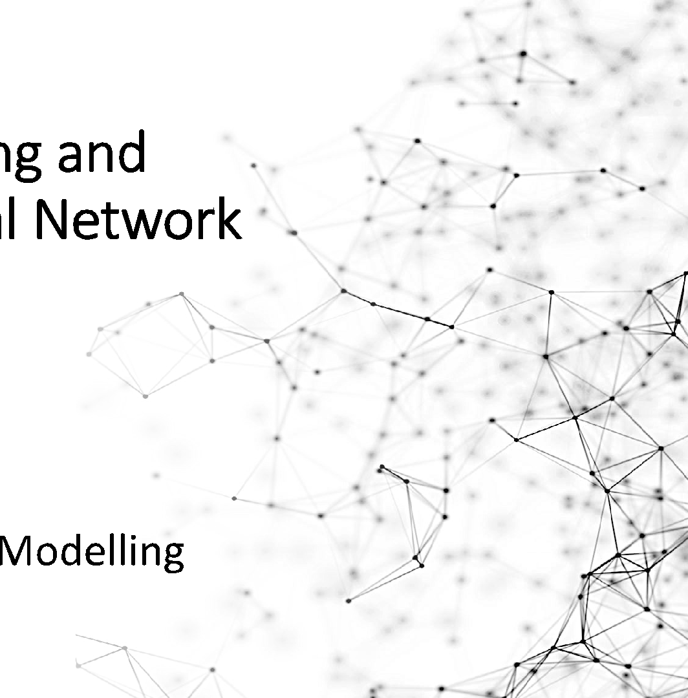

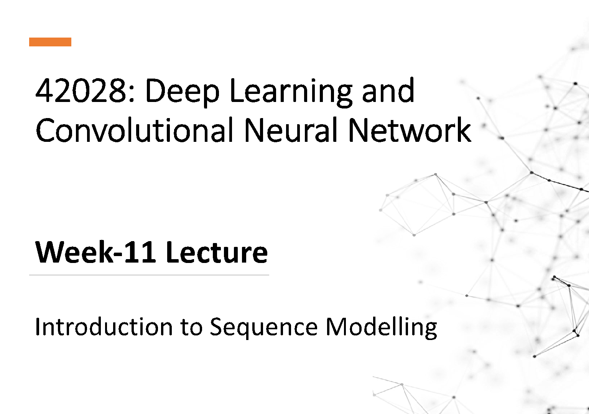

42028: Deep Learning and Convolutional Neural Network

# Week-11 Lecture

Introduction to Sequence Modelling

Outline

- • Introduction to Sequence Modelling
- • Introduction to RNNs
- • Introduction to Attention mechanism
- • Introduction to Transformers
- • Case Studies:
- • Image Classification using transformer (ViT)
- • Object Detection using Transformer (RF-DETR)
- • Diffusion models

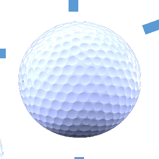

# ??

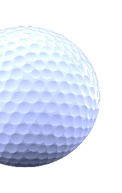

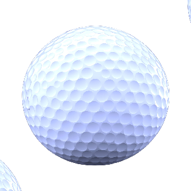

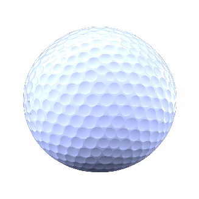

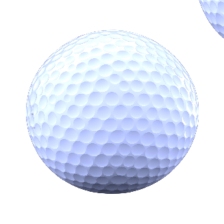

Predict where the ball will go next?

#### “This Sunday I went for a walk”

Sequence modelling types and applications

Y’

###### X

###### Many to Many Q&A with LLMs, Language translations

###### One to Many Image Captioning

###### One to One Binary classification

###### Many to One Sentiment Analysis

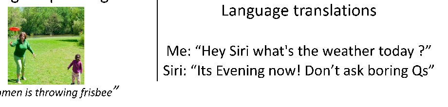

“Will it rain today?” Yes/No?

“42028 is the best subject so far!”

Me: “Hey Siri what's the weather today ?” Siri: “Its Evening now! Don’t ask boring Qs”

“A womenisthrowingfrisbee”

Size #Bedroom #Bathroom Garden Location

Price

###### Y

|House Price prediction|
|---|

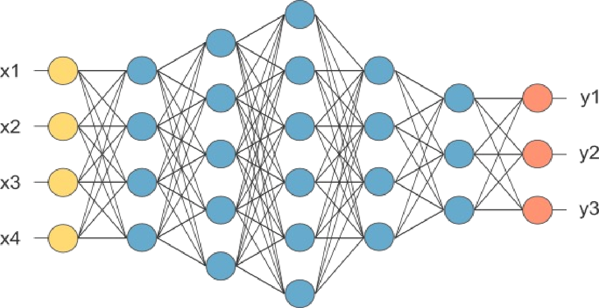

Recurrent Neural Network (RNN) Basics

Output

y’t

y’0

y’1

y’2

h0 h1

###### ht

Recurrent cell

Xt

X0

X1

X2

Input

𝑦 = 𝑓(𝑥 , ℎ )

Output Input Past Memory/ state

Output Function+

y’t

Weights w

ℎ = 𝑓 (𝑥 , ℎ )

ht

RNN

Output Input Past state

###### Recurrence Relation

Xt

𝑦 = 𝑊 ℎ OutputVector

y’t

Output

ht

ℎ = 𝑡𝑎𝑛ℎ (𝑊 ℎ + 𝑊 𝑥 )

RNN

Update Hidden State

𝑥

Xt

Input Vector

Total Loss (L)

Forward Pass Backward Pass

L0 L1 Lt

…

y’0

y’1

y’t

y’t

𝑊

𝑊

𝑊

RNN ht

𝑊 𝑊

≈

RNN

RNN

RNN

𝑊

𝑊

𝑊

…

Xt

Xt

X0

X1

Sequence Modelling: Design Criteria

- • Support for Variable-Length Input

- • Has Temporal Dependency (Long-term, Short-term)

- • Preserve the information order

- • Share parameters across sequence

- RNN Limitations

- • Prone to vanishing and exploding gradient problem

- • Long term memory not supported

- • Slow and no parallelization

Output

y’0

y’1

y’2

y’t

y’t-2

y’t-1

…

#### Features

Input

X0

X1

X2

Xt

Xt-2

Xt-1

𝑦 𝑦 𝑦 𝑦 𝑦 𝑦

Output

…

Features

𝑥 𝑥 𝑥 𝑥 𝑥 𝑥

Input

Idea:

- - No Recurrence
- - No Long-term memory
- - Feed Everything into the Dense network
- - Identify and focus on what’s important

Attention Is All you Need!

- • Identify which parts of the image to focus on
- • Extract features with high attention

Why do we need Attention?

- • RNNs process sequences one step at a time
- • Long sentences lead to Long-term memory loss
- • Important words can be hidden in long dependencies
- • Attention helps to focus on relevant parts of the input

What is Attention? Intuition

- • Mimics human focus mechanism: “Where should I look?”
- • For each output word, attention decides which input word is most important
- • Computes a weighted sum of all input vectors
- • Higher weight = more important

###### Training Query (Q)

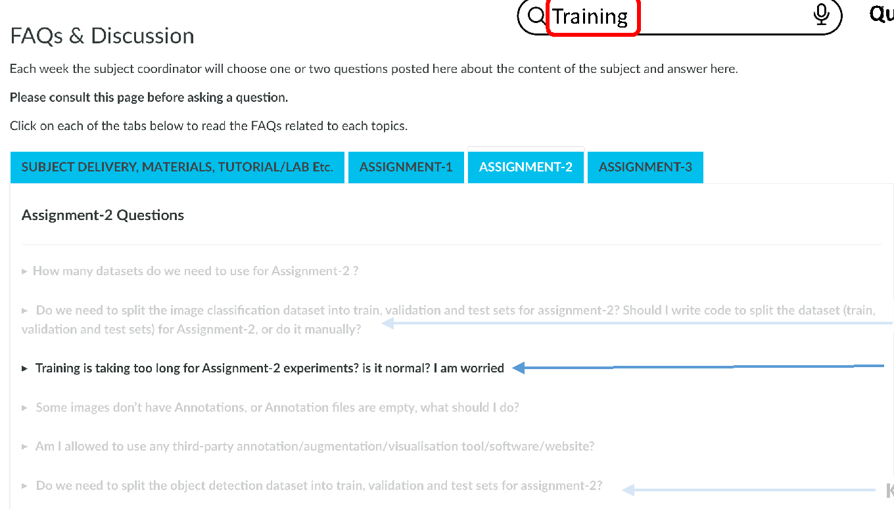

Key (K1)

###### Key (K2)

Compute similarity between Q and K

###### Key (K3)

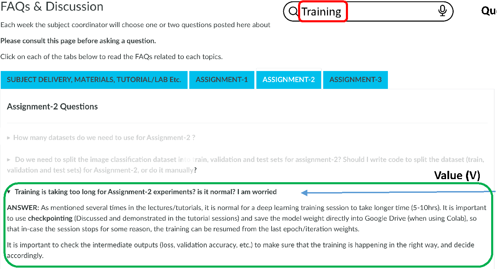

###### Training Query (Q)

###### Value (V)

###### Key (K2)

Extract Values based On attention

- • Self-Attention is the foundation for Transformer architecture

- • Entire sequence is processed in parallel

- • Has Encode and a Decoder block

- • Stack of Layers with Self Attention and Feed Forward Neural

- • Self-Attention is the foundation for Transformer architecture

- • Entire sequence is processed in parallel

- • Has Encode and a Decoder block

- • Stack of Layers with Self Attention and Feed Forward Neural

## Case Studies

- • Introduced in 2021: "An Image is Worth 16\*16 Words: Transformers for Image Recognition at Scale," published at ICLR 2021

- • Vision transformer have extensive application in all computer vision tasks

- • ViT is a type of Deep Learning Model that’s looks at Images, like how language model looks at words

- • Images are represented as sequences of patches!

##### Steps:

- 1. Split an image into patches
- 2. Flatten the patches
- 3. Produce lower-dimensional linear embeddings from the flattened patches
- 4. Add positional embeddings
- 5. Feed the sequence as an input to a standard transformer encoder
- 6. Pretrain the model with image labels (fully supervised on a huge dataset)
- 7. Finetune on the downstream dataset for image classification

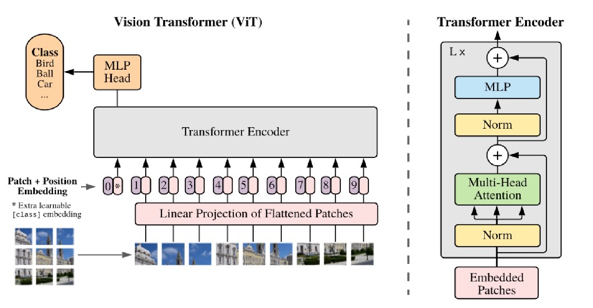

###### Reference: https://github.com/google-research/vision_transformer

###### Comparing CNN and Vision Transformer:

###### Key Aspects CNNs Vision Transformer (ViT) Input Handling

Processes the entire image using filters (kernels)

Splits image into fixed-size patches (like tokens)

Focuses on local patterns first (edges, textures)

Local vs. Global

Uses global self-attention to relate all patches

Hierarchical (convs → pools → deeper features)

Architecture

Flat transformer encoder stack Training Data Need Works well with limited data Needs lots of data or pretraining Computation Efficient with low-res inputs

Computationally heavier, especially on large images

Parallelism Limited; uses sequential feature stacking High; patch processing is highly parallelizable

- • Object Detection techniques using Transformers
- • An improvement over the original DETR (DEtection TRansformer)
- • DETR looks at everything globally but miss small things.
- • RF-DETR looks globally and understands the relationships between things.
- • Real-time Transformer-based object detection architecture
- • Outperforms all object detection models, 60+ mAP achieved on COCO dataset.

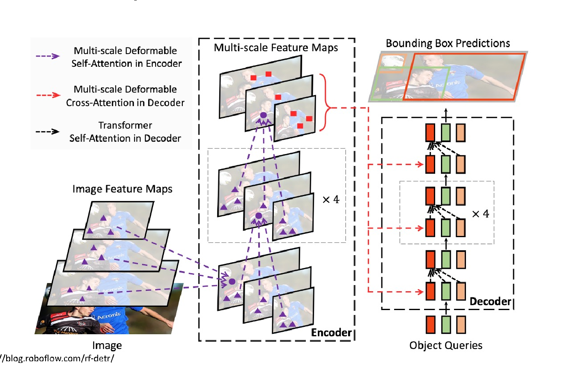

###### Source: ttps://blog.roboflow.com/rf-detr/

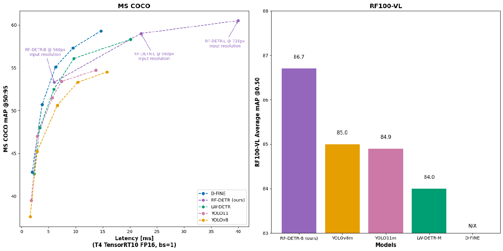

### Case Study: Diffusion Models - Intuition

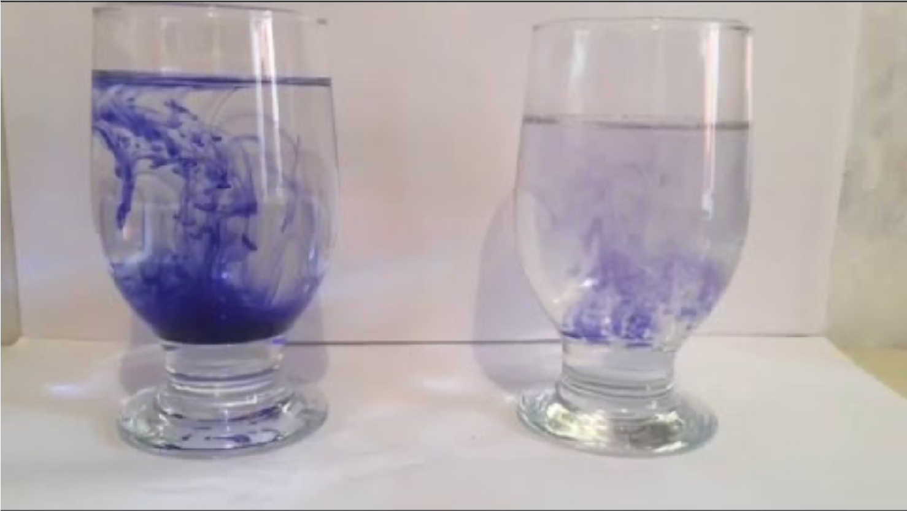

Goal: Generate new data samples (e.g. images, audio, text) that is similar to a training dataset by learning to reverse a gradual noise process! A generative model!

##### Generic steps:

- 1. Start with real data
- 2. Add noise step-by-step, until the image becomes pure noise
- 3. Train a model to reverse this process: denoising to recover the original image!
- 4. Once trained, the model can start from pure noise and generate new and realistic samples.

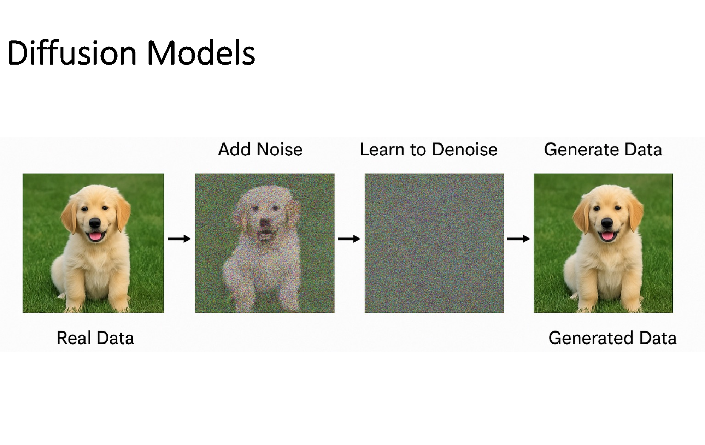

### Diffusion Models

Example: Given a lot of sprite sample images

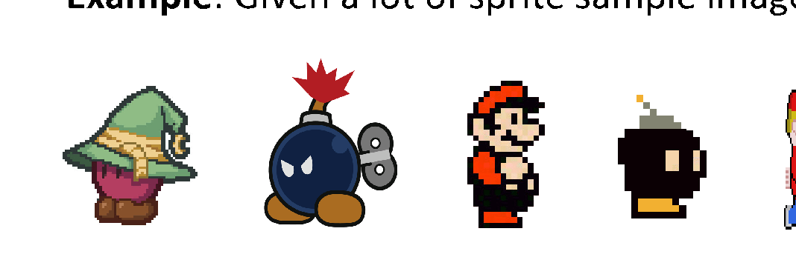

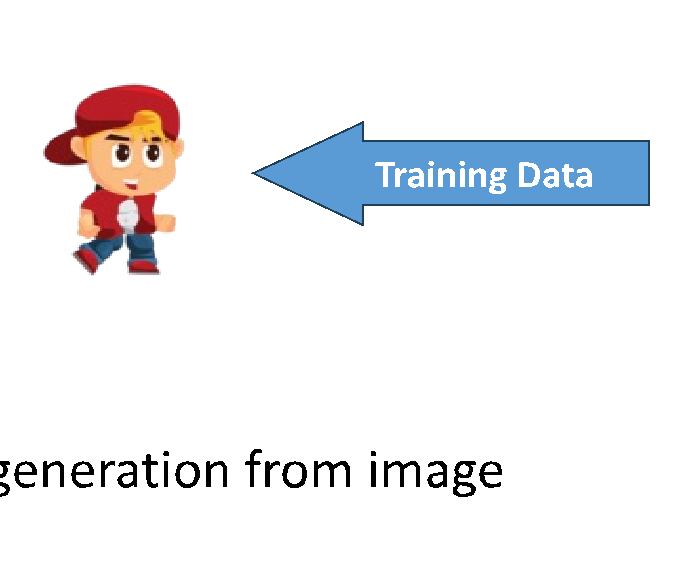

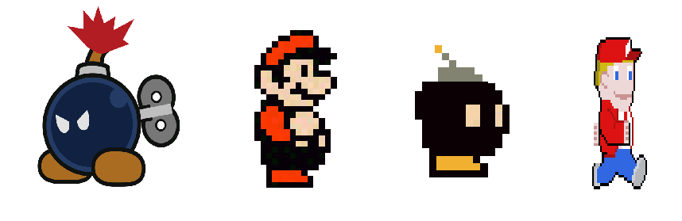

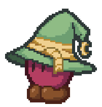

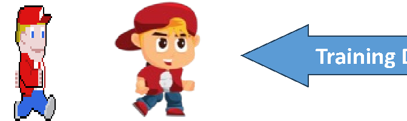

###### Training Data

Task: Generate New Sprite images (New Image generation from image input)

#### Example prompt: Butterfly image (Text to Image Generation) Task: Generate image of Butterfly!

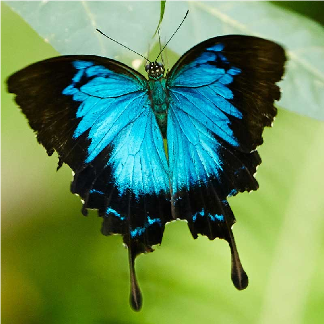

#### • Forward Diffusion:

- • Add noise gradually to the original image for many steps
- • Iterate until the Image becomes pure noise
- • Gaussian noise used
- • No-learning

#### • Reverse Diffusion:

- • Denoising: Model is trained to predict and reverse this noise
- • Use the prediction to denoise the image
- • Given a noisy image, it predicts a slightly less noisy image version
- • After several steps, it reconstructs a clean and new image! From pure noise

Week 12 Guest Lecture

Industry Guest Lecture will be presented by Amazon Web Services (AWS) on Week 12

Topic: Build, Evaluate and Scale Production ready Agents

For more details please check Canvas!

______________________________________________________________________
