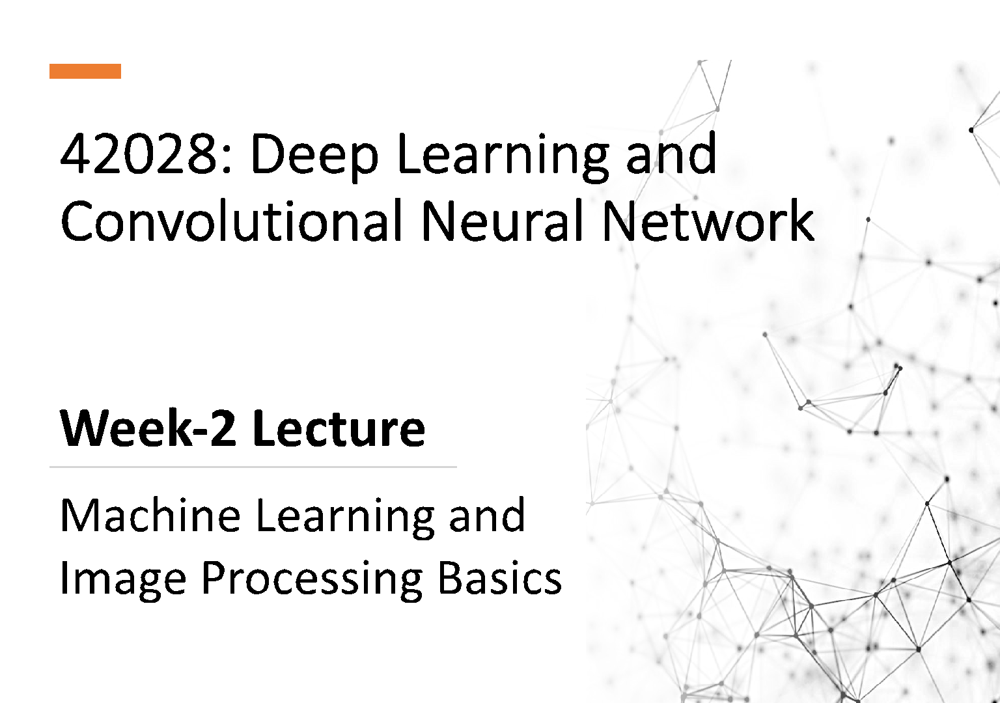

42028: Deep Learning and Convolutional Neural Network

## Week-2 Lecture

Machine Learning and Image Processing Basics

Outline

- • Types of Machine Learning System
- • Supervised and Un-supervised learning
- • Support Vector Machine (SVM)
- • Evaluation Metrics
- • Image Processing Basics, Types
- • Edge Detection using Convolution

### Machine Learning Basics

Type of Machine Learning Systems

|Supervised Learning Unsupervised Learning Semi-supervised Learning Reinforcement Learning|
|---|

Depending on whether the system is trained with human supervision

|Batch and Online Learning|
|---|

Whether System can learn on the fly

Comparing data points or detect patterns in training data to build a predictive model

|Instance-based and Model-based Learning|
|---|

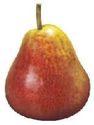

?

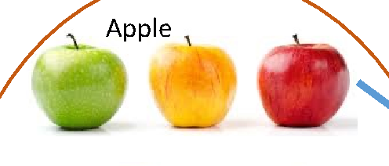

Apple

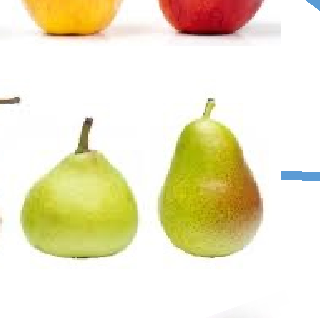

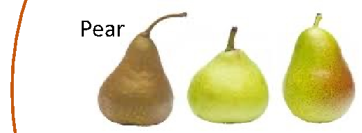

Pear

|Predictive Model|
|---|

Supervised Learning

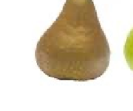

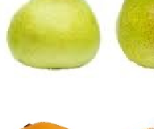

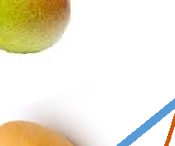

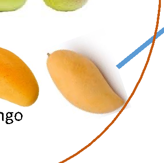

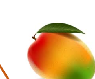

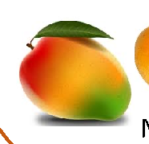

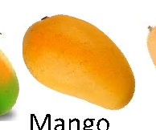

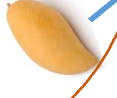

Pear

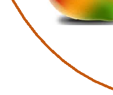

Mango

|Classification Task|
|---|

Labelled data for training (Object + Desired Output Label)

|0  500  1000  1500  2000  2500  0 200 400 600 800 1000 1200 1400  PriceinAUD$(in100Ks)  Size in Sq. ft|
|---|

|House Price prediction Feature:  - Size of the house To Predict: - Price of the house |
|---|

PriceinAUD$(in10

|Regression Task|
|---|

Important Algorithms:

- • K-Nearest Neighbours
- • Logistic regression
- • Support Vector Machines (SVMs)
- • Neural Networks (\*some of themcan be unsupervised)

Supervised Learning Examples

Image Classification Object Recognition

Predictions

Forecasting

Supervised Learning

CLASSIFICATION CLASSIFICATIONREGRESSION

Fraud Detection

New Insights

Medical Diagnostics

Process Optimization

Unsupervised Learning

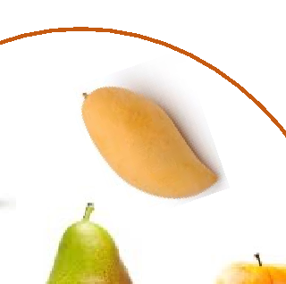

|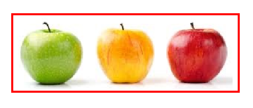|
|---|

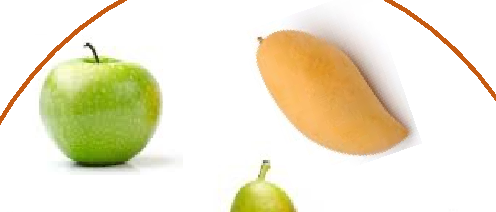

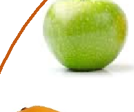

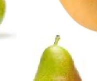

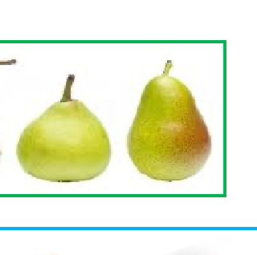

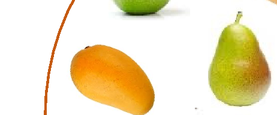

|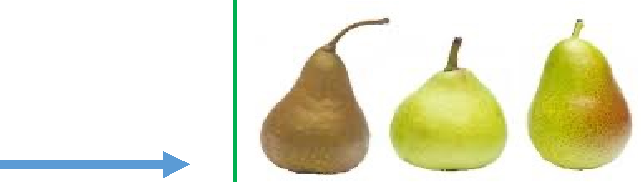|
|---|

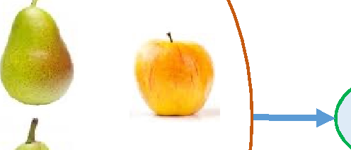

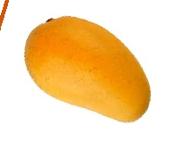

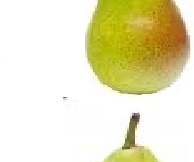

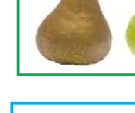

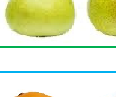

Unsupervised Learning

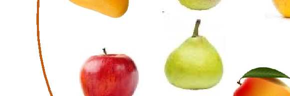

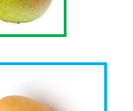

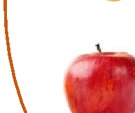

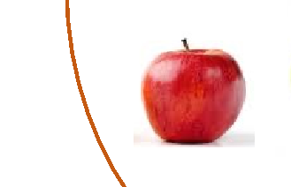

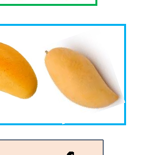

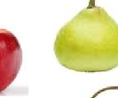

|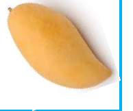  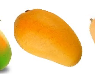  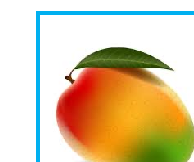  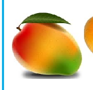|
|---|

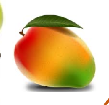

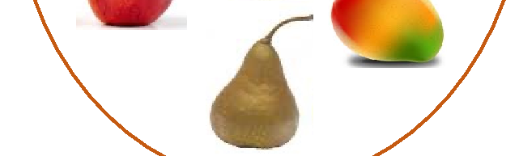

|Clustering Task|
|---|

|Groups of similar fruits|
|---|

Unlabelled data for training

Unsupervised Learning

Important Algorithms:

- • k-means

- • Expectation Maximization

- • A Support Vector Machine is a very powerful and versatile Machine Learning model, capable of performing linear or non-linear classification, regression, and also outlier detection.

- • Defined by a separating hyperplane

- • Suitable for small or medium sized datasets

###### Reference and Pre-Reading:

Theory: https://medium.com/machine-learning-101/chapter-2-svm-support-vector-machine-theory-f0812effc72 Implementation: https://medium.com/machine-learning-101/chapter-2-svm-support-vector-machine-coding-edd8f1cf8f2d

|Feature dimension: 2|
|---|

Orange Apple

Weight

###### ?

|SVM finds the best line or hyper-plane which will fairly separates the classes|
|---|

Colour

###### Example: Using sklearn for SVM classification (Partialcodesnippet)

|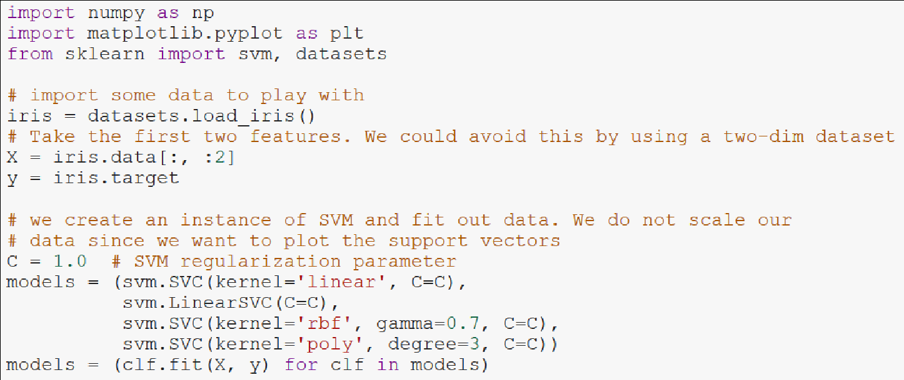|
|---|

Reference: https://scikit-learn.org/stable/auto_examples/svm/plot_iris.html#sphx-glr-auto-examples-svm-plot-iris-py

https://en.wikipedia.org/wiki/Iris_flower_data_set

###### SVM Parameters: Kernel, Gamma, Regularization (C)

| |
|---|

|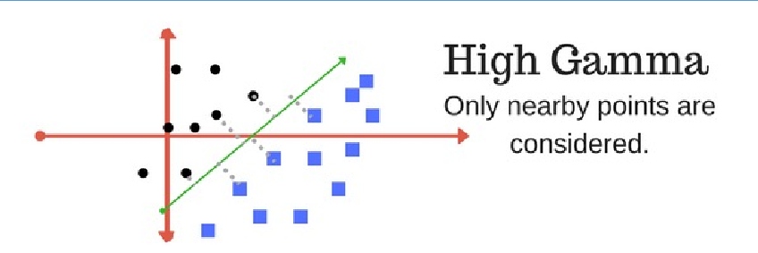|
|---|

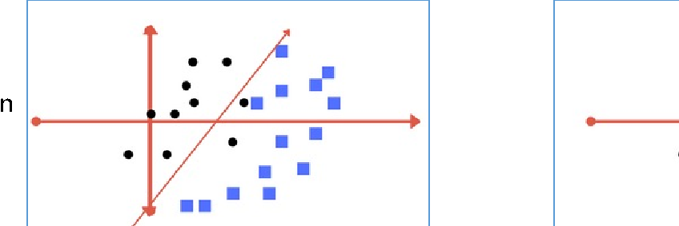

Low Regularization value

| |
|---|

|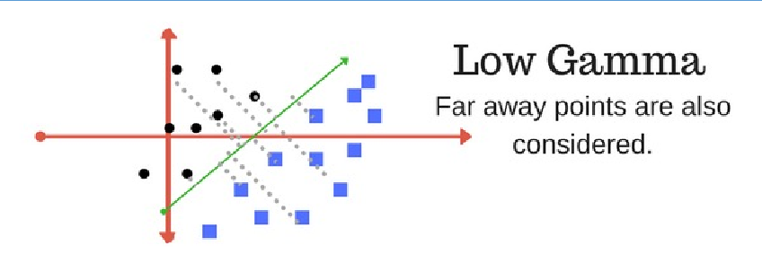|
|---|

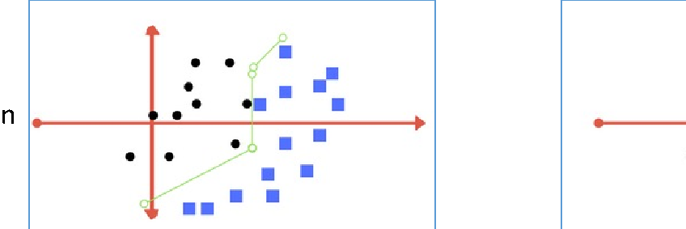

High Regularization value

Image source and Reference: https://medium.com/machine-learning-101/chapter-2-svm-support-vector-machine-theory-f0812effc72

###### Example: Using sklearn for SVM classification

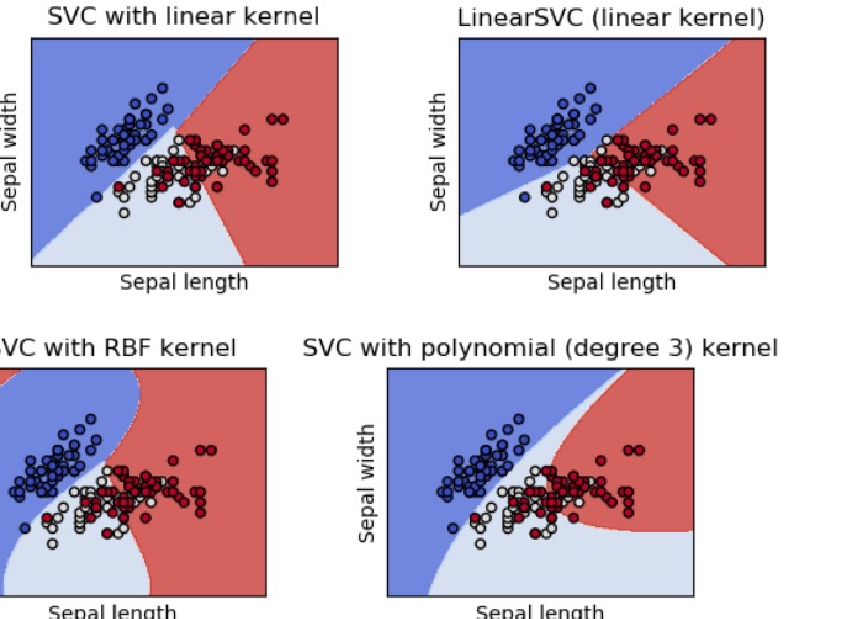

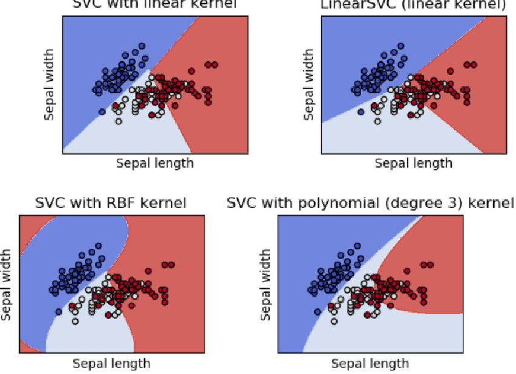

###### Iris flower data set

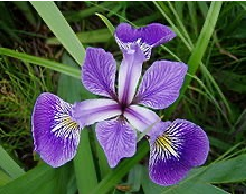

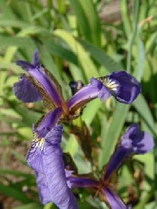

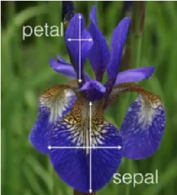

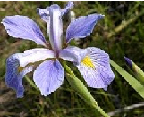

Reference: https://scikit-learn.org/stable/auto_examples/svm/plot_iris_svc.html

https://en.wikipedia.org/wiki/Iris_flower_data_set

##### • Precision & Recall

###### Precision: TP/Cancer Diagnoses Diagnoses

What are the “correct” cells?

| |No Cancer|Cancer|
|---|---|---|
|No Cancer|TN|FP|
|Cancer|FN|TP|

###### • TN: (Number of True Negatives), i.e., patients who did not have cancer whom we

Truestate

correctly diagnosed as not having cancer.

###### • TP: (Number of True Positives), i.e., patients who did have cancer whom we

correctly diagnosed as having cancer

Recall: TP/Cancer True States

##### • Precision & Recall

###### Precision: TP/Cancer Diagnoses Diagnoses

what are the “error” cells are:

| |No Cancer|Cancer|
|---|---|---|
|No Cancer|TN|FP|
|Cancer|FN|TP|

- • FN: (Number of False Negatives), i.e., patients who did have cancer whom we

incorrectly diagnosed as not having cancer

- • FP: (Number of False Positives), i.e., patients who did not have cancer whom we incorrectly diagnosed as having cancer

Truestate

Recall: TP/Cancer True States

|Precision= (𝑇𝑃)/(𝑇𝑃+𝐹𝑃)|
|---|

|Recall = (𝑇𝑃)/(𝑇𝑃+𝐹𝑁)|
|---|

##### • Intersection over Union (IoU):

###### Intersection over Union is a metric used for the evaluation of an object detector, i.e. how good is the predicted bounding box for an object detected closely matches

Reference: https://www.pyimagesearch.com/2016/11/07/intersection-over-union-iou-for-object-detection/

### Image Processing Basics

Image Processing Basics

##### What is a digital image?

- - Digital images are made of picture elements called Pixels.
- - It is an array, or a matrix of Pixels arranges in columns and rows.
- - Each Pixel has its own intensity value, or brightness
- - Intensity values in digital images are defined by bits
- - For a standard 8 bits image, a pixel can have 28= 256 (0 – 255) values.
- - Black & White images have a single 8-bits intensity range.

How computer sees Image?

||
|---|

A (24 X 16) Matrix which represents the number ’8’

### Colour Images

|170|170|55|170|170|
|---|---|---|---|---|
|170|55|170|55|170|
|170|55|170|55|170|
|55|140|140|140|55|
|55|170|170|170|55|

##### Image dimension = 5 X 5 f(2, 3) = 170 (Pixel/intensity value)

Hence, an image may be defined as a 2D function f(x, y) , where, x and y are spatial co-ordinates, and the amplitude of f at (x , y) is the intensity or Gray level of the image at that point/pixel.

###### 5 X 5 Gray scale image (8 bit)

Blue

170 170 55 170 170

Green

###### Image dimension = 5 X 5 X 3 No. of Channels = 3

170 170 55 170 170

170 55 170 55 170

Red

170 170 55 170 170

170 55 170 55 170

170 55 170 55 170

Since, RGB image contains 3 X 8-bits of intensities, they are referred to as 24-bit colour images.

170 55 170 55 170

170 55 170 55 170

55 140 140 140 55

170 55 170 55 170

55 140 140 140 55

55 170 170 170 55

So, 24-bit colour depth

55 140 140 140 55

= 8 X 8 X 8 bits

55 170 170 170 55

= 256 X 256 X 256 colours

55 170 170 170 55

= ~16 million colours

5 X 5 X 3 colour image (24 bit)

Image Processing - Types

- 1. Image Enhancement
- 2. Image Restoration
- 3. Image Segmentation
- 4. Image Recognition & Classification
- 5. Image Compression
- 6. Image Transformation
- 7. Image Filtering
- 8. Morphological Processing
- 9. Colour Image Processing
- 10. 3D Image Processing

### Image Enhancement, Restoration

###### Enhancement Restoration

Source: https://www.mathworks.com/discovery/image-enhancement.html https://en.wikipedia.org/wiki/Image_restoration_by_artificial_intelligence

- - Easiest method for image segmentation!
- - Converts gray-scale image into a binary image If f(x,y) > Threshold, then f(x,y) = 0 else f(x,y) = 255

###### Binary Image (8-bit) has only two possible values of pixel intensity ( 0 and 1, or B & W)

|170|170|55|170|170|
|---|---|---|---|---|
|170|55|170|55|170|
|170|55|170|55|170|
|55|140|140|140|55|
|55|170|170|170|55|

|255|255|0|255|255|
|---|---|---|---|---|
|255|0|255|0|255|
|255|0|255|0|255|
|0|255|255|255|0|
|0|255|255|255|0|

Threshold = 100

||
|---|

||
|---|

Thresholding

Original Image Binary Image

Image Source: https://en.wikipedia.org/wiki/Thresholding\_(image_processing)

Image Thresholding methods

###### - Histogram shape:

Peaks, valleys and curvature of the histogram are analysed.

No.ofPixels

###### - Clustering based:

The 1Otsu method, very good for bimodal distribution

|Threshold|
|---|

###### - Adaptive thresholding:

Gray-scale

Instead of a single threshold, have thresholds for different regions in the image

1Reference: https://en.wikipedia.org/wiki/Otsu%27s_method

###### Source https://scikit-image.org/docs/stable/auto_examples/segmentation/plot_multiotsu.html

Edge Detection (Image Filtering)

##### What is an edge?

- - The points/pixels in an image where brightness/intensities changes sharply
- - A simple and fundamental tools in image processing and computer vision, useful in feature detection/extraction

Colour to Gray

Edge detection

| |
|---|

Canny Edge detection Sobel Edge detection

|100|100|100|0|0|0|
|---|---|---|---|---|---|
|100|100|100|0|0|0|
|100|100|100|0|0|0|
|100|100|100|0|0|0|
|100|100|100|0|0|0|
|100|100|100|0|0|0|

|0|300|300|0|
|---|---|---|---|
|0|300|300|0|
|0|300|300|0|
|0|300|300|0|

|1|0|-1|
|---|---|---|
|1|0|-1|
|1|0|-1|

# \*

| | |
|---|---|
|Convolution operator| |

3 X 3 filter/Kernel

4 X 4 dimension matrix

6 X 6 dimension image

|(100 X 1 + 100 X 1 + 100 X 1) + (100 X 0 + 100 X 0 + 100 X 0) + (100 X -1 + 100 X -1 + 100 X -1)|
|---|

|1100|0100|-1100|0|0|0|
|---|---|---|---|---|---|
|1100|0100|-1100|0|0|0|
|1100|0100|-1100|0|0|0|
|100|100|100|0|0|0|
|100|100|100|0|0|0|
|100|100|100|0|0|0|

|0|300|300|0|
|---|---|---|---|
|0|300|300|0|
|0|300|300|0|
|0|300|300|0|

|1|0|-1|
|---|---|---|
|1|0|-1|
|1|0|-1|

-

# \*

|100|100|100|100|100|100|
|---|---|---|---|---|---|
|100|100|100|100|100|100|
|100|100|100|100|100|100|
|0|0|0|0|0|0|
|0|0|0|0|0|0|
|0|0|0|0|0|0|

|0|0|0|0|
|---|---|---|---|
|300|300|300|300|
|300|300|300|300|
|0|0|0|0|

|1|1|1|
|---|---|---|
|0|0|0|
|-1|-1|-1|

# \*

# \*

### Edge detection filters

||1|0|-1|
|---|---|---|
|1|0|-1|
|1|0|-1|
  |1|1|1|
|---|---|---|
|0|0|0|
|-1|-1|-1|
  3 X 3 filter/Kernel For Horizontal edges  3 X 3 filter/Kernel For Vertical edges  Prewitt Filters|
|---|

||1|2|1|
|---|---|---|
|0|0|0|
|-1|-2|-1|
  3 X 3 filter/Kernel For Horizontal edges  |1|0|-1|
|---|---|---|
|2|0|-2|
|1|0|-1|
  3 X 3 filter/Kernel For Vertical edges  Sobel Filters|
|---|

### Sobel edge detection - Example

Image Source: https://docs.opencv.org/3.0-beta/doc/py_tutorials/py_imgproc/py_gradients/py_gradients.html

Convolutions in CNN

- • Convolutions are very important operation in a Convolutional Neural Networks (CNN)
- • Filters weights are not fixed, but learned during the training operations of a CNN for a specific task!
- • Multiple filters are used in CNNs

Erosion example

Dilation example
