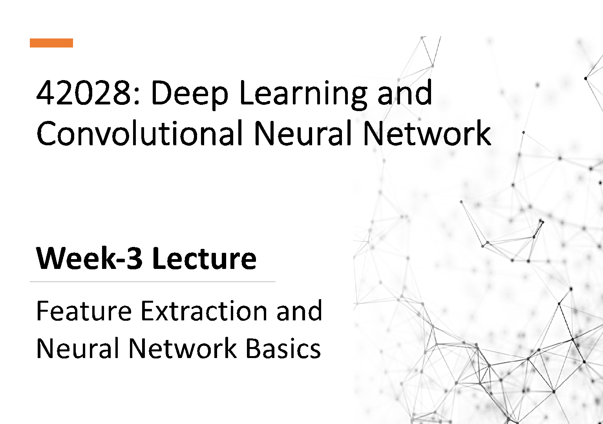

42028: Deep Learning and Convolutional Neural Network

# Week-3 Lecture

Feature Extraction and Neural Network Basics

Outline

- • Image Gradient
- • Histogram of Oriented Gradient (HoG)
- • Local Binary Pattern
- • ANN Basics
- • ANN Learning Process
- • Logistic Regression using ANN
- • Gradient Descent

## Features Extraction

##### What is an Image Gradient?

- • It is a directional change in the intensity or color in an Image.
- • Can be used to extract valuable information from images.
- • Commonly used in edge detection.

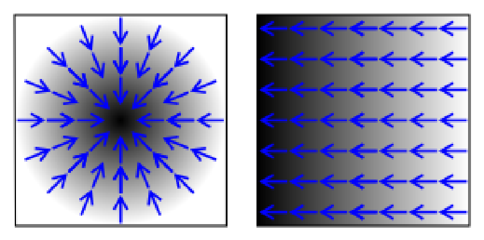

##### What is an Image Gradient?

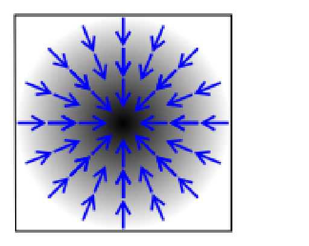

X

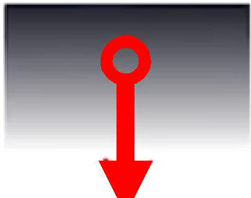

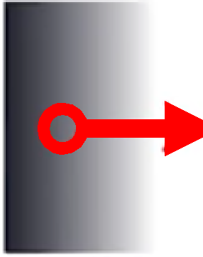

Change is X-directions

Change is Y-directions

Combining both X and Y direction to estimate if changes are in both directions

Y

##### Step -1: Computing Image Gradient:

###### 1. Use the horizontal and vertical filters to compute gradient values

Gradientisy-directions

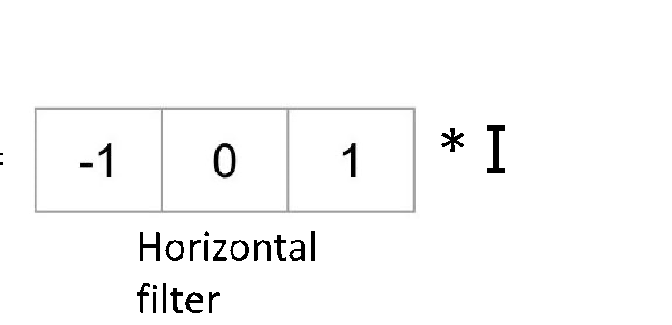

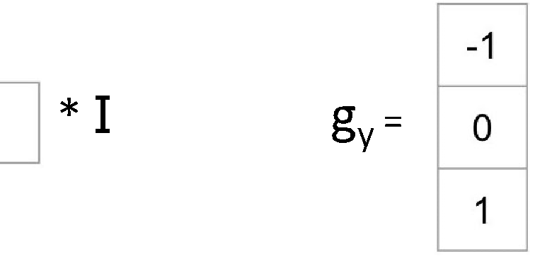

gx= * I

gy= * I

Horizontal filter

Vertical filter

Gradient is X-directions

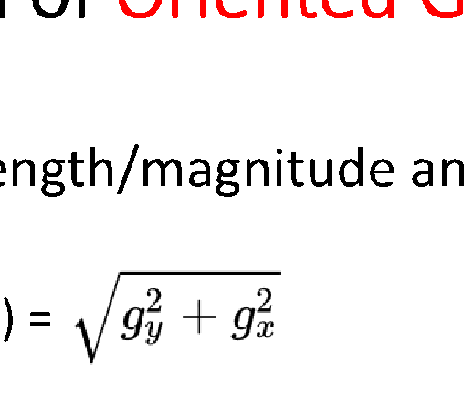

###### 2. Compute the strength/magnitude and direction of gradient.

|X|100|X|
|---|---|---|
|70|60|120|
|X|50|X|

Strength/Magnitude(g) =

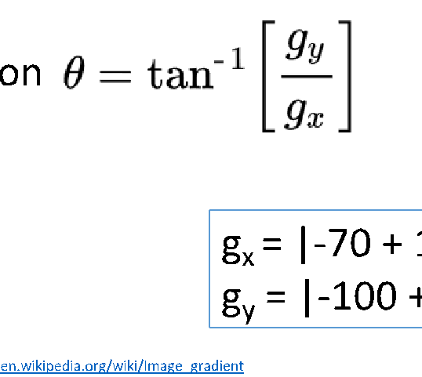

Example

Direction

|gx= |-70 + 120| = 50 gy = |-100 + 50| = 50 |
|---|

|Gradient Magnitude = ~70.7 Direction/Angle = 45o|
|---|

##### Step -2: Create orientation histogram:

- - Divide the image into small connected regions called Cells which is a 8 X 8 patch
- - Create cell histogram based on gradient direction and magnitude
- - 64 (8 X 8) gradient vectors are put into a 9-bin histogram
- - The bins are the gradient directions (Ꝋ) quantized into 9-bins

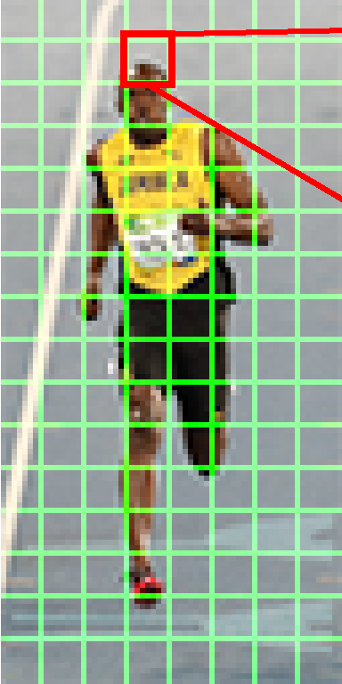

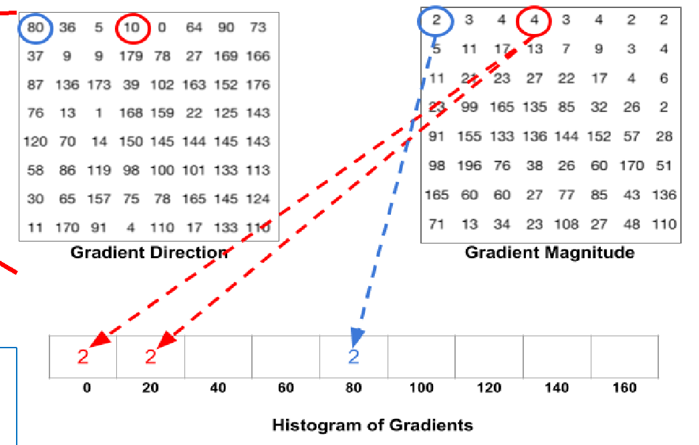

|Pixel with blue circle has an angle of 80 degrees and magnitude of 2|
|---|

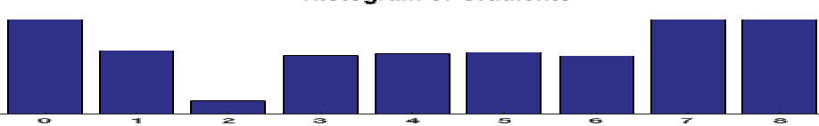

Reference: https://tanasecucliciu.wordpress.com/2016/06/08/programming-histogram-of-oriented-gradients-hog-explained/ Image source: https://www.learnopencv.com/histogram-of-oriented-gradients/

| |
|---|

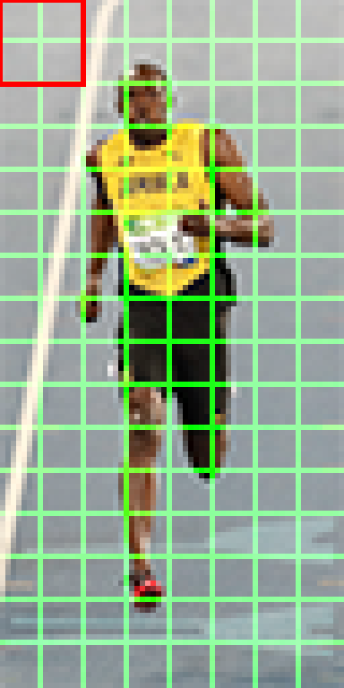

##### Step -3: Block Normalization:

- - 16 X 16 pixels blocks or 2X2 cells are used for normalization, which has 4 histograms.
- - Normalization will make it scale/multiplication invariant
- - Each block will represent 36 X 1 element vector

##### Step -3: Block Normalization:

Normalization example: (3, 9) à 3 + 9 = 9.48 (3/9.48 , 9/9.48) = (0.32, 0.95) Multiple (3, 9) by 2 to increase brightness (6, 18) à 6 + 18 = 18.97 (6/18.97, 18/18.97) = (~0.32, ~0.95)

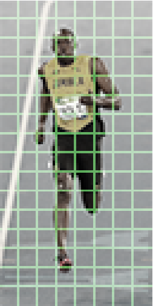

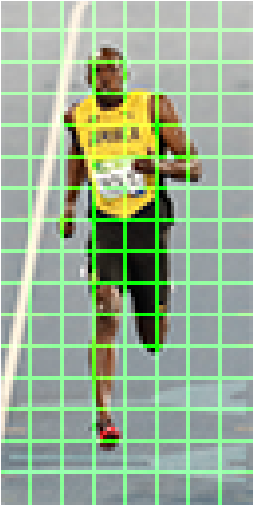

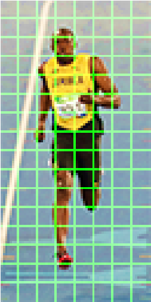

Brightness reduced Brightness increased

Original image

###### Step -4: Calculate the HOG feature vector:

- - Each of the 36 X 1 vectors in each blocks are concatenated into one big vector.
- - Size of the vector will be: Number of blocks X 36

Example: For an Image size: 64 X 128, will have 8 X 16 cells, and 7 X 15 block (with 50% overlap), hence size of HOG feature vector: 7 X 15 X 36 = 3,780

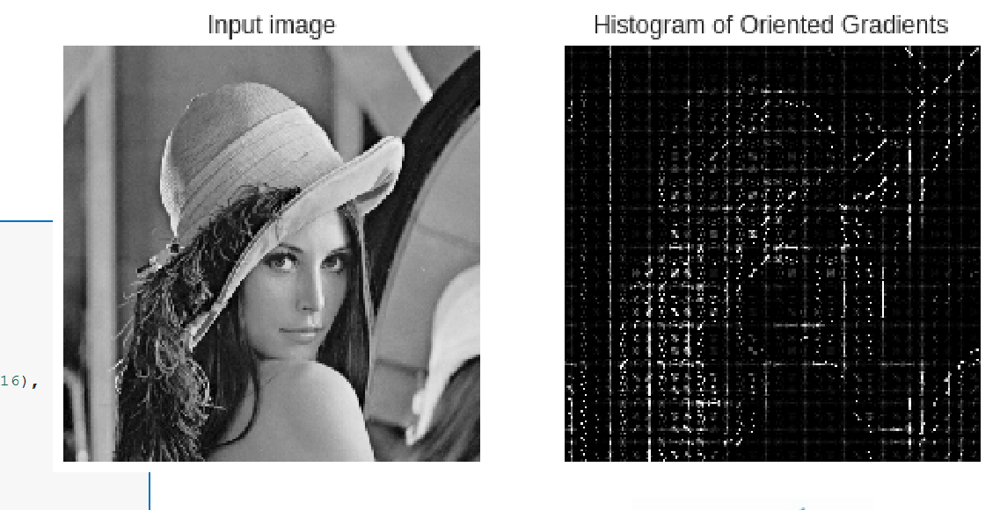

###### Example:

|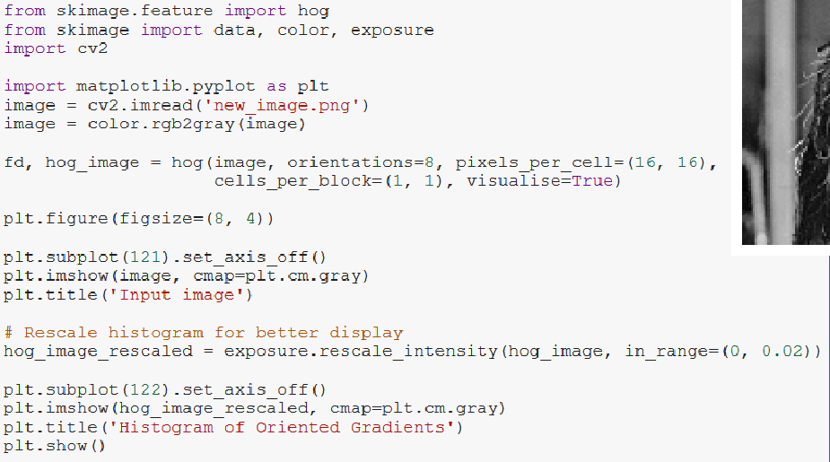|
|---|

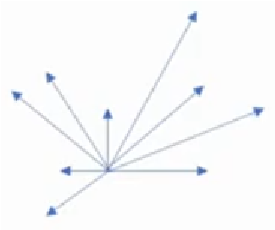

Visualisation of the histogram (Magnitude and direction)

Reference: http://scikit-image.org/docs/0.6/auto_examples/plot_hog.html

- - An efficient texture operator which labels each pixels of an image by thresholding their neighbours.
- - A powerful feature for texture classification
- - The idea behind the LBP operator is to describe the image textures using two measures namely, local spatial patterns and the gray scale contrast of its strength.

###### • The basic LBPP,R operator is defined as follows:

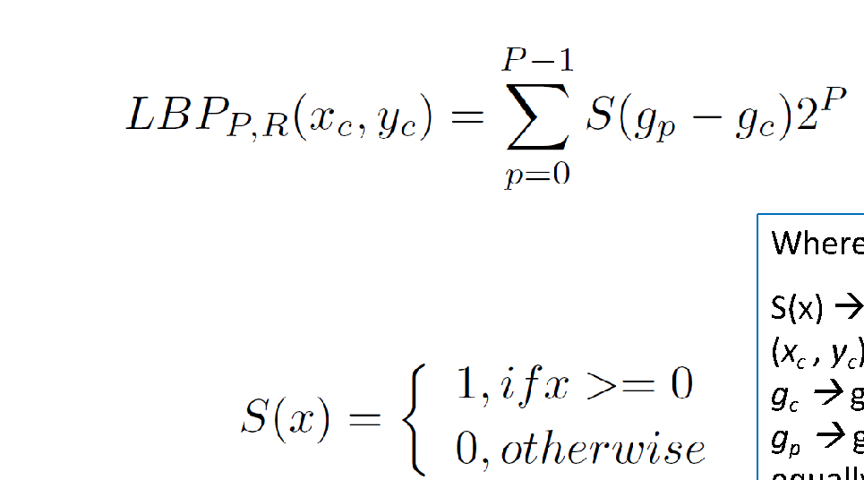

|Where, S(x) à a thresholding function (xc , yc) à the centre pixel in the 8 pixel neighbourhood, gcàgray level of the centre pixel gpàgray value of a sampling point in an equally spaced circular neighbourhood of P sampling points and radius R around the point (xc , yc)|
|---|

###### An Example of LBP Computation:

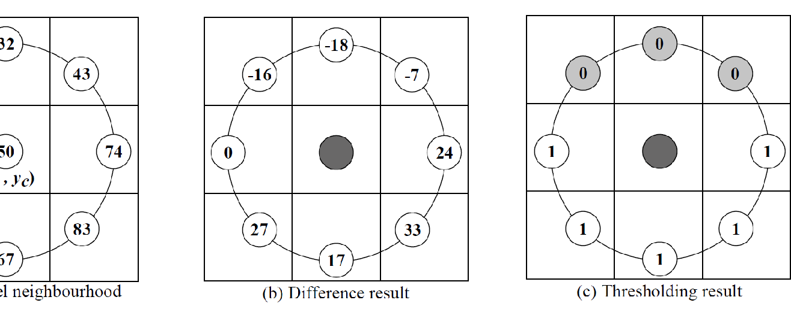

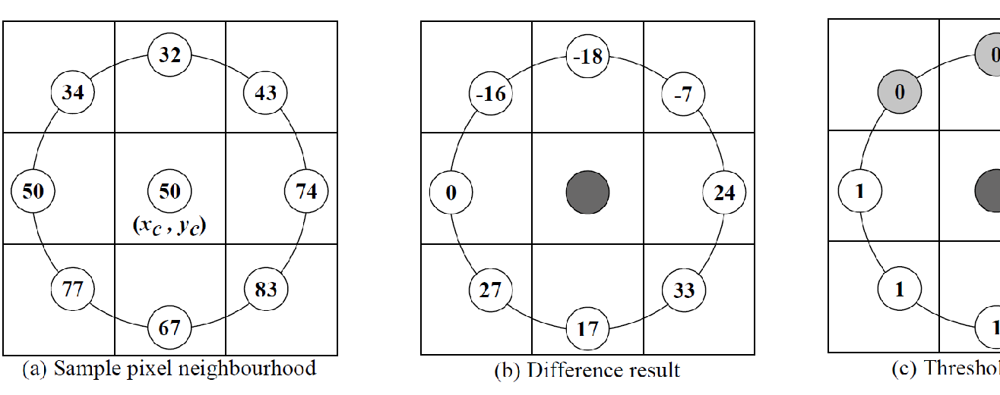

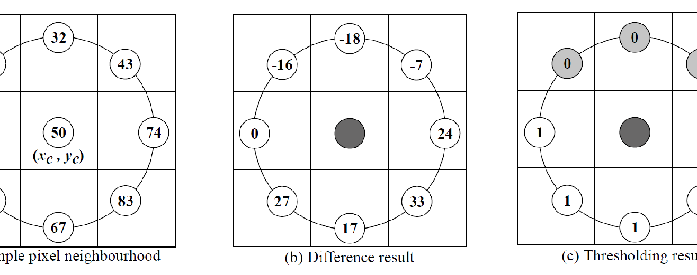

| | | |
|---|---|---|
| | | |
| | | |

| | | |
|---|---|---|
| | | |
| | | |

| | | |
|---|---|---|
| | | |
| | | |

###### An Example of LBP Computation:

An 8-digit binary number is obtained by consideringthe thresholding result, starting from pixel 1 to 8, as marked in red.

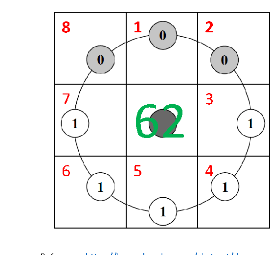

|8|1|2|
|---|---|---|
|7|62|3|
|6|5|4|

- - There can be 28 = 256 possible values
- - Hence, the LBP histogram will have 256 bins àfeature vector

|00111110 = (0 × 2⁷) + (0 × 2⁶) + (1 × 2⁵) + (1 × 2⁴) + (1 × 2³) + (1 × 2²) + (1 × 2¹) + (0 × 2⁰) = 62|
|---|

###### An Example of LBP Computation:

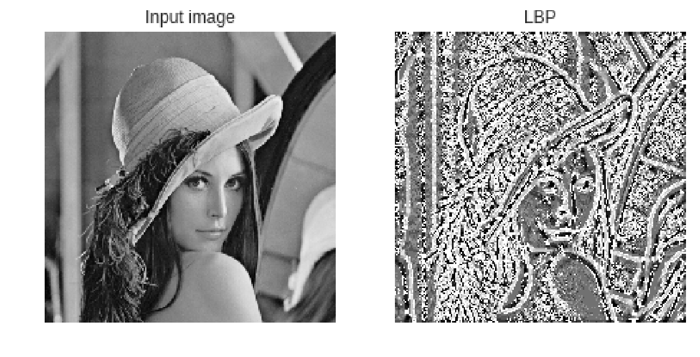

## Neural Network Basics

What is Artificial Neural Network (ANN)?

- • Artificial Neural Networks (ANN) are multi-layered fully-connected neural networks.
- • It has an input layer, multiple hidden layers and an output layer

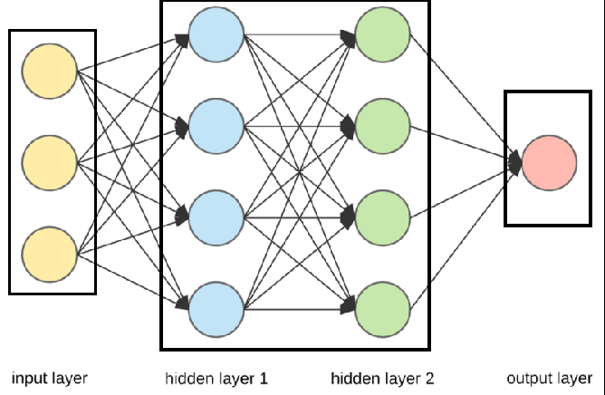

|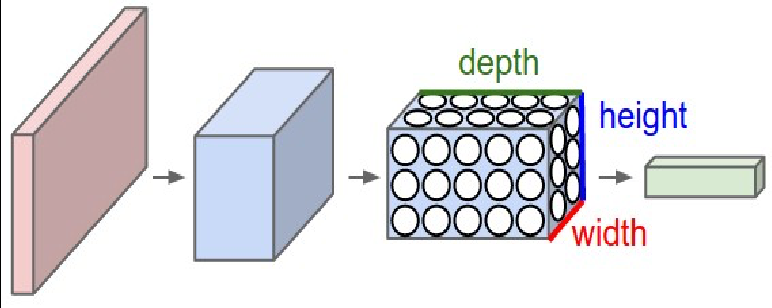|
|---|

CNNs

Standard ANNs

Image source: http://cs231n.github.io/assets/cnn/cnn.jpeg Reference & Image source: https://towardsdatascience.com/applied-deep-learning-part-1-artificial-neural-networks-d7834f67a4f6

|House Price prediction| |
|---|---|
|y = 1.8537x - 15.783  0  500  1000  1500  2000  2500  0 200 400 600 800 1000 1200 1400  PriceinAUD$(in100Ks)  Size in Sq. ft| |

|y = 1.8537x - 15.783| | |
|---|---|---|
| | | |

###### Price Y

Size X

###### “Neuron”

|House Price prediction|
|---|

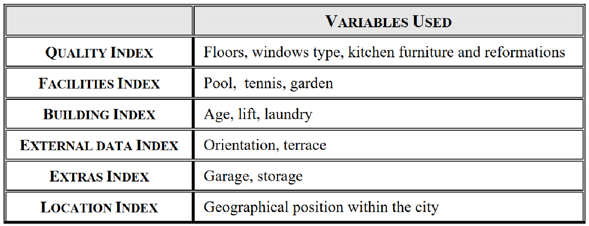

Source and Reference: https://www.econstor.eu/bitstream/10419/113851/1/756619068.pdf

|House Price prediction|
|---|

|Size  #Bedroom  #Bathroom  Garden  Location|
|---|

FamilySize Facility Index

Price

##### Y

LocationIndex

##### X

|House Price prediction|
|---|

Size #Bedroom #Bathroom Garden Location

Price

Y

X

|Data/ Features  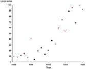| |
|---|---|
| | |

|Launch|
|---|

|Train ML Algorithm| |
|---|---|
| | |

|Study the Problem| |
|---|---|
| | |

Evaluate Solution

| |Analyse errors|
|---|---|
| | |

Function to calculate the loss/error

###### Problem of Binary Classification:

Shark ? à 1 Not Shark? à 0

Error/ Loss

Mechanism to reduce the loss in the model

Gradient

# 1

Target

|Model  ANN Architecture + Parameters|
|---|

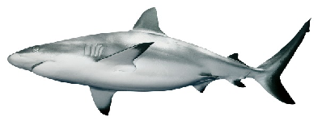

# 0

Output (y)

Input (x)

ANN Introduction – Learning Process: Example

###### T Target Position: (x, y)

###### S

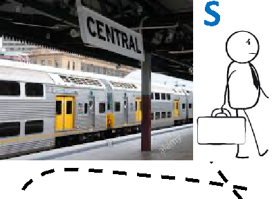

###### Position: (x+dx, y+dx)

|UTS  Building-1|
|---|

d

###### D

Distance need to cover to reach target

Distance remaining = (D – d) (Error/Loss to minimize)

Update Position (parameter):

- x = x + dx
- y = y + dy

###### Problem of Binary Classification à Logistic Regression (Shark ? à 1 | Not Shark? à 0)

|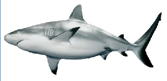|
|---|

Image dimension: 64X128 = 8192 Pixels

image.reshape(image.shape[0]\*image.shape[1]\*image.shape[2],1)

x1 x2 x3 … xn-1 xn

128 56 89 … 250 255

𝑤𝑇𝑥 +𝑏 s 0.82

0.82 > 0.5

… … Shark

X

###### Problem of Binary Classification à Logistic Regression (Shark ? à 1 | Not Shark? à 0)

|𝑤𝑇 𝑥|
|---|

|𝑏|
|---|

-

à Linear function of input x

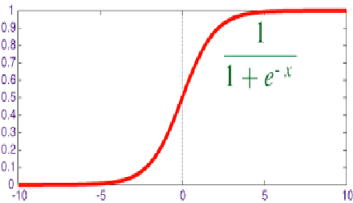

s =

|𝑤1𝑥1 + 𝑤2𝑥2 + …+ 𝑤𝑛𝑥𝑛 + 𝑏|
|---|

(Sigmoid function)

Where, Weighted sum of inputs

- W à Weights
- X à Inputs b à Bias term s à Activation function

|Rule of thumb: In case of binary classification, Sigmoid function is the obvious choice for output layer|
|---|

Problem of Binary Classification à Logistic Regression (Shark ? à 1 | Not Shark? à 0)

|Parameters:  1. w (weight) 2. b (bias) 3. Output a = s(𝒘𝑻𝒙+𝒃) |
|---|

###### Loss function for Logistic Regression:

L (a, y) =- 𝑦 log𝑎 + 1 − 𝑦 log(1 − 𝑎)

Logistic Regression pipeline with the math looks like:

###### X W B

###### L

|𝒘𝑻 𝒙 + 𝒃| |
|---|---|
| | |

|a = s(𝒘𝑻 𝒙 + 𝒃)|
|---|

|L (a, y)|
|---|

###### Problem of Binary Classification à Logistic Regression (Shark ? à 1 | Not Shark? à 0)

Gradient Descent for learning parameters: It is an iterative approach for error correction in a machine learning model.

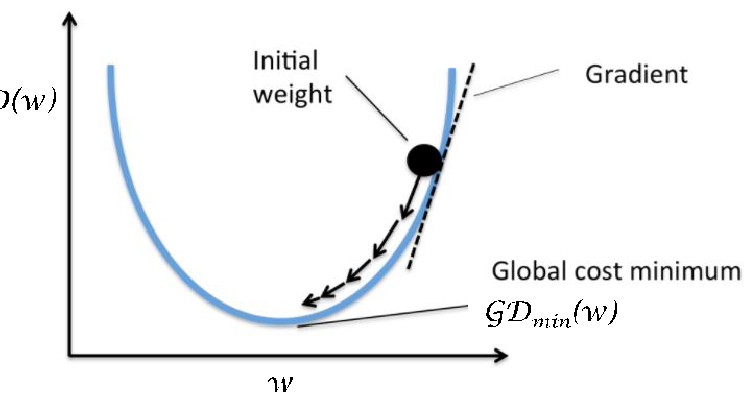

GD(w)

For 1 Sample the loss function is: L (a, y)=- 𝑦 log𝑎 + 1 − 𝑦 log(1 − 𝑎)

GDmin(w)

For m Sample the loss function is: GD(w, b) =𝑥 = ∑ L (a, y)

w

Question: Find w and b that will minimize GD(w, b)

Image Source: https://subscription.packtpub.com/book/big_data_and_business_intelligence/9781788397872/1/ch01lvl1sec22/gradient-descent Source and Reference: http://cs230.stanford.edu/files/C1M2.pdf

###### Problem of Binary Classification à Logistic Regression (Shark ? à 1 | Not Shark? à 0)

###### Gradient Descent for learning parameters: It is an iterative approach for error correction in a machine learning model.

|Where,  dw = ( , )  db = ( , )|
|---|

|Updating the w and b iteratively, :  w = w - adw Updating the b:  b = b - adb|
|---|

|a à Learning rate|
|---|

###### Problem of Binary Classification à Logistic Regression (Shark ? à 1 | Not Shark? à 0)

###### Gradient Descent for learning parameters: Learning rate(a) issues:

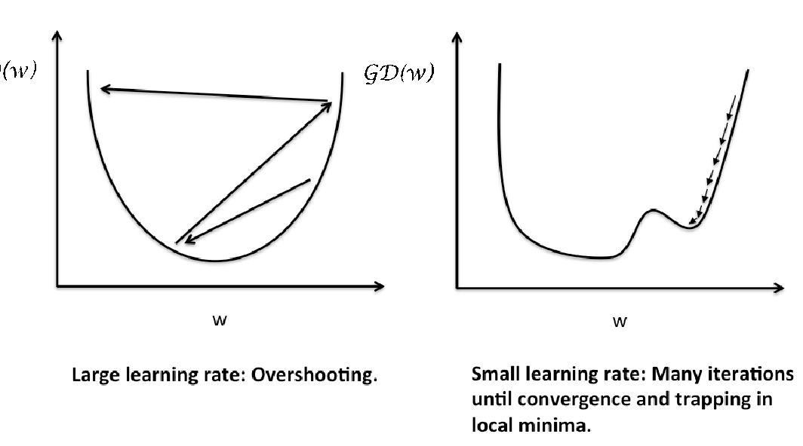

GD(w) GD(w)
