42028: Deep Learning and Convolutional Neural Network

# Week-4 Lecture

Neural Network in details

Outline

- • Logistic Regression Recap
- • Back Propagation
- • Gradient Descent and intuitions
- • Optimization techniques: SGD, RMSProp, Adam etc.
- • Activations Functions: Sigmoid, tanh, ReLu, Softmax
- • Logistic Regression with Back Propagation
- • Multi-Layered Neural Network

Logistic Regression – Recap

Function to calculate Loss/error

Mechanism to reduce the loss/error

###### Problem of Binary Classification:

Dog? → 1 Cat ( not Dog)? → 0

|Error/  Loss|
|---|

Gradient

### 1

Target

|Model  ANN Architecture + Parameters|
|---|

# 0

Output (y)

Input (x)

###### Activation function

Problem of Binary Classification → Logistic Regression (Dog ? → 1 | Not Dog? → 0)

|Parameters:  1. w (weight) 2. b (bias) 3. Output a= (𝒘𝑻𝒙+𝒃) |
|---|

###### Loss function for Logistic Regression:

|L (a, y) =- 𝑦 log𝑎 + 1 − 𝑦 log(1 − 𝑎)  |
|---|

Logistic Regression pipeline with the math looks like:

###### X W B

|𝒘𝑻 𝒙 + 𝒃| |
|---|---|
| | |

|a = (𝒘𝑻 𝒙 + 𝒃)|
|---|

|L (a, y)|
|---|

###### L

Logistic Regression pipeline with the math looks like:

|Where,  W → Weights X → Inputs b → Bias term    → Activation function|
|---|

###### X

###### ŷ

|𝒘𝑻 𝒙 + 𝒃| |
|---|---|
| | |

|a = (𝒘𝑻 𝒙 + 𝒃)| |
|---|---|
| | |

- W b

| |L (a, y)|
|---|---|
| | |

|Parameters:  1. w (weight) 2. b (bias) 3. Output a=(𝑤𝑇 𝑥 +𝑏) |
|---|

Activation function

|a= = 1+𝑒1−𝑥  |
|---|

###### Loss function for Logistic Regression:

|L (a, y) =- 𝑦 log𝑎 + 1 − 𝑦 log(1 − 𝑎)  |
|---|

Logistic Regression pipeline with the math looks like:

###### X

Activation function

|a= = 1+𝑒1−𝑥  |
|---|

###### ŷ

|𝒘𝑻 𝒙 + 𝒃| |
|---|---|
| | |

|a = (𝒘𝑻 𝒙 + 𝒃)| |
|---|---|
| | |

- W b

| |L (a, y)|
|---|---|
| | |

If y = 1:L (a, y) =-log a

###### Loss function for Logistic Regression:

If y = 0:L (a, y) =-log (1– a)

|L (a, y) =- 𝑦 log𝑎 + 1 − 𝑦 log(1 − 𝑎)  |
|---|

Logistic Regression pipeline with the math looks like:

|Where,  W → Weights X → Inputs b → Bias term    → Activation function|
|---|

###### X

|𝒘𝑻 𝒙 + 𝒃| |
|---|---|
| | |

|a = (𝒘𝑻 𝒙 + 𝒃)||L  |(a, y)|
|---|---|
| | |
|
|---|---|
| | |

|L  |(a, y)|
|---|---|
| | |

W b

Forward Pass

###### Back Propagation

|Parameters:  1. w (weight) 2. b (bias) 3. Output a=(𝑤𝑇 𝑥 +𝑏) |
|---|

|repeatedly adjust the weights to minimize the difference between actual output and desired output|
|---|

Activation function

|a= = 1+𝑒1−𝑥  |
|---|

###### Loss function for Logistic Regression:

|L (a, y) =- 𝑦 log𝑎 + 1 − 𝑦 log(1 − 𝑎)  |
|---|

#### Optimization techniques

|Generic Algorithm:  Step 1: Initialize w and b Step 2: Perform Forward pass operation/calculations Step 3: Compute Loss/Cost function L (a, y) Step 4: Compute change in w and b (Take the partial derivative of the cost function with  respect to Weights and bias (dw and db).  Step 5: Update w and b w := w – dw b := b – db Step 6: Repeat from Step 2 with new values of w and b for ‘n’ number of iterations. |
|---|

###### Gradient Descent for learning parameters: It is an iterative approach for error correction in a machine learning model.

###### Question: Find w and b that will minimize GD(w, b)

Required: Loss/cost function

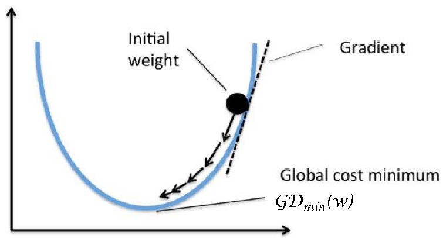

###### (L)LossFn

|Example the loss function is:  L (a, y)=- 𝑦log𝑎 + 1 − 𝑦 log(1 − 𝑎)  | | |
|---|---|---|
| | → Learning rate| |

GDmin(w)

w

Image Source: https://subscription.packtpub.com/book/big_data_and_business_intelligence/9781788397872/1/ch01lvl1sec22/gradient-descent

Source and Reference: http://cs230.stanford.edu/files/C1M2.pdf

###### Gradient Descent for learning parameters: Learning rate() issues:

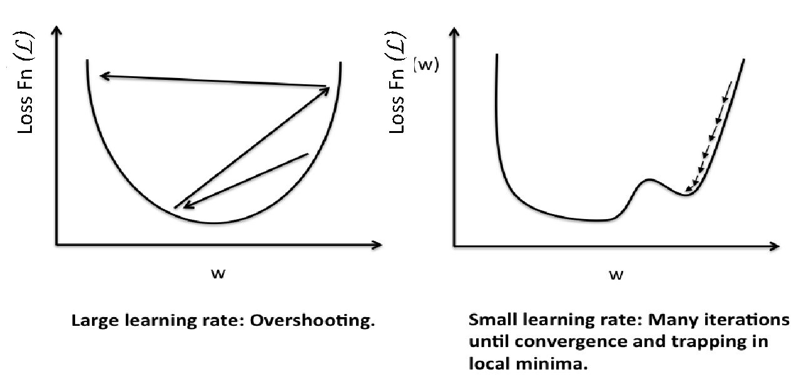

(L)LossFn

(L)LossFn

###### - It is a hyper-parameter

Image Source: https://subscription.packtpub.com/book/big_data_and_business_intelligence/9781788397872/1/ch01lvl1sec22/gradient-descent

Source and Reference: http://cs230.stanford.edu/files/C1M2.pdf

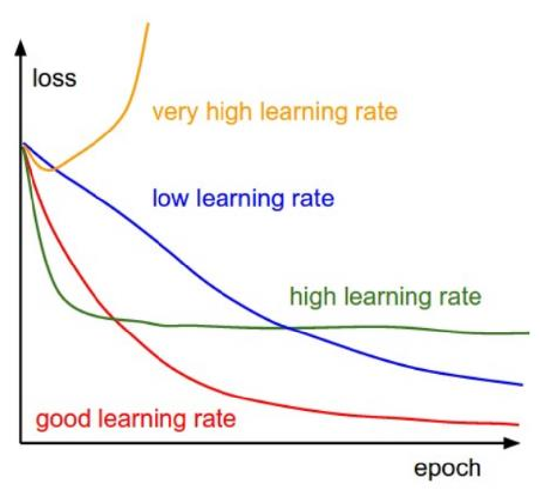

###### Learning rate(): more intuitions

Image Source: http://cs231n.github.io/neural-networks-3/

Gradient Descent Types

There are three main types of Gradient Descent Algorithms:

- 1. Batch Gradient Descent (BGD)
- 2. Stochastic Gradient Descent (SGD)
- 3. Mini-Batch Gradient Descent (MBGD)

Batch Gradient Descent (BGD)

###### Issues:

|Generic steps:  -Process each input sample and find the cost -Find the average cost over all input samples -Update w and b, and -repeat the steps for ‘n’ epochs(iterations) |
|---|

- 1. It uses the complete dataset to calculate the gradients at every steps
- 2. Slow when training set is large
- 3. Difficult to find the learning rate
- 4. Difficult to ascertain the number of epochs(iterations)

###### Advantage:

###### Stochastic → Random

- 1. Computes gradient based on single input sample: memory efficient
- 2. Much faster compared to BGD
- 3. Possible to train on large dataset
- 4. Randomness is a good escape from local minima problem

Due to the random nature, the

Algorithm is much less regular than

BGD

|Generic steps:  -Process a random input sample and find the cost -Update w and b, and -repeat the steps for ‘n’ iterations on the training samples |
|---|

###### Issues:

1. Might not reach the optimal value,

but very close to it.

Issues: Might not reach the optimal value, but very close to it.

Possible solution: Reduce the learning rate gradually → Stimulated annealing

Create a Learning Schedule to determine the learning at each iteration.

Epoch: One round through the complete training set. Iterations: Process in multiple subsets of the training set, say, ‘m’ iterations

my form 1 epoch

Mini-Batch Gradient Descent (MBGD)

###### Advantage:

|Generic steps:  -Divide the training set into mini-batches (set of random samples on fixed number) -Process all the samples in a Mini-batch and find the average cost -Update w and b, and -repeat the steps for ‘n’ iterations/epochs on the training samples |
|---|

- 1. Computes gradient based on small sets of input sample
- 2. Much faster compared to BGD
- 3. Possible to train on large dataset
- 4. Performance boost on matrix operations using GPUs!
- 5. Might not reach the optimal value, but very close to it, and possibly better than SGD

###### Issues:

1. It may be harder to escape the local

minima.

## Gradient Descent (SGD) - intuition

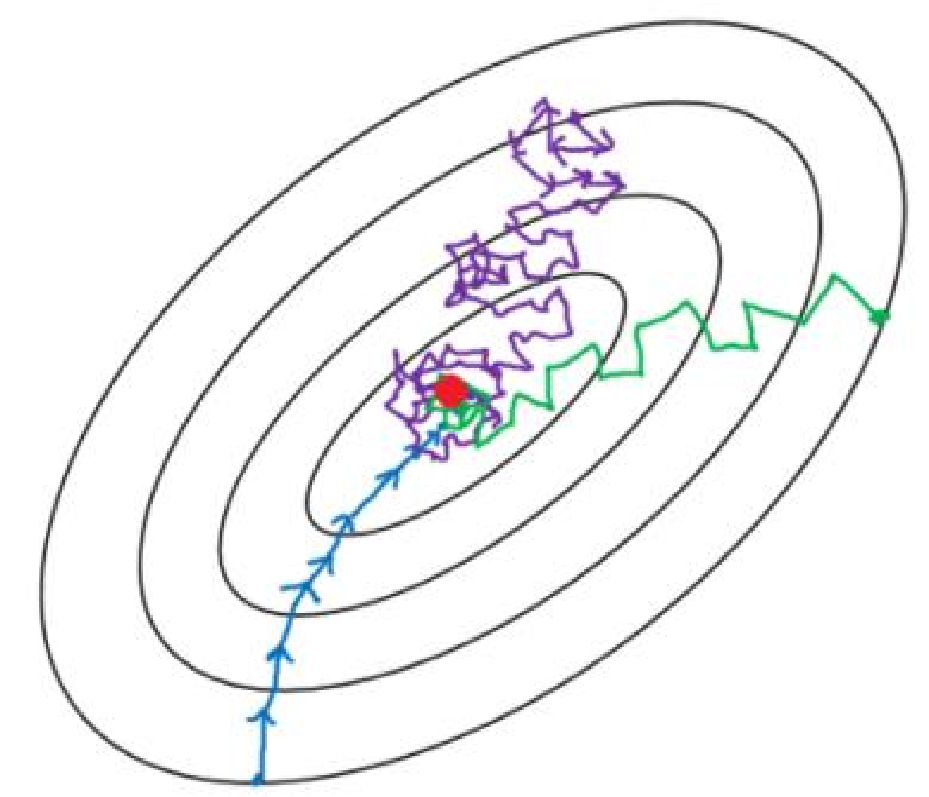

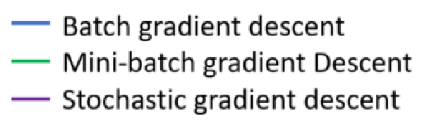

Image Source: https://towardsdatascience.com/gradient-descent-algorithm-and-its-variants-10f652806a3

## Gradient Descent (SGD) – loss function nature

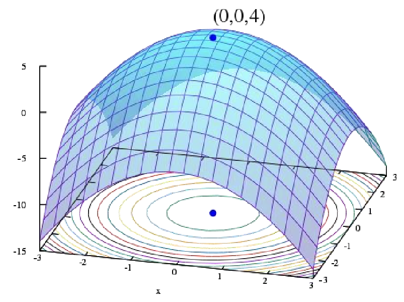

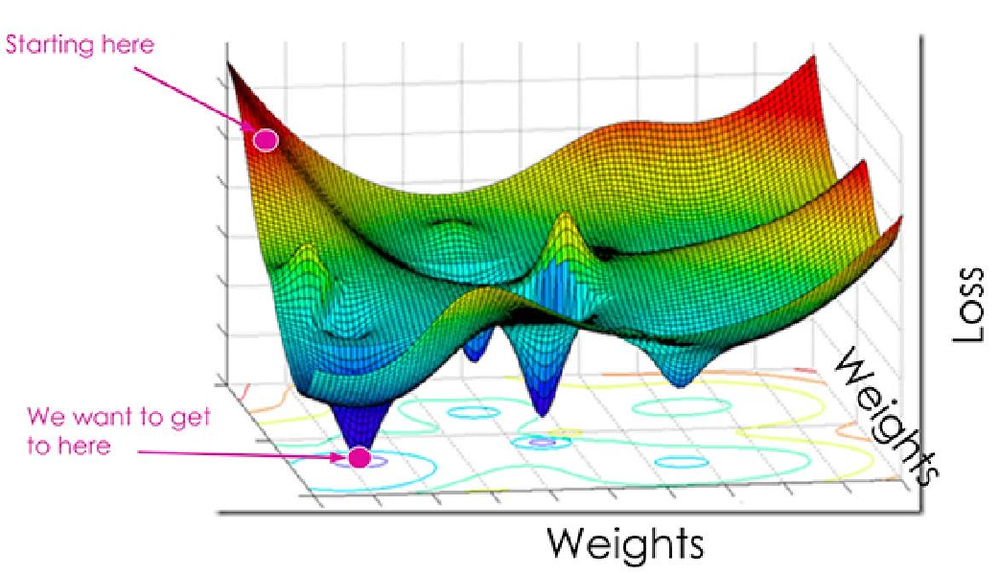

- • One of the popular algorithm for smoothing sequential data
- • Also called Moving Average
- • Weight the number of observations and using their average
- • Example: Temperatureover ‘n’ days Days

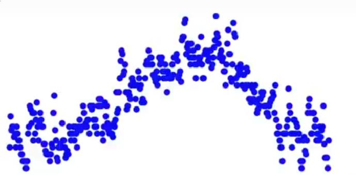

Temperature

Vt : Moving average on day ‘t’

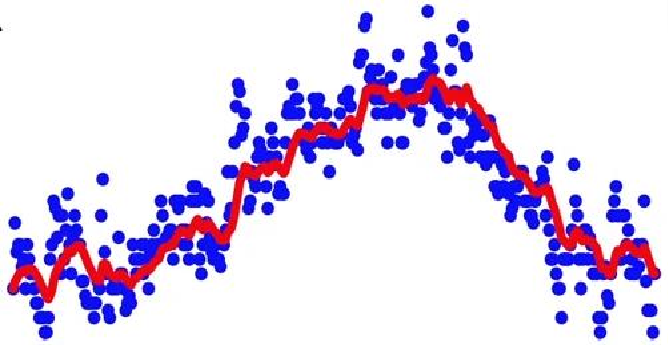

So, let V0 = 0 V1 = 0.9 V0 + 0.1 1 V2 = 0.9 V1 + 0.1 2 V3 = 0.9 V2 + 0.1 3

Temperature

: : Vt = 0.9 Vt-1 + 0.1 t

Days

Vt = 0.9 Vt-1 + 0.1 t If  = 0.9,

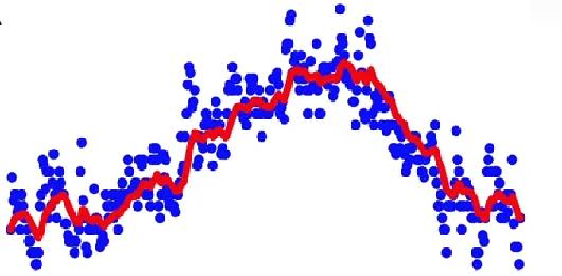

Temperature

|Vt =  Vt-1 + (1- ) t|
|---|

This equation gives the moving average

shown by the red line.

Days

|Vt =  Vt-1 + (1- ) t|
|---|

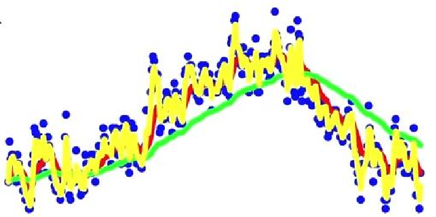

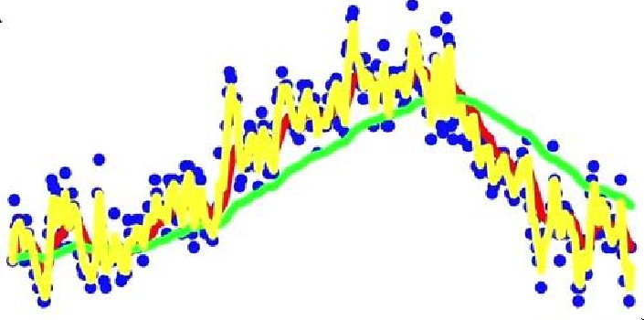

Temperature

Vt is approximate average over 1−1

 days

So,  = 0.9 is closer to 10 days temperature  = 0.98 is closer to 50 days temperature  = 0.5 is closer to 2 days temperature

Days

What is Exponentially Weighted Averages doing?

Vt =  Vt-1 + (1- ) t

For, V100= 0.9 V99 + 0.1 100 V99= 0.9 V98 + 0.1 99

Substituting, V99 V100= 0.1 100+ 0.9 (0.9 V98 + 0.1 99) V100= 0.1 100+ 0.9 ( 0.1 99+ 0.9 (0.9 V97+ 0.1 V98)) ..

- • “Compute the Exponentially weighted average of the gradients and use that gradient to update weights” - Andrew NG
- • One of the most popular algorithms
- • Helps to accelerate the gradient vectors in right direction and reduces oscillation
- • Always faster than the SGD

|Algorithm: At iteration t:  Calculate 𝑑𝑤 𝑎𝑛𝑑 𝑑𝑏 on the current mini-batch  V𝑑𝑤 =  V𝑑w + (1 - ) 𝑑𝑤 ➔ Vt =  Vt-1 + (1- ) t  V𝑑𝑏=  V𝑑𝑏 + (1 - ) 𝑑𝑏 Update w and b:  w = w -  V𝑑𝑤 ,b = b -  V𝑑𝑏 Hyper-parameters: , |
|---|

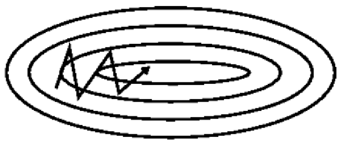

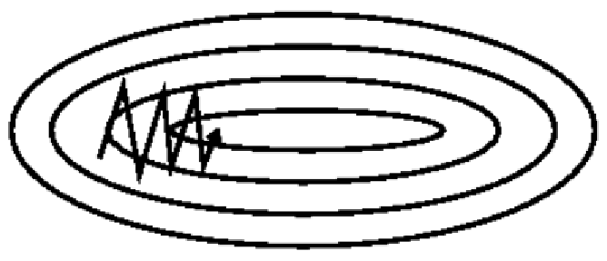

SGD Without Momentum SGD With Momentum

Faster convergence and reduced oscillation

Image Source and reference http://ruder.io/optimizing-gradient-descent/index.html#momentum

- • Root Mean Square Propagation
- • Unpublished adaptive learning method by Geoffrey Hinton
- • RMSProp also reduces oscillation but in a different way than Momentum
- • RMSprop as well divides the learning rate by an exponentially decaying average of squared gradients.

|Algorithm:  At iteration t:  Calculate 𝑑𝑤 𝑎𝑛𝑑 𝑑𝑏 on the current mini-batch S𝑑𝑤 = 2 S𝑑w + (1 - 2) 𝑑𝑤2 S𝑑𝑏= 2 S𝑑𝑏 + (1 - 2) 𝑑𝑏2  Update w and b:  w = w -  𝑑𝑤S  𝑑𝑤  , b = b -  𝑑𝑏S  𝑑𝑏  Squaring the derivatives  Square root of derivatives|
|---|

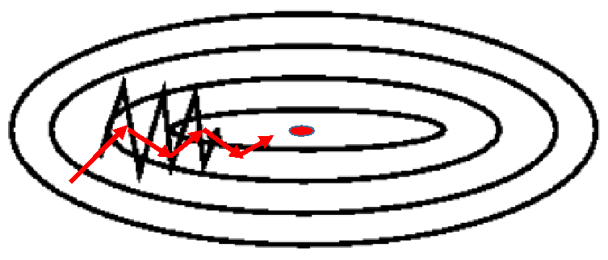

###### Intuition:

###### →Slow

S𝑑𝑤 → Smaller number expected S𝑑𝑏→ Larger number expected

b

###### W

So,

###### Fast →

w = w -  𝑑𝑤S

###### , b = b -  𝑑𝑏S

###### In Practice add ε :

𝑑𝑤

𝑑𝑏

w = w -  S𝑑𝑤

𝑑𝑤+ε , b = b -  S𝑑𝑏

|Smaller number So, w is larger|
|---|

Larger number So, b is small

𝑑𝑏+ ε

ε → small number, 10-8

- • Adam → Adaptive Moment Estimation
- • Combination of RMSProp and Momentum
- • Work well for a wide range of deep learning architecture

|Algorithm:  Initialize V𝑑𝑤 = 0, V𝑑𝑏= 0, S𝑑𝑤 = 0, S𝑑𝑏 = 0 At iteration t:  Calculate 𝑑𝑤 𝑎𝑛𝑑 𝑑𝑏 on the current mini-batch V𝑑𝑤 = 1 V𝑑w + (1 - 1) 𝑑𝑤, V𝑑𝑏= 1 V𝑑𝑏 + (1 - 1) 𝑑𝑏  From Momentum, 1 S𝑑𝑤 = 2 S𝑑w + (1 - 2) 𝑑𝑤2, S𝑑𝑏= 2 S𝑑𝑏 + (1 - 2) 𝑑𝑏2  From RMSProp, 2  Update w and b:  w = w -  V  𝑑𝑤  S𝑑𝑤+ε, b = b -  V  𝑑𝑏  S𝑑𝑏+ ε|
|---|

|In practice: Bias correction is required as V𝑑𝑤, V𝑑𝑏, S𝑑𝑤, S𝑑𝑏 are initialized to 0 and are biased towards zero. Hence, a bias correction is required as  follows:  V′𝑑𝑤 = V  𝑑w  ( 1− 1 )  , V′𝑑b = V  𝑑b  (1− 1)  S′𝑑𝑤 = S  𝑑w  (1 − 2)  , S′𝑑b = S  𝑑b  (1 − 2)  Update w and b:  w = w -  V  ′  𝑑𝑤  S′𝑑𝑤+ε , b = b -  V  ′  𝑑𝑏  S′𝑑𝑏+ ε|
|---|

|https://vis.ensmallen.org/  Hyper parameter guide:   (Learning rate)→ should be tunned, start with 0.001  1(Momentum term) → 0.9 (dw) 2(moving weighted average) → 0.999 (dw2) ε → 10-8   Optimization Demo: https://vis.ensmallen.org/  |
|---|

Learning Rate Decay

###### Speed-up the learning algorithm by slowing decreasing the 𝛼 (Learning rate)

#### Activation Functions

Activation Functions: Sigmoid

|= 1+1𝑒−𝑥  |
|---|

|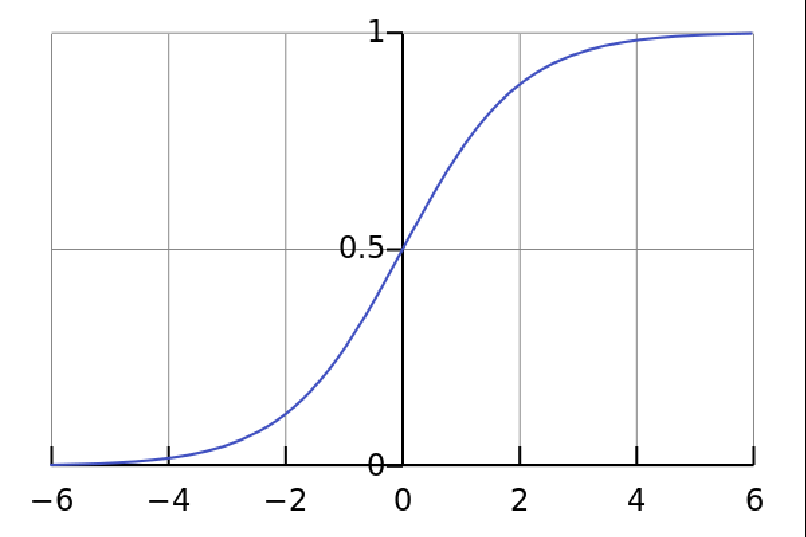|
|---|

Sigmoid function:

|Characteristics:  - Non-linear in nature - Range(0, 1) - Tends to bring the activations to either side of the curve: good for a classifier - Suffers from vanishing gradient problem |
|---|

###### Vanishing Gradient: Towards to the end of the curve, the value of Y change very less to the changes in X values. Hence gradient at the region will be very small. The network will refuse or learning extremely slowly.

Source: https://medium.com/the-theory-of-everything/understanding-activation-functions-in-neural-networks-9491262884e0

Activation Functions: tanh

|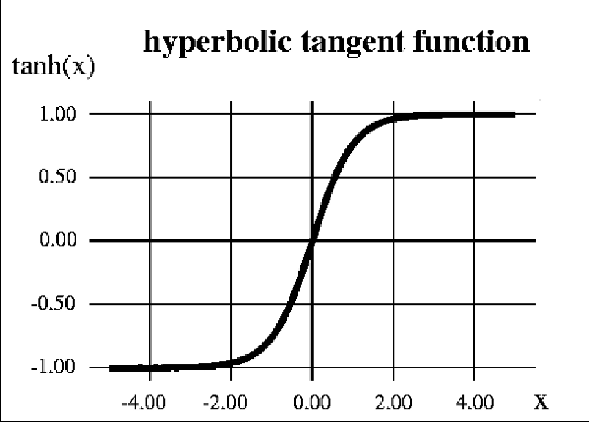|
|---|

|Hyperbolic tangent:  tanh 𝑥 =  2 1 + 𝑒−2𝑥  − 1  |
|---|

|Characteristics:  - Non-linear in nature - Range(-1, 1) - Stronger gradient than sigmoid - Also suffers from vanishing gradient problem |
|---|

Activation Functions: ReLu

|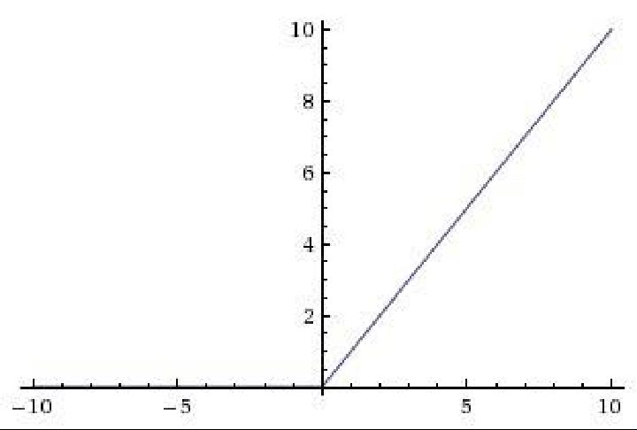|
|---|

|Rectified Linear Unit (ReLu) 𝐴(𝑥) = max(0, x)|
|---|

i.e. : if x < 0, A(x) = 0, if x > 0, A(x) = x

|Characteristics:  - Non-linear in nature - Range[0, inf] - Stronger gradient than sigmoid - Computationally less expensive than Sigmoid and Tanh - Best used in hidden layers - Dying ReLu problem |
|---|

|Avoids and rectifies vanishing gradient problem|
|---|

Activation Functions: Leaky ReLu

|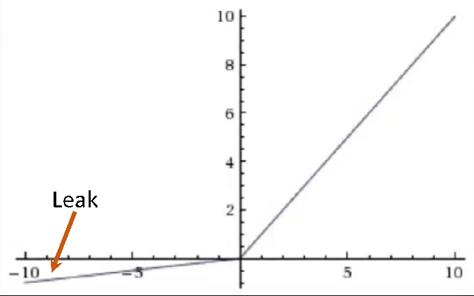  Leak|
|---|

|Leaky Rectified Linear Unit (Leaky ReLu)  𝐴(𝑥) = max(0.01𝑥,x)|
|---|

###### i.e. : if x < 0, A(x) = 0.01x, if x > 0, A(x) = x

|Characteristics:  - Non-linear in nature - Range[0, inf] - Leaky ReLUs are one attempt to fix the “dying ReLU” problem |
|---|

Source & Reference : http://cs231n.github.io/neural-networks-1/

https://towardsdatascience.com/activation-functions-in-neural-networks-58115cda9c96

Activation Functions: Softmax

| |Softmax 𝑆 𝑦𝑖 = 𝑒𝑦𝑖   𝑗 𝑒𝑦𝑗  for j = 1, …, K.| |
|---|---|---|
|Characteristics:  - Non-linear in nature - Turns numbers in probabilities that sum to one. - Useful when we have more than one output - Used for classification in the output layer - Less computationally expensive than Sigmoid and Tanh | |Y|

###### Illustration:

###### = [ 2.0, 1.0, 0.1] Softmax(Y) = [0.7, 0.2, 0.1] (approx.)

Reference: https://medium.com/data-science-bootcamp/understand-the-softmax-function-in-minutes-f3a59641e86d

Logistic Regression with Backpropagation

###### Logistic Regression pipeline with the math looks like:

Average cost over all training ‘m’ samples

X W

###### a = (𝒘𝑻 𝒙 + 𝒃)

| |L (a, y)  |
|---|---|
| | |

𝒘𝑻 𝒙 + 𝒃

|Avg Loss(J) =  𝟏  𝒎  ෍  𝒊=𝟏  𝒎  L(ai,yi)  |
|---|

b

|Batch GD  Step 1: Initialize w and b Step 2: Perform Forward pass operation/calculations   Step 2: Compute Loss/Cost function L (a, y) Step 3: Find the average cost over all input samples (Take the partial derivative of the cost function with  respect to Weights and bias (dw and db).  Step 4: Update w and b w := w – dw b := b – db Step 5: Repeat from Step 2 with new values of w and b for ‘n’ number of iterations.   |
|---|

|dw = 𝜕𝑤𝜕𝐽 , db = 𝜕𝑏𝜕𝐽  |
|---|

|𝑤 ≔ 𝑤 − dw  b := b – db|
|---|

|Size  #Bedroom  #Bathroom  Garden  Location|
|---|

###### Price

Y

X

Hidden Layer→ Adding more neurons in between input and output layer

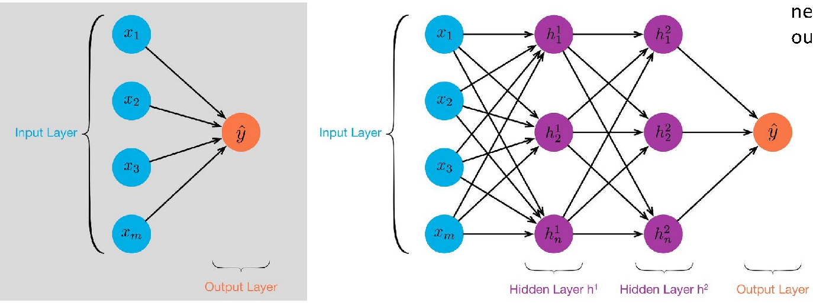

Single layer perceptron 3-layered neural network with 2 hidden layers

Image Source: https://towardsdatascience.com/multi-layer-neural-networks-with-sigmoid-function-deep-learning-for-rookies-2-bf464f09eb7f

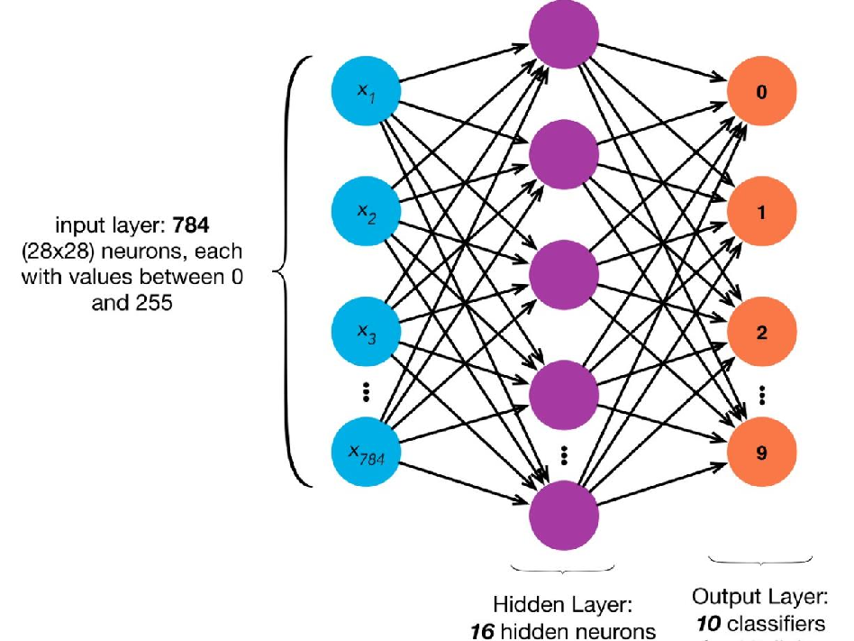

Example: 2-layered architecture for multi-class classification (e.g: Fashion MNIST dataset)

Intuition: In a multi-layer neural network, the first hidden layer will be able to learn some very simple patterns. Each additional hidden layer will somehow be able to learn progressively more complicated patterns.

###### Example: 2-layered architecture for multi-class classification (e.g: MNIST digit dataset) intuition

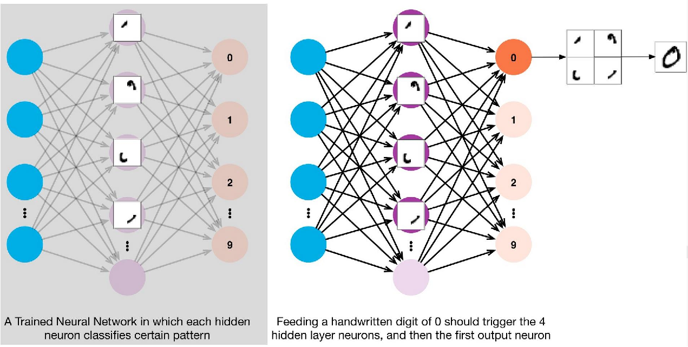
