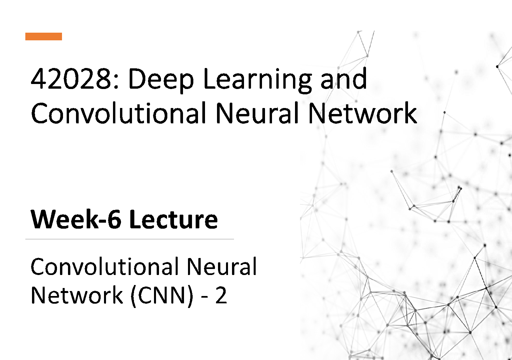

42028: Deep Learning and Convolutional Neural Network

# Week-6 Lecture

Convolutional Neural Network (CNN) - 2

Outline

- • Dataset preparation

- • Bias and Variance

- • Understanding Accuracy

- • Fixing Bias and Variance issues

- • Regularization

- • L1 and L2 Regularization

- • Dropouts

- • Data Augmentation – Simple and advanced

- • In case of small dataset (Range : 100 - \<100k)

- - Train set: 60%

- - Validation set: 20%

- - Test set: 20%

|Popular dataset spit choice in non-DL era! Or Small Data era!|
|---|

Or,

- - Train set: 70%
- - Test set: 30%

###### • In case of Large dataset (Range : 500K - 1M+)

###### Example: Total data sample : 1M+ Train: 98% ! Validation: 10,000 samples Test: 10,000 samples

|Popular dataset spit choice in DL era! Or BIG Data era!|
|---|

###### Train, validation and test set distribution:

Rule of Thumb: Validation and Test set should come from the same distribution

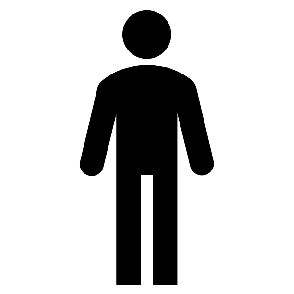

### Bias and Variance

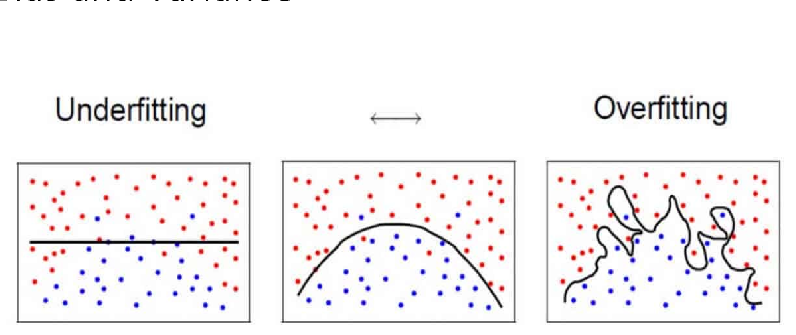

Image Source: https://cv-tricks.com/machine-learning/bias-variance-trade-off/

###### • It is a value that allows to shift the activation function to left or right, to better fit the data

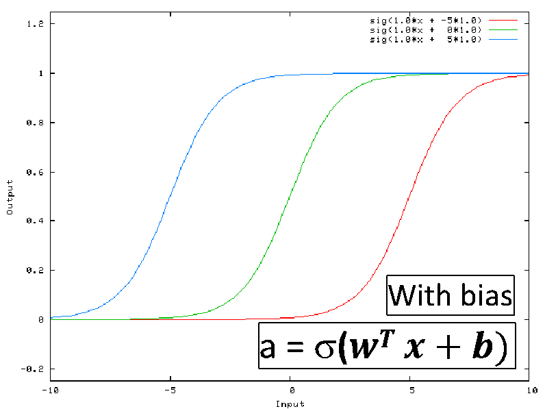

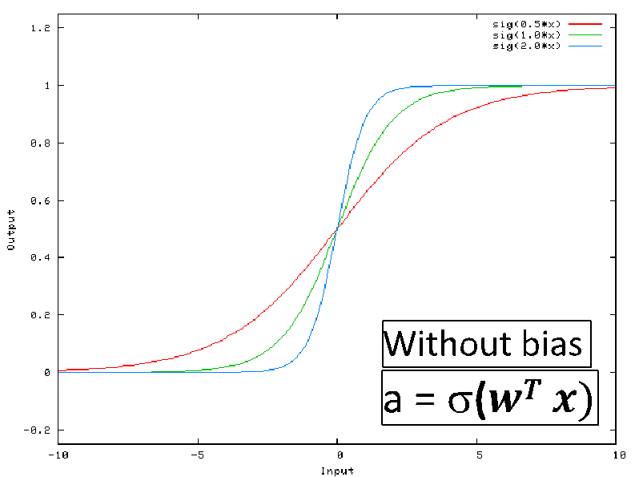

|With bias|
|---|

|Without bias|
|---|

|a = s(𝒘𝑻 𝒙)|
|---|

|a = s(𝒘𝑻 𝒙 + 𝒃)|
|---|

- • Changes in ‘w’ alters the steepness of the curve, keeping the origin at (0,0) or same/unchanged
- • Without bias we may get a poor fit to training data

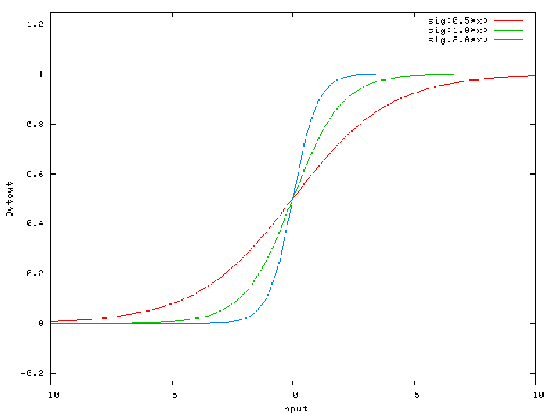

|a = s(𝒘𝑻 𝒙)|
|---|

|Without bias|
|---|

- • Changes in ‘b’ shifts the curve to left or right
- • With bias the curve/line will not always pass through origin
- • We get a better fit to training data

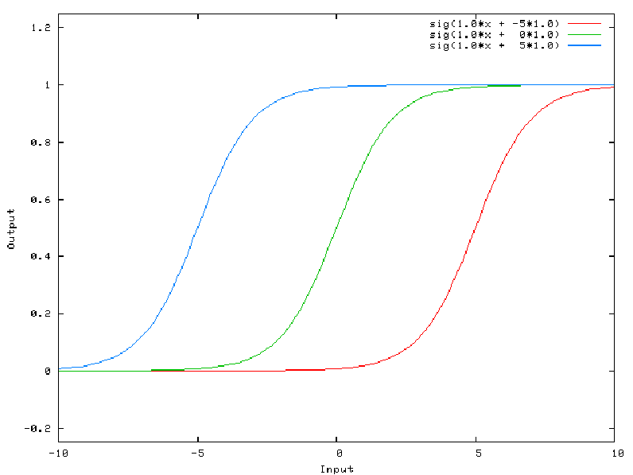

|a = s(𝒘𝑻 𝒙 + 𝒃)|
|---|

|With bias|
|---|

Variance

- • It is the change in prediction accuracy of Machine Learning model between training data and test data.
- • Model with high variance pays a lot of attention to training data and does not generalize on the data which it hasn’t seen before.
- • With high variance, models perform very well on training data but has high error rates on test data.

### Bias and Variance effect

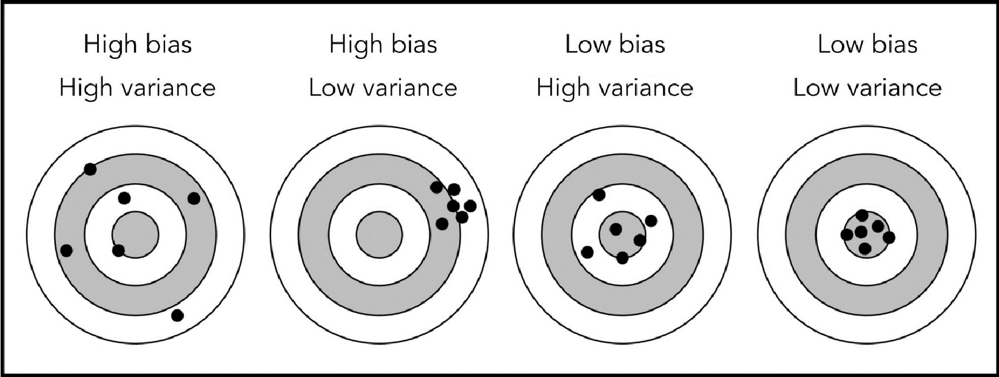

Reference and Source: http://snoek.ddns.net/~oliver/mysite/the-bias-variance-tradeoff.html

###### • Bayesian Optimal Error (BOE):

• Best optimal error that can be achieved

###### • Human Level performance:

- • Humans are very good at a lot of tasks
- • Can get labelled data from Humans – helps to improve the ML model performance
- • Gain insights from manual error analysis - Why did a human got it right?

Bayesian Optimal Error / Best Possible error

Accuracy

Human-level performance

Time

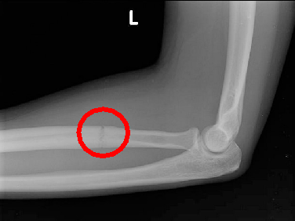

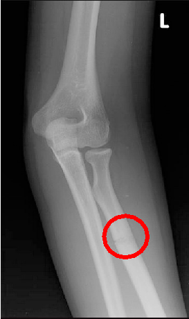

Medical diagnosis of fractures on arms Consider the performance by these groups:

|A|Untrained human|16 % error|
|---|---|---|
|B|General practitioner (GP)|5 % error|
|C|Orthopedic doctor (Specialist)|2 % error|
|D|Team of experienced doctors|0.4 % error|

X-ray: Stress fracture on arms

What is Human-level error?

###### • Identify High Bias:

- • High training error
- • Validation/test error nearly same as train error

###### • Identify High Variance:

- • Low training error

- • High validation/test error

- • High Bias Low Variance: Models are consistent but inaccurate

- • High Bias High Variance: Models are inconsistent and inaccurate

|• Low Bias and Low Variance: Models are consistent and accurate|
|---|

- • Low Bias and High Variance: Models are somewhat accurate but inconsistent on average

- • High Bias: Due to simple ML model and high training error.

- • Potential things to try :

- • Increase features: this will help in generalizing dataset

- • Make ML model more complicated

- • Decrease Regularization parameter

- • High Variance: Due to a ML model which is fitting most of the training dataset - overfitting.

- • Potential things to try :

- • Increase dataset size

- • Reduce input features

- • Increasing Regularization parameter

- • Regularization is a technique which makes slight modifications to the learning algorithm such that the model generalizes better.

- • Improves the model’s performance on the unseen data as well.

- • Popular techniques:

- • L2 and L1 regularization

- • Dropout

Source and reference: https://www.analyticsvidhya.com/blog/2018/04/fundamentals-deep-learning-regularization-techniques/

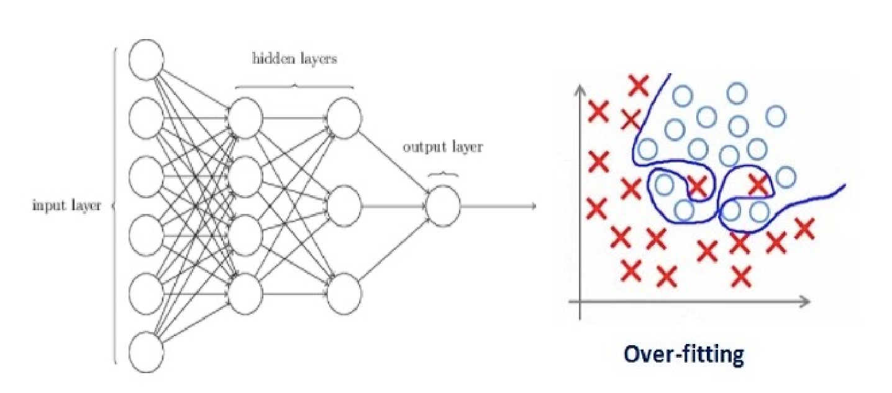

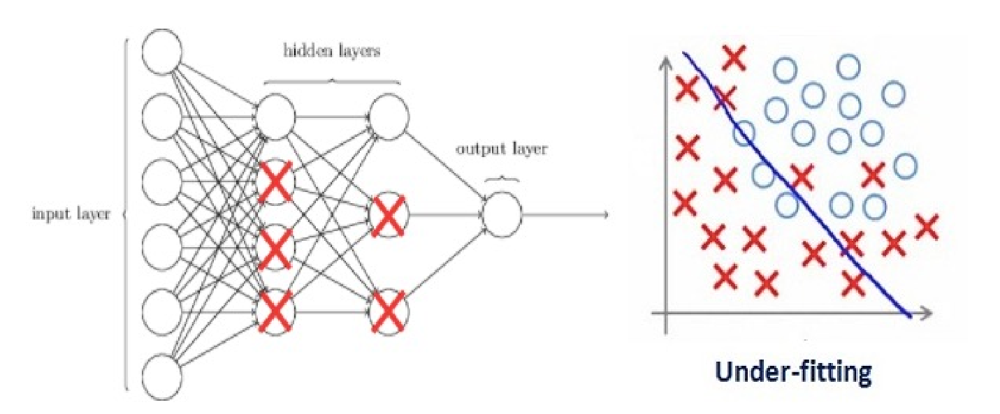

- • L2 and L1 regularization are common types and help in reducing the overfitting issue
- • Idea: Update the loss/cost function by adding a regularization term

Loss function = Loss + Regularization term (l)

- • Duetol,theweightmatriceswilldecrease,assuminganeuralnetworkwith

smaller weight matrices leads to simpler model

- • In Deep Learning, Regularization penalizes the weight matrices of the nodes

###### • L2 regularization:

|l 2𝑚  ∗ 𝑤  |
|---|

Cost func on = Loss + lis a hyper-parameter

Also known as weight decay, as it forces the weight to decay towards zero, but not exactly zero.

- • L1 regularization:

Cost func on = Loss +

|l 2𝑚  ∗ 𝑤  |
|---|

- • Penalize the absolute value of the ‘w’

- • Weight may reduce to zero

- • Useful in compressing a model

- • It produces good results and most popular regularization technique

- • At every iteration it randomly selects and drops some nodes and remove all the connections to and from them

- • Each iteration has a different set of nodes

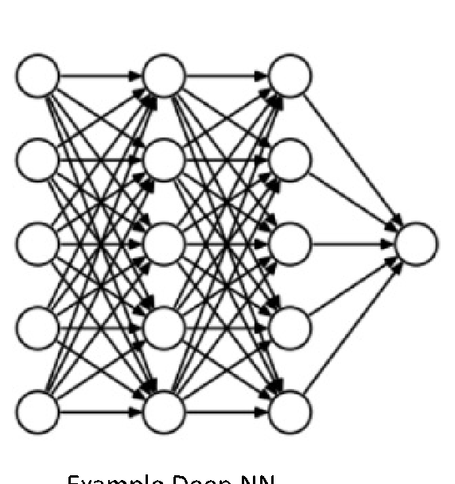

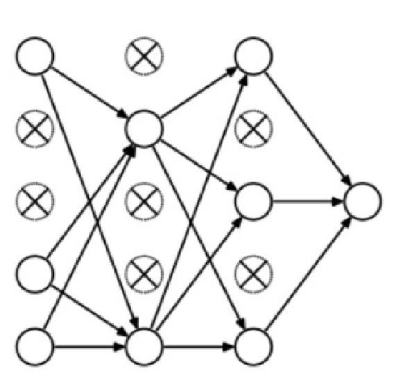

###### Example Deep NN Example Deep NN with Dropout

Data Augmentation

- • Another simple way to reduce overfitting is to increase size of training dataset!
- • Increase the size of training data by creating more sample using the existing training set and applying the following simple operations:
- • Flip
- • Rotate
- • Scale
- • Crop
- • Translate
- • Gaussian Noise

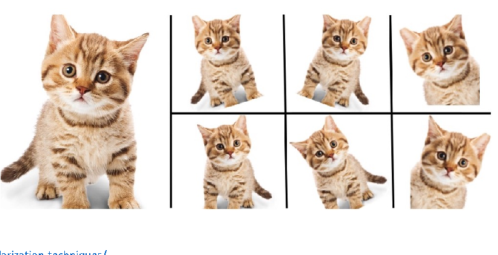

Cutout:

Simple regularization technique of randomly masking out square regions of input during training

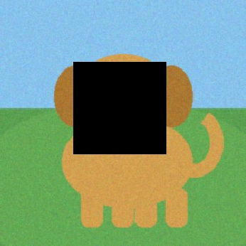

Key Parameters:

- - Patch size: 16X16 to 64X64
- - Fill Value: 0(black) or mean
- - Patches: 1-3 per image

Original Image After CutOut

Cutout:

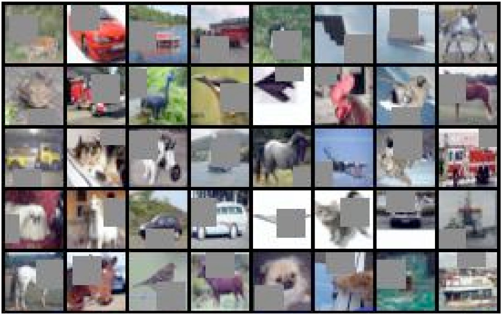

Example - Cutout applied to CIFAR-10 dataset

Mixup:

Trains a neural network on convex combinations of pairs of examples and their labels. By doing so, mixup regularizes the neural network to favour simple linear behaviour in-between training examples

##### +

##### =

Image A (λ=0.55)

Blended Output

Image B (1-λ=0.45)

Reference: https://arxiv.org/pdf/1710.09412 | Zhang et. Al ICLR 2018

CutMix:

In CutMix augmentation strategy: patches are cut and pasted among training image; ground truth labels are also mixed proportionally to the area of the patch.

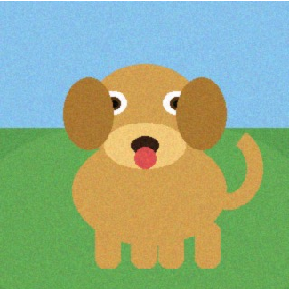

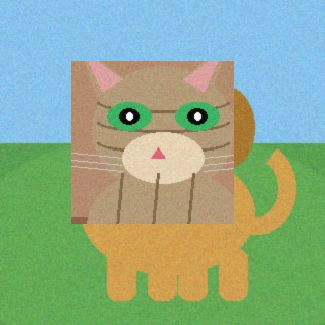

##### +

##### =

Image A

Pasted Patch

Image B (Patch Donor)

#### Overview of Mixup, Cutout and CutMix

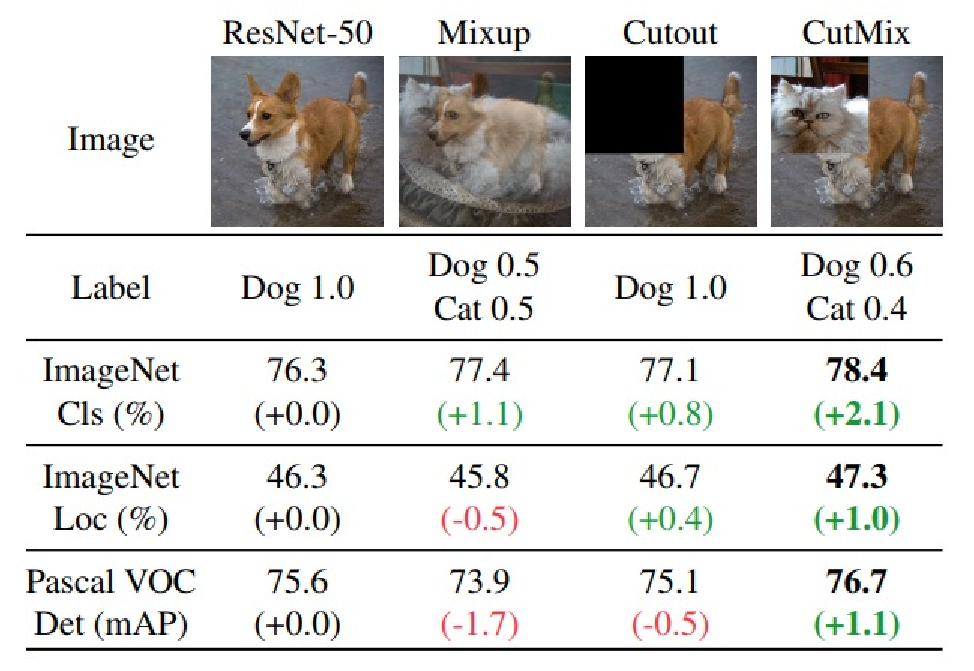

#### RandAugment:

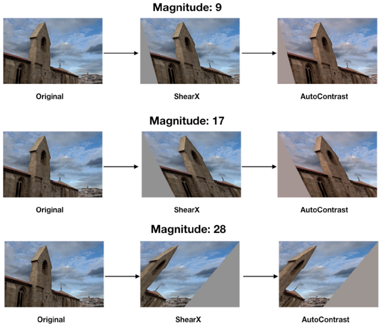

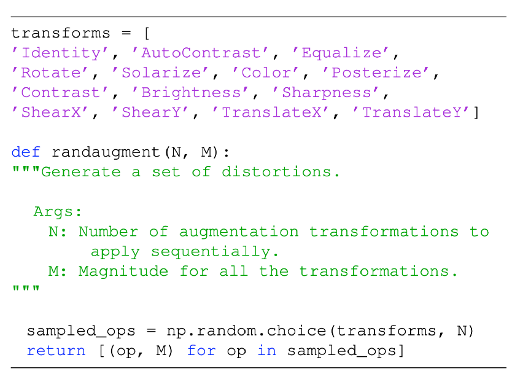

Example images augment by RandAugment

Reference: https://arxiv.org/pdf/1909.13719 | Cubuk et. Al, 2019

###### • Generative Adversarial Networks (GANs):

- - Among the hottest topic is DL
- - Able to generate images which look similar to the original ones
- - Proven to be very effective

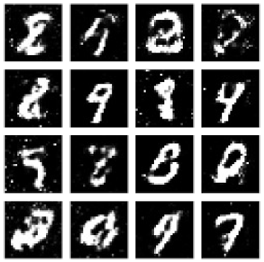

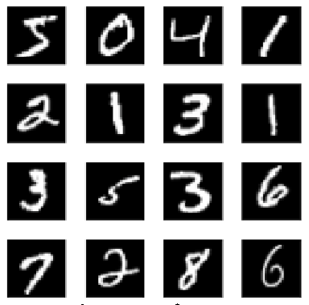

Original image from MNIST GAN generated

Source and reference: https://towardsdatascience.com/advanced-data-augmentation-strategies-383226cd11ba Image Source: https://towardsdatascience.com/having-fun-with-deep-convolutional-gans-f4f8393686ed

Data Augmentation

###### • Advanced data augmentation techniques:

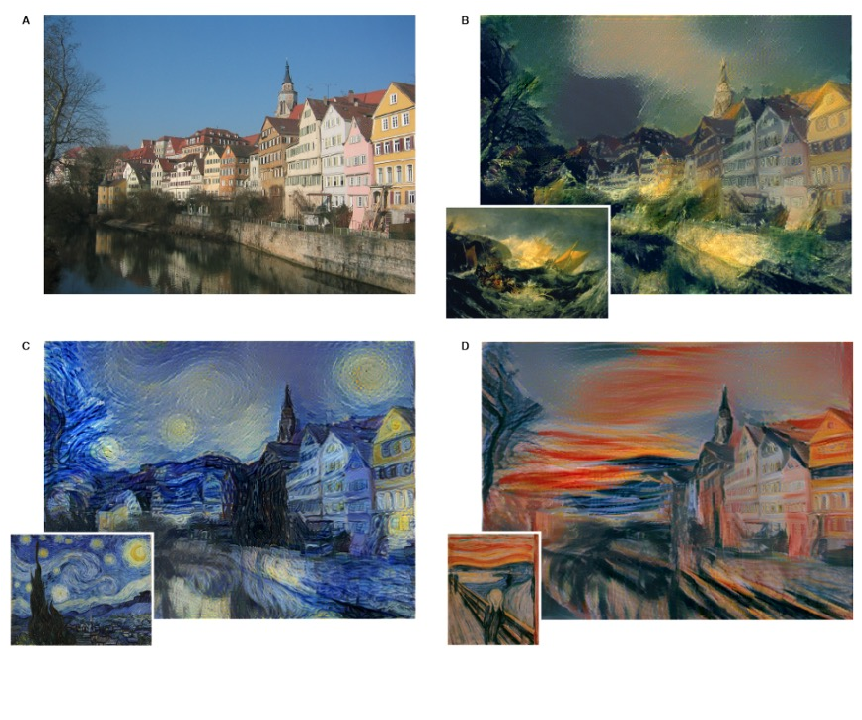

• Neural Style transfer:

- - Using CNN to separate style
- - transfer style to different image

Source and reference: https://towardsdatascience.com/advanced-data-augmentation-strategies-383226cd11ba
