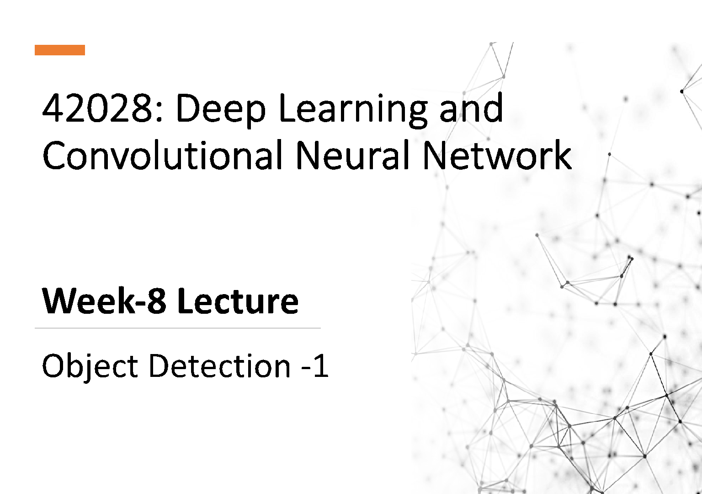

42028: Deep Learning and Convolutional Neural Network

# Week-8 Lecture

Object Detection -1

Outline

- • Introduction to Object Detection
- • Datasets and Performance metrics
- • Taxonomy
- • Classification and Localization task
- • Object detection as a regression problem
- • Object detection as a classification problem
- • Case study: RCNN family
- • Image annotation

Introduction

Image Classification

Image Classification Object Detection

- Localization Instance Segmentation

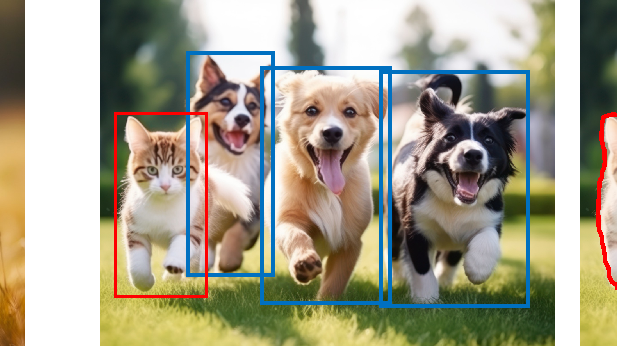

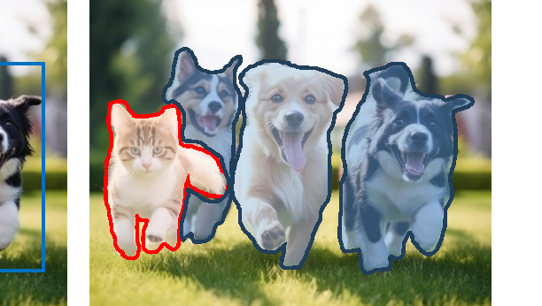

| |
|---|

|DOG|
|---|

|CAT|
|---|

|DOG|
|---|

|CAT|
|---|

|DOG|
|---|

DOG

Single Object

Multiple Object

- • The PASCAL Visual Object Classification (PASCAL VOC) is a popular dataset for object detection, classification and segmentation.

- • 20 categories

- • Link: http://host.robots.ox.ac.uk/pascal/VOC/

- • ImageNet has released an object detection dataset in 2013

- • Train set: 500,000 images, 200 categories.

- • Not very popular due to large number of classes and dataset size!

- • Large number classes complicates the task

Images source: https://towardsdatascience.com/evolution-of-object-detection-and-localization-algorithms-e241021d8bad

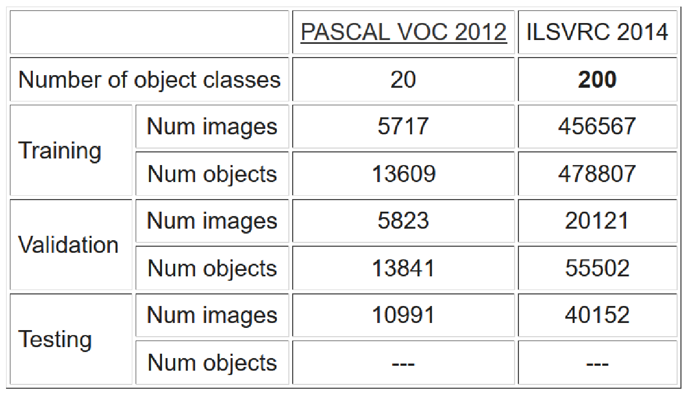

###### Dataset Comparison

Images source: http://image-net.org/challenges/LSVRC/2014/

###### • Intersection over Union (IoU): Intersection over Union is a metric used for the evaluation of an object detector, i.e. how good is the predicted bounding box for an object detected closely matches

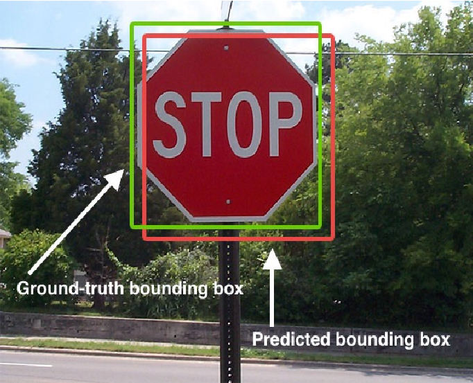

Reference: https://www.pyimagesearch.com/2016/11/07/intersection-over-union-iou-for-object-detection/

## Microsoft COCO Dataset

|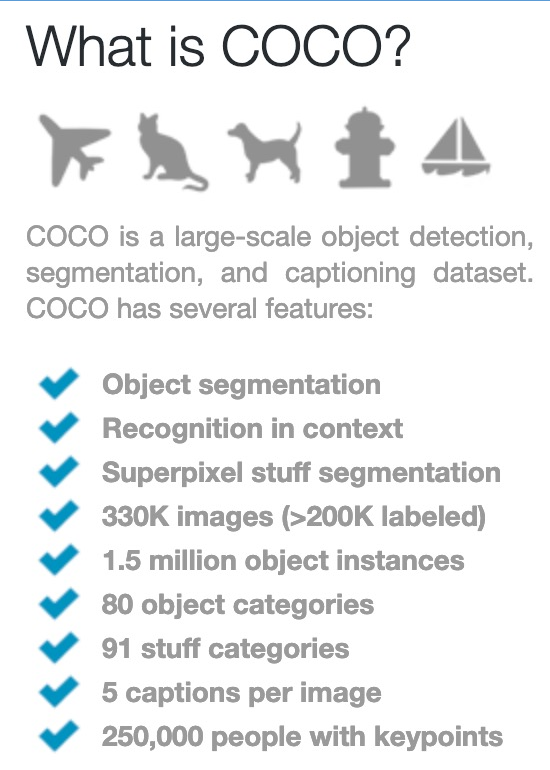|
|---|

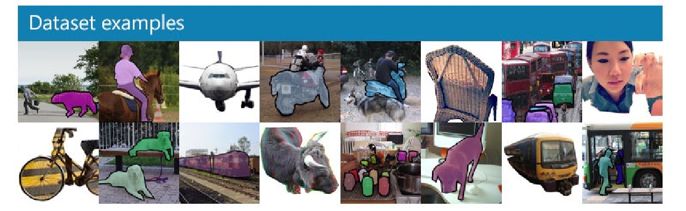

Source: https://cocodataset.org/#home

## Microsoft COCO Evaluation metrics

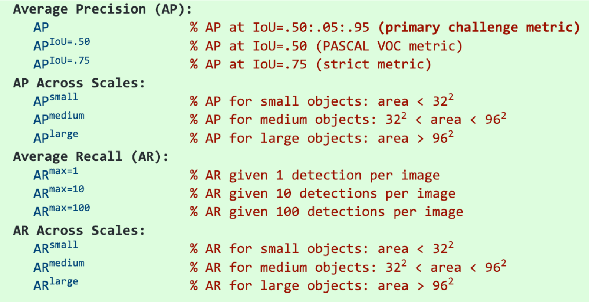

Source: https://cocodataset.org/#detection-eval

## Taxonomy of Object detectors

|Object Detection|
|---|

|Network type|
|---|

|Data type|
|---|

|Single stage| |
|---|---|
| | |

|Two Stage| |
|---|---|
| | |

|3D Object Detector|
|---|

|2D Object detectors|
|---|

|Regression/Classification Based|
|---|

|Region Proposal Based| |
|---|---|
| | |

|Monocular Image|
|---|

|Point Cloud|
|---|

|Point Nets|
|---|

|RCNN family|
|---|

|SSD|
|---|

|Yolo|
|---|

Refernce: https://medium.com/@saifhajsalem12/object-detection-state-of-the-art-and-modern-approaches-eaa5e6bfb46b

Image Classification

Image Classification Object Detection

- Localization Instance Segmentation

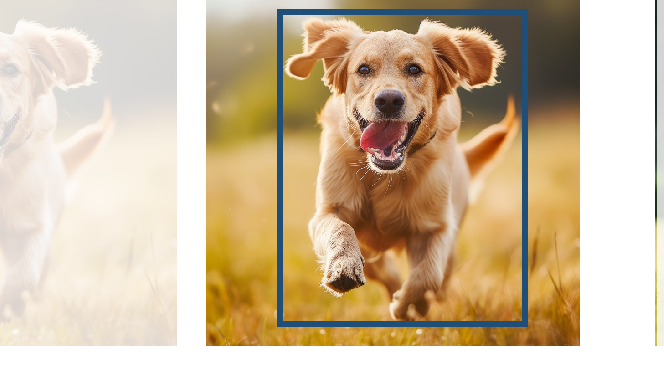

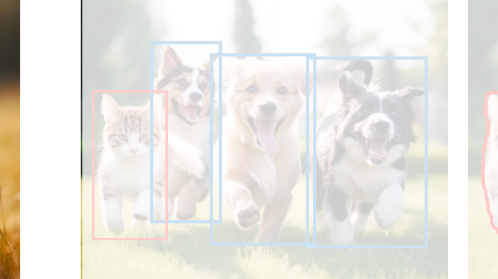

| |
|---|

|DOG|
|---|

|CAT|
|---|

|DOG|
|---|

|CAT|
|---|

|DOG|
|---|

DOG

Single Object

Multiple Object

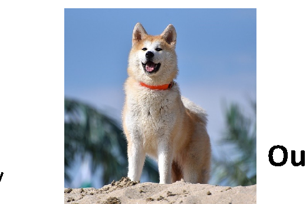

##### Classification Task:

Input : Image Output: Label Performance Evaluation: Accuracy

##### Output : Dog

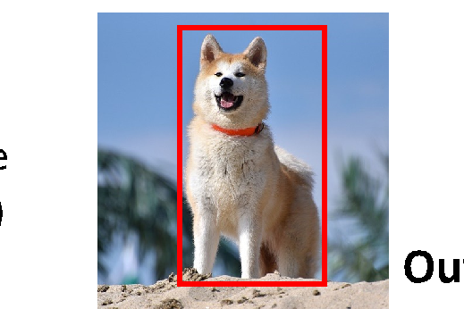

##### Localization Task:

| |
|---|

Input : Image Output: Bounding Box in the image

(x, y, Ht, Wd) or (x, y, x’, y’) Performance Evaluation: IoU

##### Output : (x, y, Ht, Wd)

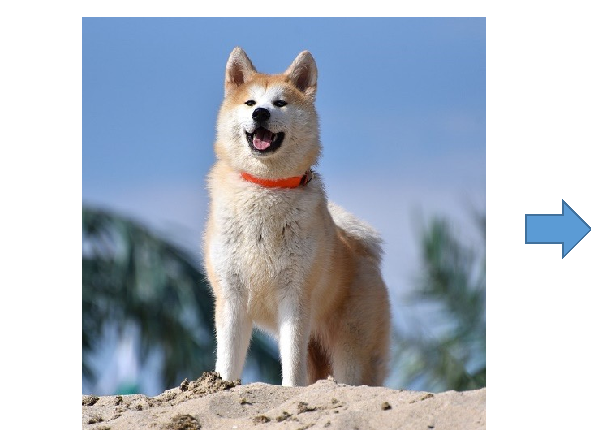

###### Output : 4 numbers (x’, y’, Ht’, Wd’)

| |
|---|

###### Calculate Loss L2 Loss

###### CNN

###### Ground Truth: 4 numbers (x, y, Ht, Wd)

Input Image

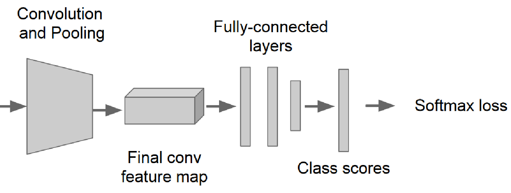

###### Input Image

|We need to modify this CNN pipeline to output Class Label and Bounding Box (4 numbers)|
|---|

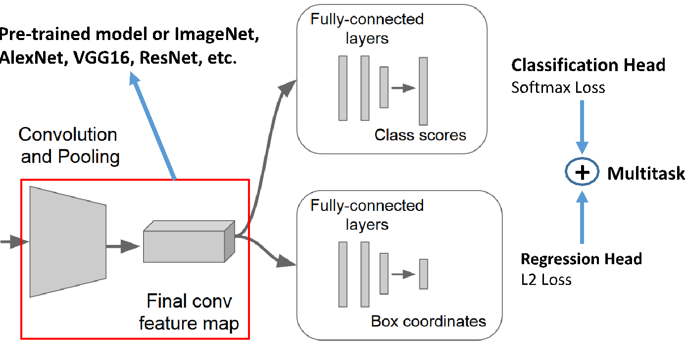

###### Pre-trained model or ImageNet, AlexNet, VGG16, ResNet, etc. Classification Head

Softmax Loss

#### + MultitaskLoss

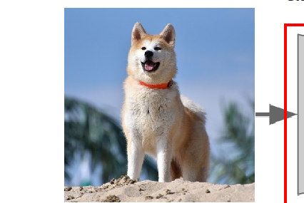

Regression Head L2 Loss

Input Image

Image Source and Reference: http://cs231n.stanford.edu/slides/2016/winter1516_lecture8.pdf

Potential locations for Regression head in CNN

###### After CONV Layer, Before the FC layer After Last FC layer

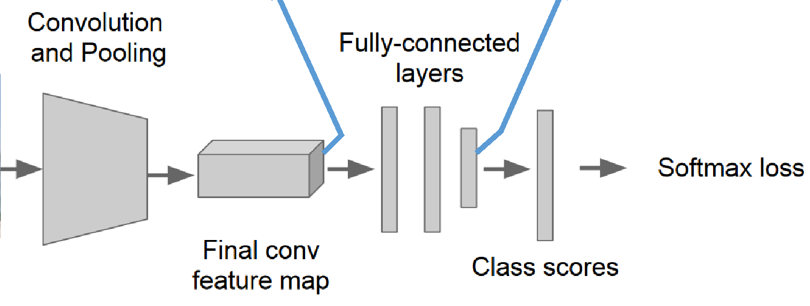

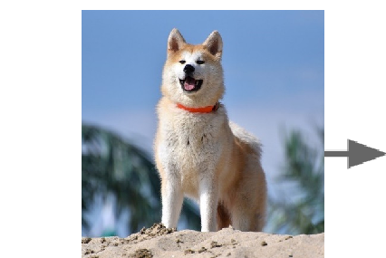

Input Image

Task: Object Detection Problem

Image Classification

Image Classification Object Detection

- Localization Instance Segmentation

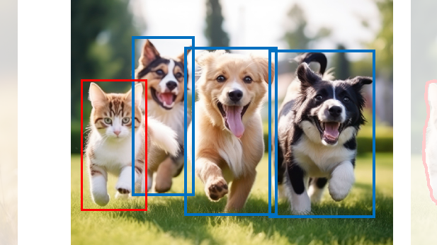

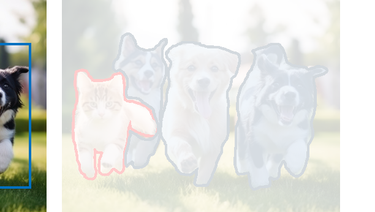

| |
|---|

|DOG|
|---|

|CAT|
|---|

|DOG|
|---|

|CAT|
|---|

|DOG|
|---|

DOG

Single Object

Multiple Object

Detection as a regression problem

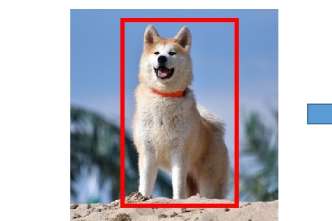

##### Output : Dog, (x, y, Ht, Wd)

|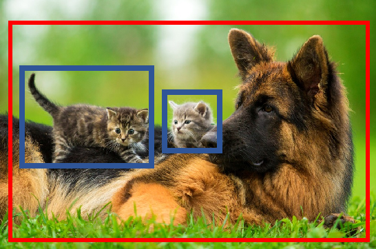|
|---|

##### Output : Dog, (x, y, Ht, Wd)

##### Cat, (x, y, Ht, Wd) Cat, (x, y, Ht, Wd)

- 1. Apply Sliding Window technique
- 2. Apply CNN to different Windows and get a prediction

##### Output : Dog? No Cat? No

|CNN|
|---|

##### Background? Yes

- 1. Apply Sliding Window technique
- 2. Apply CNN to different Windows and get a prediction

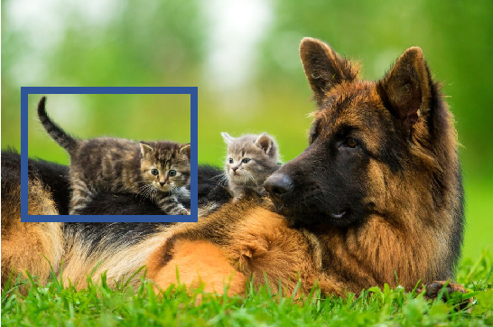

##### Output : Dog? No Cat? Yes Background? No

|CNN|
|---|

- 1. Apply Sliding Window technique
- 2. Apply CNN to different Windows and get a prediction

##### Output : Dog? No Cat? Yes Background? No

|CNN|
|---|

###### Issue with Sliding Window technique

- 1. Apply CNN on large number of windows
- 2. Multiple scale and locations of windows
- 3. Inaccurate bounding boxes
- 4. Computationally expensive

###### Region Proposal Technique:

- • Find blobs in the image that are most likely to contain objects
- • E.g: Selective search à ~1000-2000 region proposals using CPU!

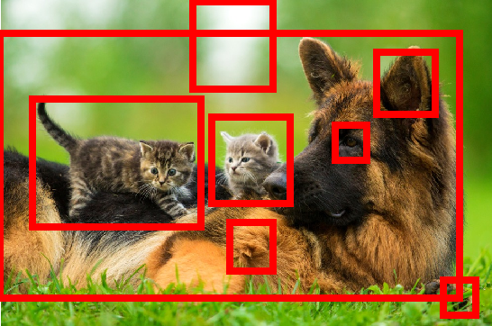

Source and Reference: http://cs231n.stanford.edu/slides/2016/winter1516_lecture8.pdf

Case Study: R-CNN

Linear Regression for bounding box offsets

###### R-CNN: Region based CNN

Classify each region with SVMs

|SVMs|
|---|

|Bbox Reg|
|---|

|SVMs|
|---|

|Bbox Reg|
|---|

- 1. Resized to match the input to CNN requirement.
- 2. mAP: 62.4% for 2007 PASCAL VOC
- 3. Problem: Very Slow!

Pass each region through ConvNet

|SVMs|
|---|

|Bbox Reg|
|---|

|Conv -Net|
|---|

|Conv -Net|
|---|

|Conv -Net|
|---|

Warped image regions

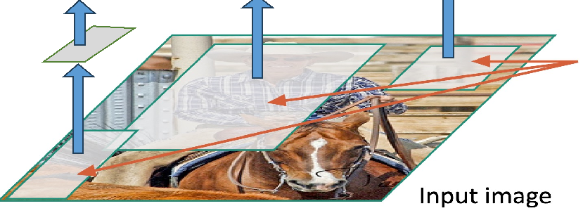

Region-of-interest (ROI) from proposal method around ~2K

|Linear + Softmax|
|---|

Object category

|Linear|
|---|

Box offset

|CNN|
|---|

Per-Region Network

###### Slow RCNN

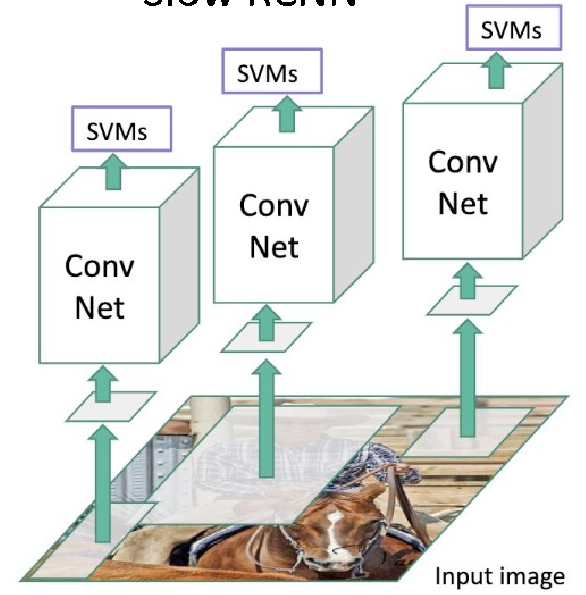

| | | |
|---|---|---|
| | | |

Crop + Resize features

Region of Interest (ROIs) from proposal method

Run whole image through ConvNet

|ConvNet|
|---|

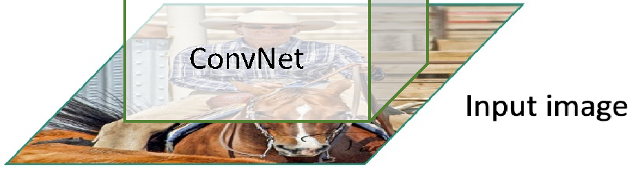

Source and Reference: https://cs231n.stanford.edu/slides/2022/lecture_9_jiajun.pdf

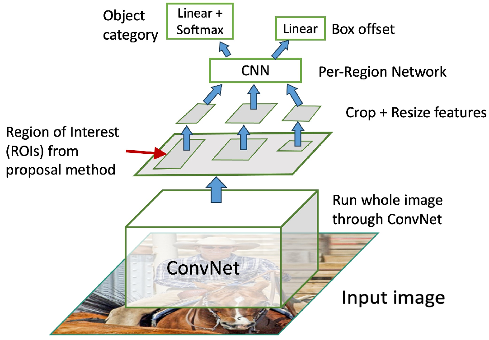

- 1. Reduce computation
- 2. ROIs from feature maps using selective search
- 3. mAP: 70% for 2007 PASCAL VOC

Case Study: FASTER- R-CNN

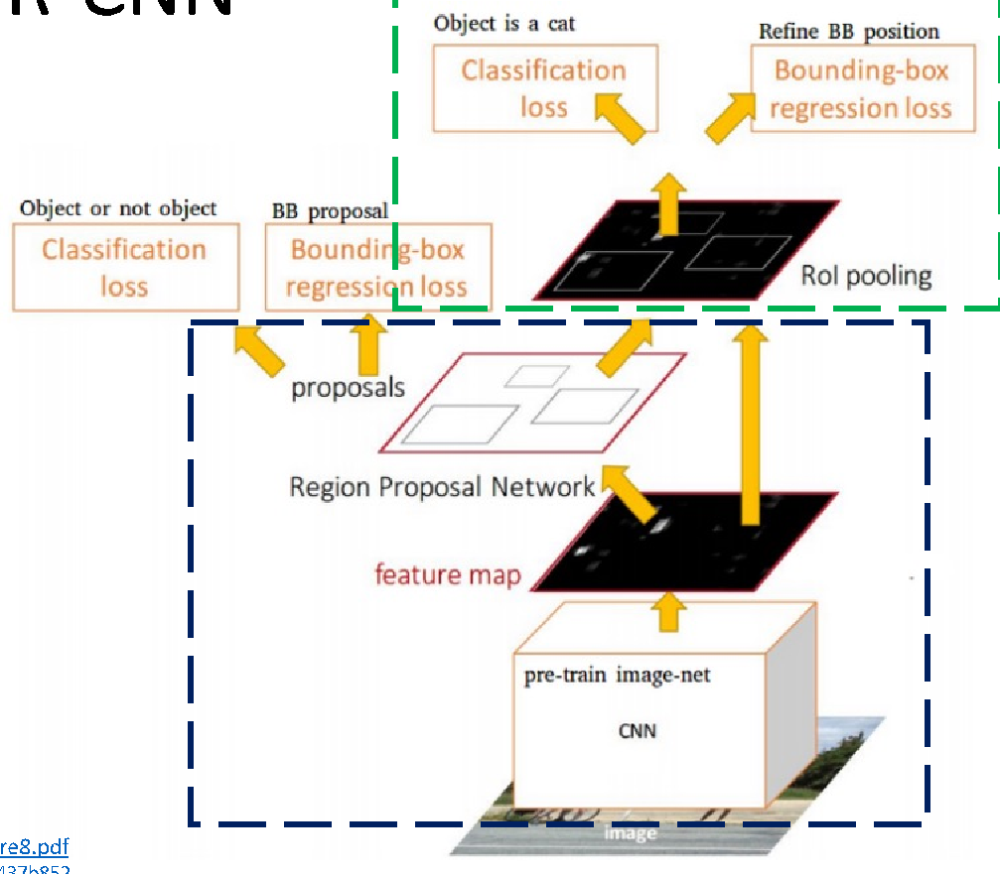

- 1. Use CNNs to make proposals

- 2. Introduced RPN (Region Proposal Network)

- 3. mAP: 78.8% for 2007 PASCAL VOC

- • RCNN à Look at every patch one by one

- • Fast R-CNN à Look once, and then inspect patches on feature map

- • Faster R-CNN à Propose patches using a neural network (RPN)

|Feature R-CNN Fast R-CNN Fater R-CNN|
|---|
|Region proposal Selective search Selective search RPN (learned)|
|CNN Usage Per region Once per image Once per image|
|Speed Very slow Faster Can work in realtime|
|Training Multi-stage, discreate  Partially en-to-end Fully end-to-end|
|Accuracy Good Better Best of all three|

## Object Detection Techniques History

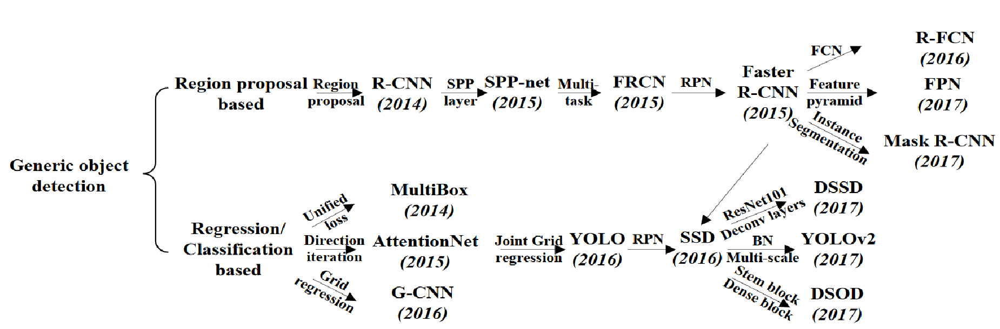

Images source: https://arxiv.org/pdf/1807.05511.pdf

Image Annotation for Object Detection

|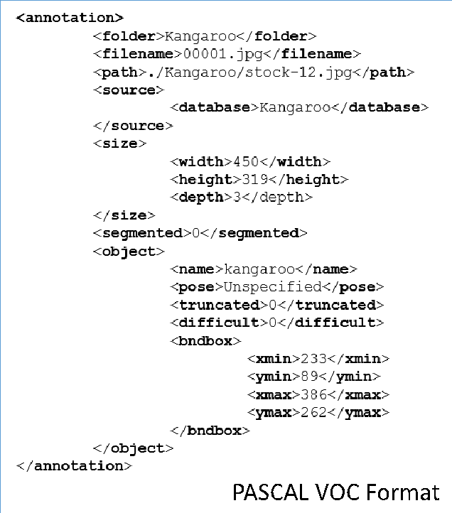  PASCAL VOC Format|
|---|

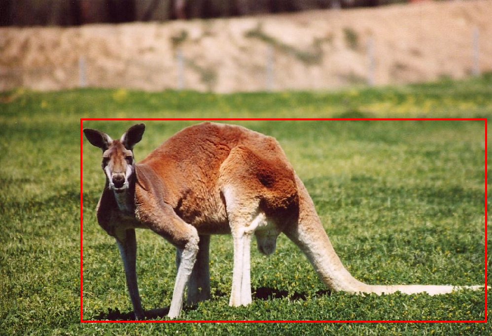

| |
|---|

Image Sources: https://en.wikipedia.org/wiki/Kangaroo#/media/File:RedRoo.JPG https://towardsdatascience.com/coco-data-format-for-object-detection-a4c5eaf518c5
