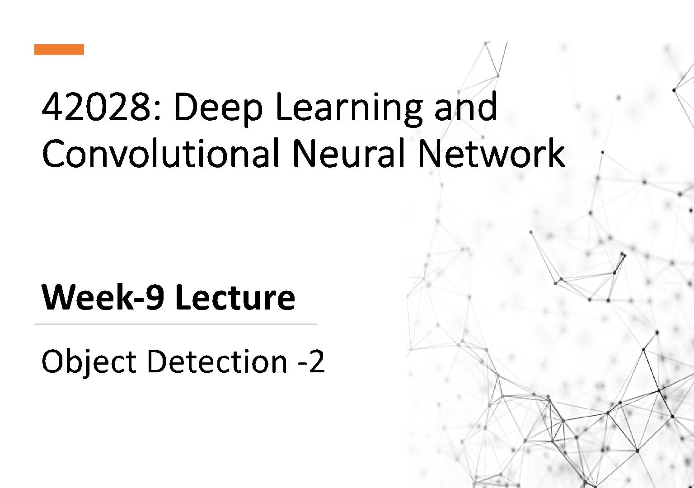

42028: Deep Learning and Convolutional Neural Network

# Week-9 Lecture

Object Detection -2

Outline

- • Object detection techniques recap
- • Strategies for predicting bounding boxes
- • Non-Maxima suppression (NMS)
- • Anchor boxes
- • Case study:
- • Yolo (You Look Only Once)
- • SSD (Single Shot Detector)
- • Object detection state-of-the-art

## Taxonomy of Object detectors

|Object Detection|
|---|

|Network type|
|---|

|Data type|
|---|

|Single stage| |
|---|---|
| | |

|Two Stage| |
|---|---|
| | |

|3D Object Detector|
|---|

|2D Object detectors|
|---|

|Regression/Classification Based|
|---|

|Region Proposal Based| |
|---|---|
| | |

|Monocular Image|
|---|

|Point Cloud|
|---|

|Point Nets|
|---|

|RCNN family|
|---|

|SSD|
|---|

|Yolo|
|---|

Refernce: https://medium.com/@saifhajsalem12/object-detection-state-of-the-art-and-modern-approaches-eaa5e6bfb46b

## Object Detection Techniques History

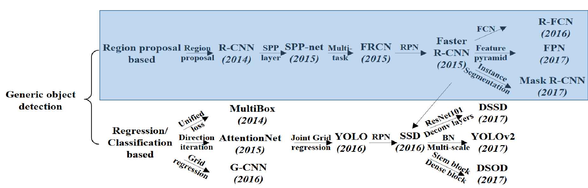

| |
|---|

###### Sliding Window technique

| |
|---|

||
|---|

| |
|---|

#### Sliding Window technique

- - Crop images and classify using CNN
- - Try different sizes of the sliding window Issues:
- - Slow
- - Computationally very expensive
- - Less accurate

#### Region Proposals

Currently:

Task:

- - Sliding Window

- - Selective Search

- - Region Proposals

- Predict Bounding boxes from CNN

Source and Reference: http://cs231n.stanford.edu/slides/2016/winter1516_lecture8.pdf

- - Place a grid over the image
- - Apply image classification and localization to each of the grid cells

| | | |
|---|---|---|
| |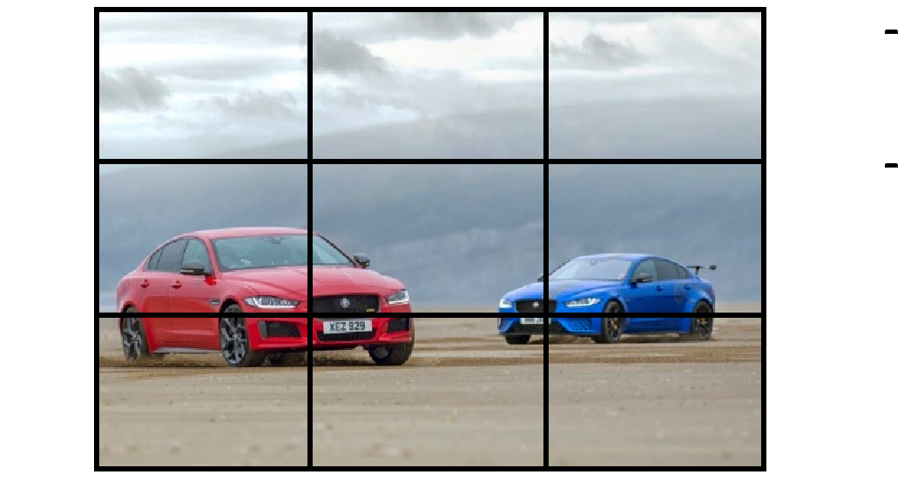| |
| | | |

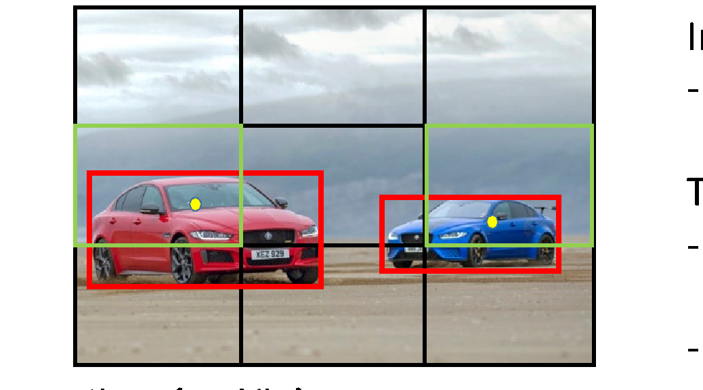

- Input:
- - Image: (ht x wd x 3) Target:
- - Bounding box information for each object
- - Class for each object

###### Class : {car, bike}

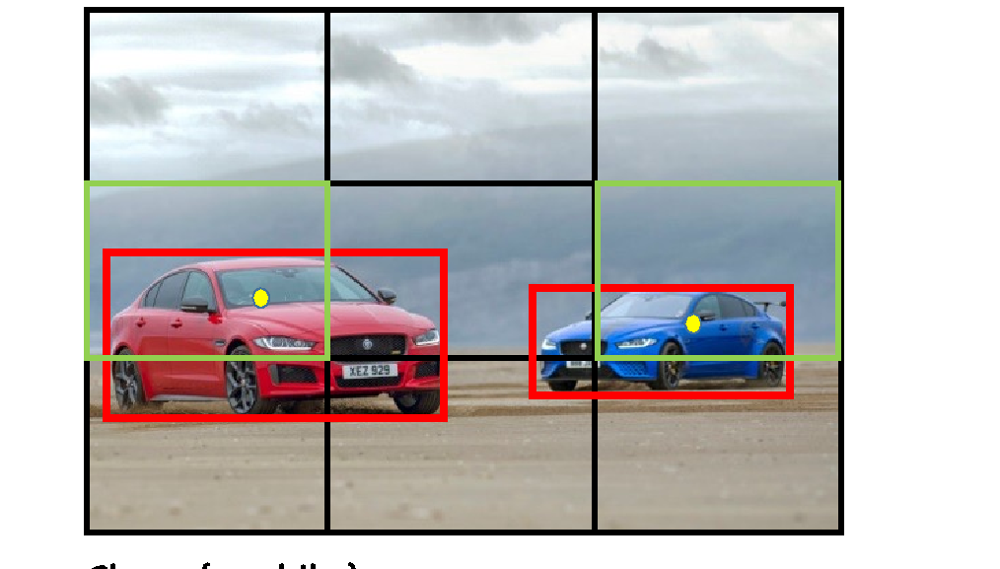

##### Target:

Y = {po, x, y, h, w, c1, c2} for each cell e.g:

- Cell(1,1) = {0, ?, ?, ?, ?, ?, ?} :

- Cell(2,1) = {1, x, y, h, t, 1, 0}

- Cell(2,2) = {0, ?, ?, ?, ?, ?, ?}

- Cell(2,3) = {1, x, y, h, t, 1, 0} :

- Cell(3,3) = {0, ?, ?, ?, ?, ?, ?}

###### Class : {car, bike}

###### Idea: Take the mid-point of the object and Assign it to a grid cell based on its location

Images source: https://yallacompare.com/car-deals/uae/en/two-cars-one-dnajaguar-xe-300-sport-and-xe-sv-project-8/ Source and Reference: https://www.youtube.com/watch?v=gKreZOUi-O0

##### Target output vector: 3 X 3 X 7 3 X 3: Grid size 7: (5 + Number-of-Classes)

| | | |
|---|---|---|
| | | |
| | | |

###### Class : {car, bike}

3 X 3 X 7

#### Training Strategy:

Target: Y

Input: X

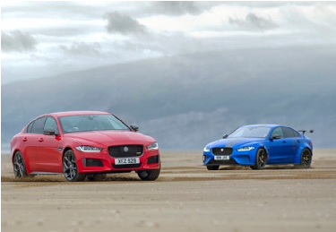

| | | |
|---|---|---|
| | | |
| | | |

|CNN|
|---|

3 X 3 X 7

Class : {car, bike}

In practice: The grid is finer, 19 X 19 instead of 3 X 3 So, Target will be of size: 19 X 19 X 7 Works well for non-overlapping objects

| | | | | | | | | | | | | | | | | | |
|---|---|---|---|---|---|---|---|---|---|---|---|---|---|---|---|---|---|
| | | | | | | | | | | | | | | | | | |
| | | | | | | | | | | | | | | | | | |
| | | | | | | | | | | | | | | | | | |
| | | | | | | | | | | | | | | | | | |
| | | | | | | | | | | | | | | | | | |
| | | | | | | | | | | | | | | | | | |
| | | | | | | | | | | | | | | | | | |
| | | | | | | | | | | | | | | | | | |
| | | | | | | | | | | | | | | | | | |
| | | | | | | | | | | | | | | | | | |
| | | | | | | | | | | | | | | | | | |
| | | | | | | | | | | | | | | | | | |
| | | | | | | | | | | | | | | | | | |
| | | | | | | | | | | | | | | | | | |
| | | | | | | | | | | | | | | | | | |
| | | | | | | | | | | | | | | | | | |
| | | | | | | | | | | | | | | | | | |
| | |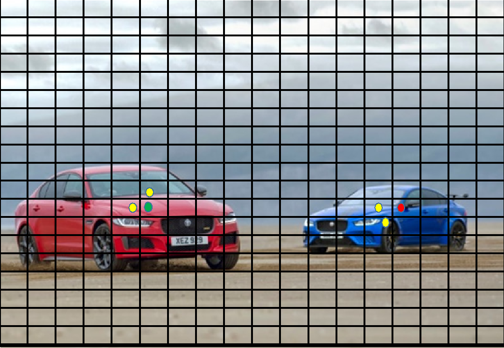| | | | | | | | | | | | | | | |

###### Issues with Object Detection:

- 1. Each object has one midpoint
- 2. Each cells are subjected to object localization + classification
- 3. Hence, neighbouring cells might assume that it has the mid-point
- 4. Hence, Multiple detection bounding box

###### Sample prediction: For C1: Box1: 0.9 (Confidence Score) Box2: 0.79 Box3: 0.82

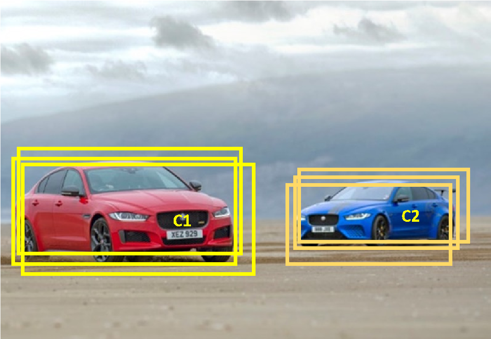

|C1| |
|---|---|

###### For C2: Box1: 0.92 Box2: 0.85 Box3: 0.7

|C2|
|---|
| |

NMS cleans/removes the multiple detection and only keeps the one with very high confidence

- 1. Check the probabilities of each detection and keep ones with score > Threshold (0.7)
- 2. For remaining boxes:

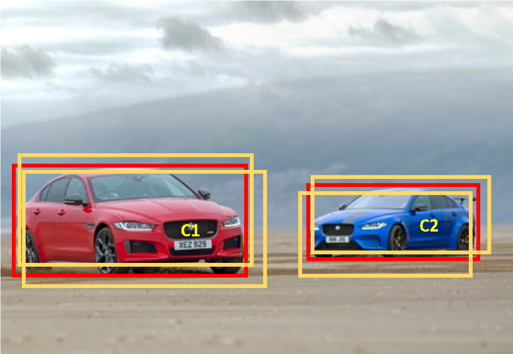

|C1| |
|---|---|

- - Box with highest score is the detection results.
- - Discard any remaining boxes with IoU > 0.5 with final detected box, i.e: overlap with the box with highest score.

|C2|
|---|
| |

YOLO: You Only Look Once Algorithm

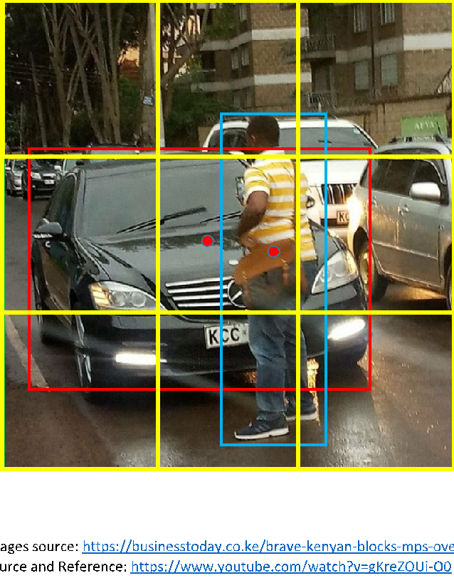

###### Challenges with overlapping objects

- - Each grid cell detect only one object
- - For multiple overlapping objects, Mid point are on the same grid cell

###### So, Currently the Target Y = {1, x, y, h, w, C1, C2}, As the mid-points for both the objects are on the same grid cell, only one of the objects will be associated

Anchor Box 1 Anchor Box 2

| | | |
|---|---|---|
| | | |
| | | |
| | | |
| | | |

###### Anchor Box 1

###### Associate each object to:

Predicted BB

- 1. A cell which contains its mid-point and
- 2. Anchor box for the cell with highest IoU

Anchor Box 1

Calculate the IoU of Anchor boxes and predicted BB

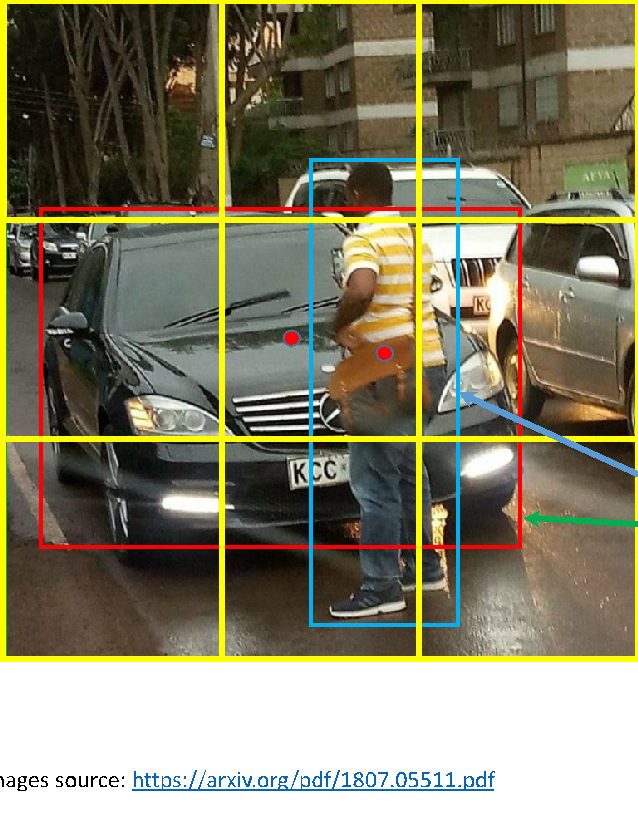

Anchor Box 1 Anchor Box 2

Similar Shape

###### So, with Anchor boxes: Target Y = {Po, x, y, h, w, C1, C2, Po, x, y, h, w, C1, C2},

Anchor Box 1 Anchor Box 2

| | | | | | | | | | | | | | | | | | |
|---|---|---|---|---|---|---|---|---|---|---|---|---|---|---|---|---|---|
| | | | | | | | | | | | | | | | | | |
| | | | | | | | | | | | | | | | | | |
| | | | | | | | | | | | | | | | | | |
| | | | | | | | | | | | | | | | | | |
| | | | | | | | | | | | | | | | | | |
| | | | | | | | | | | | | | | | | | |
| | | | | | | | | | | | | | | | | | |
| | | | | | | | | | | | | | | | | | |
| | | | | | | | | | | | | | | | | | |
| | | | | | | | | | | | | | | | | | |
| | | | | | | | | | | | | | | | | | |
| | | | | | | | | | | | | | | | | | |
| | | | | | | | | | | | | | | | | | |
| | | | | | | | | | | | | | | | | | |
| | | | | | | | | | | | | | | | | | |
| | | | | | | | | | | | | | | | | | |
| | | | | | | | | | | | | | | | | | |
| | | | | | | | | | | | | | | |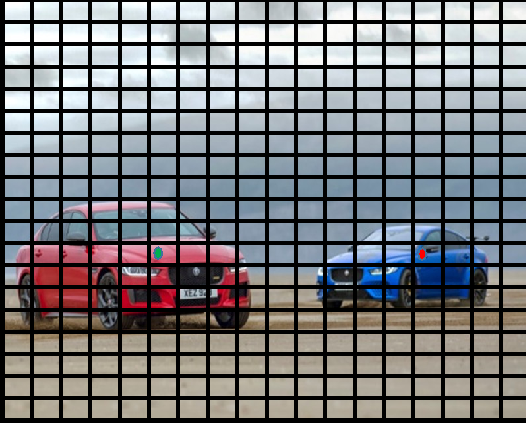| | |

|Training Set|
|---|

- Anchor Box 1
- Anchor Box 2

|Y = {Po, x, y, h, w, C1, C2, Po, x, y, h, w, C1, C2} Cell(1,1) = {0, ?, ?, ?, ?, ?, ?, 0, ?, ?, ?, ?, ?, ?} : Cell(12,6)= {0, ?, ?, ?, ?, ?, ?, 1, x, y, h, w, 1, 0} : Cell(12,15)= {0, ?, ?, ?, ?, ?, ?, 1, x, y, h, w, 1, 0} : Cell(19,19)= {0, ?, ?, ?, ?, ?, ?, 0, ?, ?, ?, ?, ?, ?}|
|---|

InputX

Class : {1:car, 2:bike} Y size : (

X 2 X 7 )

|19 X 19|
|---|

|Grid Size|
|---|

|#Anchor Box|
|---|

|5(Po, x,y,h,w) + #Classes(2)|
|---|

#### Training:

Target: Y

Input: X

| | | | | | | |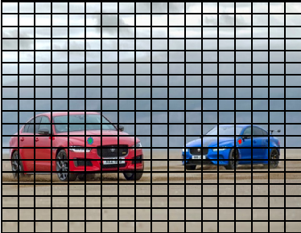| | | | | | | | | | |
|---|---|---|---|---|---|---|---|---|---|---|---|---|---|---|---|---|---|
| | | | | | | | | | | | | | | | | | |
| | | | | | | | | | | | | | | | | | |
| | | | | | | | | | | | | | | | | | |
| | | | | | | | | | | | | | | | | | |
| | | | | | | | | | | | | | | | | | |
| | | | | | | | | | | | | | | | | | |
| | | | | | | | | | | | | | | | | | |
| | | | | | | | | | | | | | | | | | |
| | | | | | | | | | | | | | | | | | |
| | | | | | | | | | | | | | | | | | |
| | | | | | | | | | | | | | | | | | |
| | | | | | | | | | | | | | | | | | |
| | | | | | | | | | | | | | | | | | |
| | | | | | | | | | | | | | | | | | |
| | | | | | | | | | | | | | | | | | |
| | | | | | | | | | | | | | | | | | |
| | | | | | | | | | | | | | | | | | |
| | | | | | | | | | | | | | | | | | |

| | | | | | | | | | | | | | | | | | |
|---|---|---|---|---|---|---|---|---|---|---|---|---|---|---|---|---|---|
| | | | | | | | | | | | | | | | | | |
| | | | | | | | | | | | | | | | | | |
| | | | | | | | | | | | | | | | | | |
| | | | | | | | | | | | | | | | | | |
| | | | | | | | | | | | | | | | | | |
| | | | | | | | | | | | | | | | | | |
| | | | | | | | | | | | | | | | | | |
| | | | | | | | | | | | | | | | | | |
| | | | | | | | | | | | | | | | | | |
| | | | | | | | | | | | | | | | | | |
| | | | | | | | | | | | | | | | | | |
| | | | | | | | | | | | | | | | | | |
| | | | | | | | | | | | | | | | | | |
| | | | | | | | | | | | | | | | | | |
| | | | | | | | | | | | | | | | | | |
| | | | | | | | | | | | | | | | | | |

|CNN|
|---|

19 X 19 X 2 X 7

Class : {car, bike}

###### Input: X

|Y = {Po, x, y, h, w, C1, C2, Po, x, y, h, w, C1, C2}  {0, ?, ?, ?, ?, ?, ?, 0, ?, ?, ?, ?, ?, ?} : {0, ?, ?, ?, ?, ?, ?, 1, x, y, h, w, 1, 0} : {0, ?, ?, ?, ?, ?, ?, 1, x, y, h, w, 1, 0} : {0, ?, ?, ?, ?, ?, ?, 0, ?, ?, ?, ?, ?, ?} |
|---|

| | | | | | | | | | | | |
|---|---|---|---|---|---|---|---|---|---|---|---|
| | | | | | | | | | | | |
| | | | | | | | | | | | |
| | | | | | | | | | | | |
| | | | | | | | | | | | |
| | | | | | | | | | | | |
| | | | | | | | | | | | |
| | | | | | | | | | | | |
| | | | | |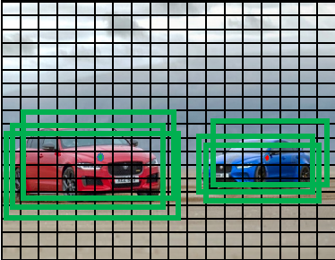| | | | | | |
| | | | | | | | | | | | |
| | | | | | | | | | | | |

|CNN|
|---|

19 X 19 X 2 X 7

###### Class : {car, bike}

###### Input: X

|Y = {Po, x, y, h, w, C1, C2, Po, x, y, h, w, C1, C2}  {0, ?, ?, ?, ?, ?, ?, 0, ?, ?, ?, ?, ?, ?} : {0, ?, ?, ?, ?, ?, ?, 1, x, y, h, w, 1, 0} : {0, ?, ?, ?, ?, ?, ?, 1, x, y, h, w, 1, 0} : {0, ?, ?, ?, ?, ?, ?, 0, ?, ?, ?, ?, ?, ?} |
|---|

| | | | | | | | | | | | |
|---|---|---|---|---|---|---|---|---|---|---|---|
| | | | | | | | | | | | |
| | | | | | | | | | | | |
| | | | | | | | | | | | |
| | | | | | | | | | | | |
| | | | | | | | | | | | |
| | | | | | | | | | | | |
| | | | | | | | | | | | |
| | | | | || | | | | | |
| | | | | | | | | | | | |
| | | | | | | | | | | | |

|CNN|
|---|

19 X 19 X 2 X 7

###### Class : {car, bike}

| |Apply NMS|
|---|---|
| | |

- • Real-time performance with 45 frames per sec, 0.02 sec per image

- • Not suitable for small objects

- • Issues with new or multiple aspect ratios and unable to generalize

- • Similar to YOLO

- • VGG16 base CONV layers

- • Take advantage of Anchor boxes with different aspect ratios

- • Large number of anchors boxes are chosen

- • Not suitable for small objects

- • 3 times faster than Faster-RCNN

- • With ResNet101 base SSD may be help in detecting small objects with better features from the CONV base

##### SSD300 architecture:

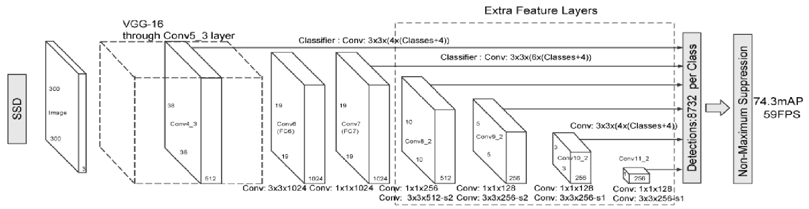

Object Detection State-of-the-Art

###### Dataset: PASCAL VOC 2007 and 2017 Test Dataset : PASCAL VOC 2007

|Method|Train Dataset|mAP|Time in sec/image|Time Frame /sec|
|---|---|---|---|---|
|RCNN (VGG16)|Pascal VOC 2007|66.0|50|-|
|Fast RCNN|VOC 2007+2012|70.0|2|-|
|Faster RCNN (VGG16)|VOC 2007+2012|73.2|0.11|9|
|Faster RCNN (ResNet101)|VOC 2007+2012|83.8|2.24|0.4|
|Yolo|VOC 2007+2012|63.4|0.02|45|
|SSD300|VOC 2007+2012|74.3|0.02|45|
|SSD512|VOC 2007+2012|76.8|0.05|19|

Yolo State-of-the-Art

###### Dataset: MS COCO

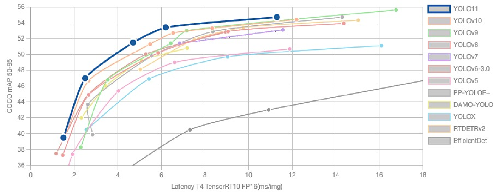

Source: https://docs.ultralytics.com/models/yolo11/#performance-metrics

Object Detection Summary

|Base Networks:  • VGG16 • REsNet101 • Inception V2 • Inception V3 • ResNet • MobileNet • Alexnet • ZFNet Etc. |
|---|

|Object Detection FrameWorks:  • RCNN Family (RCNN, Fast/Faster RCNN) • Yolo Family • SSD • F-RCN |
|---|

|Summary:  • Faster-RCNN is more accurate but slower • Yolo/SSD are faster/real-time but may not be very accurate |
|---|

Source: http://cs231n.stanford.edu/slides/2017/cs231n_2017_lecture11.pdf
